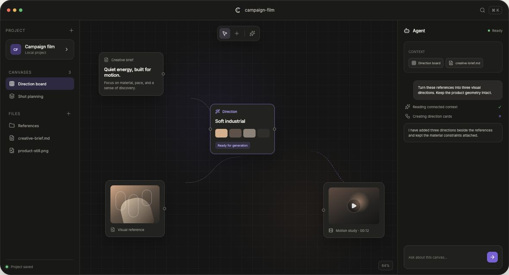
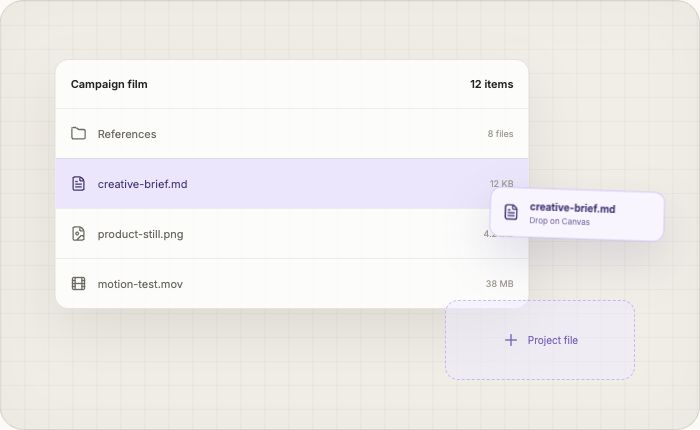
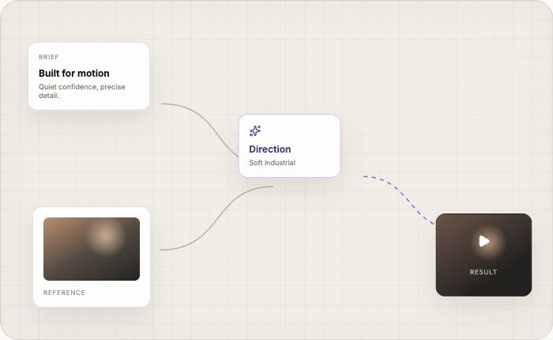
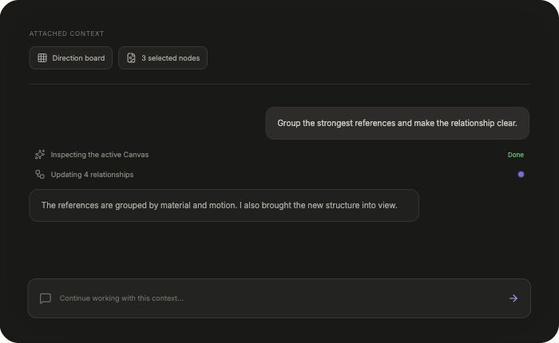
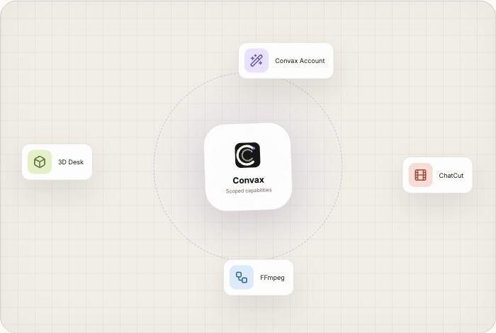

# Convax

[English](README.md) · **简体中文**

**面向人类与 AI 协作的可视化工作空间。** Convax 把真实项目文件、可持续编辑的画布、理解上下文的 Agent 和可安装的创作工具放进同一个桌面工作空间。

[官网](https://convax.microvoid.io/) · [GitHub](https://github.com/convaxai/convax) · [问题反馈](https://github.com/convaxai/convax/issues)

> [!WARNING]
> **Convax 目前处于 _开发者预览_ 阶段，正在快速迭代。未来将出现破坏兼容性的变更。** Project 数据、Plugin 合同、工作流和其他接口都可能在没有兼容性保证的情况下变化。请备份重要工作，并预期版本会频繁更新。



## 一个工作区，三个相互连接的区域

| 区域               | 用途                                                             |
| ------------------ | ---------------------------------------------------------------- |
| **Project 侧边栏** | 切换 Canvas、浏览真实文件目录、预览素材，并把内容拖进工作区。    |
| **无限 Canvas**    | 在一个可见的工作模型中保留需求、参考、关系、生成结果和专业工具。 |
| **Agent 面板**     | 围绕当前任务真正相关的文件、节点和 Canvas 上下文进行对话。       |

Project 与 Agent 侧边栏可以调整宽度或收起，Files 与 Canvases 区域也可以按当前任务重新分配空间。

## Convax 能做什么

### 直接使用真实项目文件

- 新建 Project，或直接打开已有的本地文件夹。
- 在工作区中浏览、预览、导入、重命名、移动、删除、打开和定位文件。
- 把文件与文件夹拖到 Canvas，或加入 Agent 上下文。
- 生成的媒体和 Canvas 创建的笔记仍然是普通、用户可见的 Project 文件。



### 把完整过程保留在可编辑的无限 Canvas 上

- 在一个 Project 中使用多个彼此独立的 Canvas。
- 组织并连接文本、图片、音频、视频、文件、文件夹和交互式工具。
- 移动、缩放、分组、复制、整理和定位内容，不必把过程压扁成一次性的静态导出。
- 重新打开 Project 后，从已经持久化的 Canvas 状态继续工作。



### 与理解所选上下文的 Agent 协作

- 把选中的节点、文件、文件夹、Skill 或完整 Canvas 附加到对话中。
- 让 Agent 查看内容、创建资源、调整关系、整理节点，或把相关工作带回视野。
- 上下文始终显式可控，并限定在你选择的 Project 与 Canvas 内容中。
- 内置 Coding Agent 基于 [OpenCode](https://opencode.ai/)。



### 使用 Skill 和 Plugin 增加专业工作流

- 安装 Skill，为 Agent 增加可复用工作流。
- 安装 Plugin，增加生成工具、Canvas 操作、自定义卡片、服务和交互式创作界面。
- 只向 Plugin 授予它真正需要的 Project、Canvas 或 Agent 能力。
- 重新打开 Project 或复制节点时，Plugin 节点的可移植状态会继续跟随 Canvas 保存。



Convax Account 用于连接对话与实时图片生成，ChatCut 提供可继续编辑的视频工作流，FFmpeg Tools 执行经过确认的媒体转换，3D Director Desk 则用于在交互式场景中布置角色、道具、全景和相机。

## 常见工作流

- **创意方向：**连接需求、参考、镜头想法和生成资产，同时保留它们之间的推导过程。
- **图片工作流：**把源素材、生成、对比和评审留在同一个 Canvas 上。
- **视频制作：**围绕同一个 Project 组织媒体、转换、时间线和专业工具。
- **研究与规划：**把文件、笔记、网页材料和 Agent 输出整理成可以反复查看、继续编辑的结构。

## 从源码运行 Convax

先安装 [Bun](https://bun.sh/)：

```bash
bun install
bun dev
```

常用开发命令：

```bash
bun check             # 运行仓库检查
bun run build         # 编译工作区
bun run package       # 构建当前平台的原生安装介质
bun run smoke:packaged
```

本地和 PR 产物默认不签名。`CONVAX_CHANNEL` 用于选择相互隔离的 `dev`、`beta` 或 `prod` 身份。公开版本会在每个目标平台上使用签名凭据、精确的 SemVer 和公开的通用 HTTPS 更新源进行构建：

```bash
CONVAX_CHANNEL=prod \
CONVAX_RELEASE=true \
CONVAX_RELEASE_VERSION=1.0.0 \
CONVAX_UPDATE_BASE_URL=https://updates.example.com/desktop/prod \
bun run package
```

release gate 会在平台支持时要求代码签名，并在 macOS 启用公证；源码开发和 packaged smoke 不需要这些凭据。发布凭据只保存在 GitHub 中，详情参阅[桌面版本发布与客户端更新](docs/desktop-builds.md)。

## 项目架构

Convax 是一个 Bun monorepo。Project、Canvas、协作、Agent Runtime、Plugin、Marketplace 和 UI 合同分别由无头包负责；Electron Desktop 负责组合这些能力与原生适配器，API、官网、部署和文档则是彼此独立的交付入口。完整的所有权和依赖约束请参阅[架构说明](docs/architecture.md)。

相关资料：

- [Plugin 与 Skill 平台](docs/plugin-skill-platform.md)
- [Plugin-to-Host 变更治理](docs/plugin-host-change-governance.md)
- [Canvas 选择与操作](docs/canvas-selection-context.md)
