# Convax Architecture Contract

Status: canonical. This document describes the current architecture and the
decisions that new code must preserve. `AGENTS.md` turns these decisions into an
operational checklist, and `scripts/package-boundary-check.ts` enforces the parts
that can be checked statically.

## 1. Design principles

Convax is built from independently testable domain packages and one application
composition root. A package owns its state, invariants, and public capabilities.
Cross-domain behavior is assembled through injected ports; packages do not discover
each other through globals or mutate each other's persistence.

The recurring rules are:

1. One concept has one owner and one canonical state source.
2. Domain state machines are headless; hosts provide I/O and rendering adapters.
3. UI and Agent entry points execute the same application/business operations.
4. Portable Project state is separate from user/window preferences.
5. Every native path is treated as a trust boundary and works on Windows.

When a feature does not fit an existing owner, make the ownership decision explicit.
Do not default it into Desktop, Project, a `shared` folder, or a new `workspace`
package.

Convax host/platform source and concrete capability-package source are intentionally
split across repositories. This repository owns Plugin contracts, validation,
installation, lifecycle, runtime composition, UI/IPC, and Registry consumption.
The `convaxai/convax-plugins` repository owns every concrete Plugin, Skill, and
companion tool, including official and default-catalog integrations. A new
integration therefore adds generic host support here only when the ABI genuinely
lacks it, while its manifest, assets, workflow instructions, and executable source
are authored and released from `convax-plugins`.

`packages/desktop/resources/plugins` is a legacy/bootstrap migration surface, not
the canonical source tree for new Plugins. Long term, Desktop consumes immutable
Registry/Release artifacts or mechanically generated and verified bootstrap bytes;
it does not duplicate hand-maintained Plugin source. No runtime semantic may depend
on a concrete package id merely because a package was historically bundled here.

Collaboration has exactly one current protocol. `@convax/collaboration` owns one
kernel, one frame codec, one restricted JCS canonicalization, and one current
protocol descriptor. That descriptor is generated deterministically from the owner
schemas in source, recomputed in CI, and packaged with the application; its exact
`protocolDigest` is the only protocol identity. Canvas owns one Canvas schema and
reducer, Project owns one ProjectIndex schema and reducer, and Desktop composes one
runtime around them.

There is no authority selector, no active/pinned release pair, no dual-version
dispatch, no promotion bridge, no successor runtime, and no predecessor decoder.
Runtime, build, and packaging never derive protocol behavior from a pointer file, a
release directory, a durable record shape, or directory presence. Bytes whose frame
magic, wire format, or `protocolDigest` differ from the built descriptor are
`unsupported-project-data`: the runtime reports that one classification and never
tries a second decoder or guesses a layout. A descriptor that is missing or does not
match the build fails closed before decode, sign, reset, or mutation.

The archived V11 collaboration cutover uses Route F pointer selection, and that
whole model is retired. Its
[`pointer`](superpowers/specs/collaboration-v11-active-authority.json), its
[`R1 release`](superpowers/specs/authorities/collaboration-v11/r1/) with its
sixteen verified snapshot paths, and every other release below
`superpowers/specs/authorities/**` are **non-runtime archive and review material**.
Production source, build scripts, and packaging must not read, stage, copy, or
import them. Their sealed bytes stay unchanged, and their identities remain recorded
only so a reviewer can recognize archive tampering: pointer SHA-256
`2c7ecc4c9a3d1b339c2f135babe874900e53af1a2d06379e67ab4fcacf2ad0f6`, manifest
SHA-256 `351634036ae88bbe843430bb11b3e9d46e6b9bcd865df4aaf55e50fe55dfb1b4`,
review-evidence SHA-256
`ef820d44a350303fb5eb1f2d4bb1179c1800e7bc407e3debba52d7588c317dc2`, protocol-bundle
SHA-256 `180199f3e77e5f4daa9c914f97b8e9a08293ba70e201656efe3bd0c10af70d6c`, recorded
protocol digest
`5fe693c9eb0485814fcbe11b6f0136bbc97870184530748ef58502c22ce7865f`, pin SHA-256
`ac17fd5a5ee5b989909266bc58d616a1476a286ea7f27f7cda5819c0a857f369`, predecessor
pointer SHA-256 `f1b6f1e09dba629ab06530b2e21c6ac451cd4c04c82ed21cd7cabfb9b7e78398`,
and predecessor protocol digest
`de192e03a7466b631b1cefa50f745e22b1ed997f5ce23cbb9c9aea7e46b73bf5`. Editing an
archived byte is `activated-authority-mutation` and is rejected as tampering. These
archives, drafts, reviews, and prior implementation snapshots are evidence only and
never fallback protocol authority.

The product model is local-first: every Project is one local durable aggregate, and
sharing adds collaborators to that same Project rather than converting it into a
different Team Project kind. Project open and shell rendering therefore do not
require Team creation, an invitation, membership bootstrap, a control-plane session,
or PeerJS startup.

Creating a Project therefore writes its current ProjectIndex genesis once, and each
new Canvas writes its current Canvas genesis once. Sharing uses the same current
Project and Canvas scopes and never switches protocol. The only local mutation
outcomes are the current protocol, `unsupported-project-data`, and an explicit
recovery-required classification; there is no legacy, successor, or promoted state.
An unshared Project's durable local-owner binding is a first-class mutation
authority: it signs ProjectIndex frames, Canvas frames, and the generic current
Canvas-genesis author proof without a Team record, control-plane session, or network.
The one causal-frame codec commits an explicit `local-project-owner` or
`team-replica` signer-authority kind and its digest; those are authority modes of the
same current protocol, never protocol selectors. A missing or rejected local owner
remains `local-authority-unavailable`, and Team creation is never presented as
recovery.

A durable Team binding is additive sharing authority and disables new local-owner
signing for that Project. Retained local-owner frames and genesis bytes remain
historical inputs to the same current decoder; sharing never rewrites or re-signs
them. A Team handoff must close the local head set before remote admission, and no
Team enrollment record may be used as a fallback for an absent local owner.

When a registry-bound unshared local Project still has its canonical root but no
collaboration authority bytes, Project/node may restore a missing `project.json`
and replay the exact durable local-owner genesis into a new current private store.
This is empty-store recovery, not a decoder fallback: unsupported, Team-bound, or
unknown private bytes still fail closed. Native document inventory may ignore a
regular macOS `.DS_Store` file, but no other unexpected entry is treated as noise.

When Desktop enters an editable local Project whose current ProjectIndex has no
live Canvas route, its Workbench coordinator invokes the same Project-owned typed
Canvas-create command used by the visible New Canvas action and opens the committed
result. It never fabricates a route or Canvas document in Renderer state. Canvas
genesis crosses the native publication barrier only while the exact current Canvas
owner materializer is registered for that scope; successful accepted frames are
then observed by the same process-local causal index before a dependent local frame
may commit. Registration failure, publication failure, or an incomplete causal
closure fails the command without publishing a live route.

Existing experimental collaboration trees written by the retired multi-release model
are unsupported. They may be archived unchanged, exported as user-visible resources,
or replaced by a new current genesis after an explicit user confirmation that retains
a recoverable backup of the old bytes. A completed local reset moves the exact prior
`.convax` tree to the inert sibling `.convax-archive-<reset-token-suffix>`; runtime
resolution ignores that archive, and only an explicit later user action may delete
it. Open, checkpoint, and GC never reset, delete,
re-sign, renumber, or reinterpret them, and no migration helper keeps an old decoder
inside the production bundle.

Project/node retains each Project's canonical-root/local-actor binding even after
the last runtime lease closes. A changed root or actor can be admitted only after a
successful serialized close/reset operation; a failed or interrupted barrier keeps
the old binding and subsequent acquisition fails closed. This prevents lease churn
from becoming an implicit identity reset.

### Architecture map

This diagram is part of the canonical architecture, not a generated illustration.
Keep it and the corresponding prose, tables, state map, persistence map, and flows
up to date in the same change whenever package ownership, dependencies, runtime
routing, trust boundaries, persistence targets, or delivery surfaces change. Keep
the reviewable Mermaid source in this document; do not commit duplicate PNG, SVG, or
JSON renderings.

```mermaid
flowchart TB
  subgraph Authoring["Authoring and immutable release"]
    PluginSource["convax-plugins<br/>Plugin, Skill, companion source"]
    MarketplaceCli["create-convax-marketplace"]
    MarketplaceKit["@convax/marketplace-kit"]
    Release["Registry / immutable Release artifacts"]
    DesktopUpdateFeed["Signed Desktop release<br/>generic HTTPS metadata + immutable installers"]
    PluginSource --> MarketplaceKit
    MarketplaceCli --> MarketplaceKit
    MarketplaceKit --> Release
  end

  subgraph Desktop["@convax/desktop · Electron composition root"]
    subgraph Entry["Runtime entry surfaces"]
      Renderer["Renderer UI<br/>React, controllers, first-run onboarding"]
      Preload["Preload<br/>typed window.convax bridge"]
      Agent["Agent / OpenCode"]
      PluginRuntime["Plugin iframe, sidecar, Skill, Hook"]
      Main["Main authority<br/>I/O, execution, persistence"]
      Composition["Desktop composition<br/>adapters and package wiring"]
      Renderer -->|typed IPC · opaque preview leases| Preload --> Main
      Agent --> Main
      PluginRuntime --> Main
      Composition --> Renderer
      Composition --> Main
    end

    subgraph Packages["Headless and publishable packages"]
      Workbench["@convax/workbench"]
      Project["@convax/project"]
      Canvas["@convax/canvas<br/>schema, reducer, React Flow projection"]
      ProjectFiles["@convax/project-files"]
      Collaboration["@convax/collaboration<br/>one current protocol descriptor<br/>replicaDoc / candidateDoc kernel"]
      URI["@convax/uri"]
      UI["@convax/ui"]
      AgentRuntime["@convax/agent-runtime"]
      Marketplace["@convax/marketplace"]
      PluginSdk["@convax/plugin-sdk"]
      PluginApi["@convax/plugin-api"]

      Project --> Canvas --> UI
      Project --> Collaboration
      Project --> URI
      Project --> ProjectFiles
      ProjectFiles --> URI
      Canvas --> Collaboration
      Canvas --> URI
      Project --> UI
      PluginSdk --> PluginApi
    end

    ProtocolDescriptor["Packaged current protocol descriptor<br/>generated from owner schemas · exact protocolDigest"]
    Collaboration --> ProtocolDescriptor
    ProtocolDescriptor --> Main

    MarketplaceKit --> Marketplace
    MarketplaceKit --> PluginSdk
    MarketplaceKit --> PluginApi
    Composition --> Workbench
    Composition --> Project
    Composition --> Canvas
    Composition --> ProjectFiles
    Composition --> Collaboration
    Composition --> URI
    Composition --> UI
    Composition --> AgentRuntime
    Composition --> Marketplace
    Composition --> PluginSdk
    Composition --> PluginApi
  end

  Release --> Main
  DesktopUpdateFeed -->|version, release notes, SHA-512 and signed package| Main

  subgraph ExternalServices["External first-party service boundary"]
    AuthXPortal["AuthX ProjectUser Portal<br/>identity UI + short-lived Application Session"]
    NexusControl["Nexus resource control plane<br/>Plan · Quota · Usage · Checkout"]
  end
  Web -->|public ProjectUser Portal links only| AuthXPortal
  AuthXPortal -->|exact-origin bearer requests; no product persistence| NexusControl
  PluginRuntime -->|system-browser OAuth + runtime HTTPS only| NexusControl

  subgraph State["State and persistence"]
    UserData["Electron userData<br/>bindings, Marketplace, grants, immutable Plugin closures<br/>isolated per identified development task"]
    CompanionUserData["Companion-owned user application data<br/>private rotating refresh credential only"]
    ProjectRoot["Project root / .convax<br/>identity, final-frame objects/journals/heads, checkpoints/floors, managed assets"]
    LocalStorage["Browser localStorage<br/>preferences, onboarding progress, recovery<br/>and disposable Marketplace / Service / model display caches"]
    UpdaterCache["Electron updater cache<br/>verified partial/downloaded package · disposable"]
  end

  Main --> UserData
  PluginRuntime --> CompanionUserData
  Main --> UpdaterCache
  Main -->|validated native I/O · range streams| ProjectRoot
  Renderer -. non-authoritative UI state only .-> LocalStorage

  subgraph DataPlane["P2P collaboration data plane"]
    PeerReplicas["Peer replicas<br/>final signed frames, checkpoints, blobs"]
  end

  Main <-->|P2P causal objects and durable ACKs| PeerReplicas

  subgraph Delivery["Independent delivery surfaces"]
    Web["@convax/web<br/>public marketing site"]
    Cloudflare["@convax/deploy-cloudflare<br/>public origin and API routing edge"]
    Docs["@convax/docs<br/>independently deployed documentation site"]
    Api["@convax/api<br/>membership, rendezvous, attestation, floor, registry, cutoff"]
    Web --> Cloudflare
    Api --> Collaboration
    Api -->|browser-safe collaboration-protocol only| Project
    Cloudflare -. explicit Service Binding .-> Api
  end

  Main -->|control-plane requests only| Api

  classDef authority fill:#123047,stroke:#46c7e8,color:#ffffff,stroke-width:2px;
  classDef store fill:#15382e,stroke:#63d4a5,color:#ffffff;
  classDef external fill:#312a1a,stroke:#e8b44e,color:#ffffff;
  class Main authority;
  class UserData,CompanionUserData,ProjectRoot,LocalStorage store;
  class PluginSource,Release,PeerReplicas external;
```



## 2. Terms

### Project

A Project is the durable product aggregate associated with one bound root directory.
It has a stable identity, a per-user binding, private namespaced storage, and a
catalog of capabilities such as Canvases. It is not merely a filesystem folder and
does not own the currently displayed UI.

### Project Files

Project Files is the scoped file capability for visible content below a Project root.
Its contract owns strict opaque `ProjectFileId`, `ProjectDirectoryId`,
`ProjectEntryId`, and `ProjectVersionId` codecs. A stable entry id is identity, a
Project-relative path is only the current projection/hint, a `pv_` version id names
one content-family version, and SHA-256 names exact bytes. These values are never
collapsed into one path or hash identity. The native adapter currently lives in
`@convax/project/node` because that adapter resolves Project bindings and real paths;
it implements the `ProjectFilesClient` contract without moving file semantics back
into `ProjectController`. Sidebar media presentation keeps bounded row covers and
full hover previews separate. Image covers return directly as small data URLs. Each
mounted video row may request a purpose-tagged, sender-scoped thumbnail lease;
Chromium captures one bounded first-frame data URL and immediately releases that
lease without waiting for hover. The independently delayed hover opens one full
preview lease. Both lease kinds stream the native file through Main with HTTP
byte-range support and are revoked on explicit close, navigation, renderer loss, or
owner disposal; replacing a hover revokes only the prior hover lease. Full media
bytes never cross Project Files IPC and preview eligibility has no file-size cutoff.

### Canvas

A Canvas is an independent Y.Doc shard with its own schema, typed intents, semantic
guards, business operations, queries, view commands, and editor. Project owns the
ProjectIndex route/catalog relationship and persistence adapter, but it does not own
Canvas document semantics or a global shard revision counter.
Every Canvas card has exactly one left-side input and one right-side output. Canvas
edges are directed from `source` (right/output) to `target` (left/input); moving
cards never changes those port roles. A structural Group is connectable as one
whole-Group endpoint. Its edges attach to the Group identity, never fan out to
descendants, and disappear from the focused projection when they cross that scope
without being rewritten. A resource created while a Group is focused is placed and
parented by one Main-owned Canvas command; the renderer never follows a successful
root insertion with a second reparent save. Group is the expanded structural
container by default. Fold is a persisted presentation state that projects the same
Group as a compact folder; Unfold atomically removes that folded Group and restores
its children to the containing scope without moving them in world space. Camera, placement, snapping, and layout use
the active presentation geometry while durable expanded bounds continue to describe
the child coordinate container. File-input inference remains direct and file-only, so a
Group relation does not implicitly contribute child resources.

A Project-directory folder is different from a structural Group/Fold: it remains
one connectable Canvas file node backed by a `project-directory` reference. Its
double-click focus is a transient read-only projection of the current directory
listing through an injected Canvas service. Desktop resolves the authoritative
owning node, delegates to the existing scoped Project Files capability, bounds the
result, and rechecks active Project/Canvas scope after asynchronous work. Canvas may
pan, zoom, and navigate those opaque projected entries, but it never persists them,
selects them into Workbench, connects or moves them, or adds them to history.

### URI and Collaboration

`@convax/uri` is the stateless owner of Convax URI components, canonical codecs, and
closed static scheme grammar. It does not resolve resources, perform I/O or auth,
read the current Project, or host a dynamic scheme registry.

`@convax/collaboration` is the generic headless owner of one current protocol
descriptor and digest, one set of primitives/JCS, one causal frame/frontier model,
one exact Yjs wire codec, descriptor validation, one local `replicaDoc`, isolated
`candidateDoc` validation, checkpoint/floor primitives, journal ports, and session
undo coordination. It may depend on external `yjs` but on no Convax package. Project
and Canvas own their exact logical schemas and one pure reducer each; Desktop owns
PeerJS, OS-vault/writer-lock adapters, lifecycle, and composition;
`@convax/project/node` implements native durability ports. There is no second
decoder, kernel, or reducer, no multi-document promotion model, and no centralized
edit-sequencing owner.

### Workbench

Workbench is window-scoped interaction state: the active Input, Input-scoped
Selection, derived Surface, guarded navigation, and generic top-level layout-part
transactions. It is the only source of the active Canvas/file. It does not persist
Project or Canvas data and has no DOM, React, Electron, or localStorage dependency.

### Workspace

There is no current Workspace aggregate. The term is reserved for a future feature
where one window/session genuinely coordinates multiple Projects. Legacy Workspace
catalog schemas are unsupported and are never migrated or rewritten.

### Skill and Plugin

An OpenCode Skill is a trusted instruction bundle discovered and executed by the
existing Agent runtime. A Convax Plugin is an installable product surface or
integration composed by Desktop from generic Skill, MCP, Agent, Tool, Canvas and UI
capabilities. Concrete 3D, FFmpeg, external-editor, model and vendor behavior belongs
to `convax-plugins`; Host code never branches on a concrete Plugin id, vendor or
model.

`convax.plugin/8` and `convax.package/2` are the admitted manifest and package
formats. `convax.plugin-host/8` is the only author-facing iframe/Web MessagePort
ABI; `convax.plugin-capability/3` is restricted to Host-internal renderer/Main and
verified-sidecar transport. Host API evolution is independent and follows the SemVer
Catalog in `@convax/plugin-api`.

Plugin internationalization is split along the same boundary. `@convax/plugin-sdk`
owns bounded manifest `i18n` resources, stable message keys, locale validation, and
the deterministic exact-locale → parent-locale → declared-default → source fallback.
`@convax/plugin-api` owns the additive `host.locale.get` Catalog contract, while
Desktop Renderer owns the application-language preference and mirrors its canonical
BCP-47 value into each exact Web Plugin connection. Main keeps only that ephemeral
connection mirror and emits `host.locale.changed` on the existing Host command lane;
it does not persist or select language. A language change updates mounted Host
projections and the live iframe connection without changing Plugin identity,
ActiveSet leases, or remounting the iframe. A manifest that declares `i18n` must
require `host.locale.get`; manifests without `i18n` retain their source strings and
remain valid. The authoring contract and examples are in
[`plugin-internationalization.md`](plugin-internationalization.md).

A Plugin has two orthogonal surfaces:

1. **Contributions registered into the Host:** owned Skills, remote MCP/Agent tools,
   verified companion tools, Hooks, Canvas node renderers, node Toolbars and
   host-rendered selection-action menus.
2. **Capabilities called from the Plugin:** explicit required/optional Host APIs
   whose audience, grant, scope, side effect, availability version and stable errors
   come from the generated API Catalog. One schema-first
   `@convax/plugin-api` descriptor owns every complete nested request/result
   contract, refinement, byte budget, cross-field numeric constraint and schema
   dialect. Cross-field constraints serialize their field names and bounds into the
   contract; API-specific interpreter constants are forbidden because they can
   change runtime meaning without changing the digest. TypeScript types, the strict
   runtime interpreter, generated JSON/Markdown/Skill references and immutable
   history digests all derive from that descriptor; the SDK derives
   `callHostApi` parameters and results by API id instead of accepting `unknown`.
   Generated-Catalog consumers import the canonical artifact schema constant and
   strict `parsePluginApiCatalogArtifact` entry from `@convax/plugin-api`; they do
   not copy a `convax.plugin-api-catalog/*` token or validator.
   API SemVer, Catalog artifact schema and wire-schema dialect are independent
   version axes. The current runtime admits one exact artifact/dialect pair. A
   retired major remains only as digest-bound opaque history and is never routed
   through the current Host or SDK interpreter.
   Cancellation delivery is explicit Catalog metadata (`cancelable` or
   `commit-preserving`) and is never inferred from side-effect class.

Registration never grants call authority, and a call declaration never creates a UI
or Agent contribution. Skills remain instructions; MCP remains an OpenCode-owned
protocol client; Tool execution remains Desktop-owned; third-party Web code remains
sandboxed. A Hook is separately authorized exact executable bytes.

Plugin authoring is also separated from Host evolution. A Plugin task treats the
published Catalog and SDK as complete and must not decide to modify this repository
when an API is missing. It submits a structured generic capability request from
`convax-plugins`; only an explicit human decision may start a separate Host change.
Repository-local approval text is not authority: automated unblocking requires a
protected external decision receipt bound to the accepted contract version and
Catalog digest. Until that verifier exists, the request and affected Plugin version
remain pending and unpublished.
The mandatory gate and request template are defined in
[`plugin-host-change-governance.md`](plugin-host-change-governance.md).

Official discovery, selection, and installation use the validated Marketplace v2
descriptor, Registry, Showcase, Release, and product-lock path. The legacy
`convax.registry/1` client is not a production composition option: old Plugin and
Skill management surfaces may show installed/local inventory, but they must not
fetch, install, or open releases from Registry v1. A package publication is admitted
only through a source-qualified Marketplace v2 candidate and the immutable ActiveSet
installer.

Installed Plugin snapshots contain the complete contribution closure. One global
ActivePluginSet selects exact snapshot digests and resolves global Skill names and
other cross-Plugin constraints before a single compare-and-swap pointer change.
Every runtime principal binds the active revision, ActiveSet digest and Plugin
snapshot digest; old in-flight work retains leases while new calls resolve only the
new ActiveSet.

Plugin-to-Plugin calls use a Host-mediated typed capability broker. Providers export
versioned schemas, callers declare required or optional imports, and ActiveSet
activation binds every import to one exact provider snapshot. The caller and provider
snapshots are leased together for a call. The Host validates both principals,
versions, schemas, limits, cancellation and active bindings. A callee uses only its
own grants and never inherits the caller's authority. Direct object references,
Plugin-to-Plugin MessageChannels, service locators and dynamic "first provider wins"
selection are forbidden. Required dependency cycles reject activation; optional
runtime calls have bounded depth and re-entrancy.

`@convax/plugin-sdk/client` is the sole authoring owner for the portable
`convax.plugin-host/8` MessagePort envelopes and Web client. The sibling
`@convax/plugin-sdk/pet-client` entry owns the contribution-scoped
`convax.pet-host/1` client and derives Plugin identity from the immutable Plugin
origin rather than author input. Host API Catalog calls
remain separate from inter-Plugin availability and invocation. The client accepts
only manifest-declared imports, validates their closed request and response schemas,
bounds bytes and in-flight correlation, and emits sender-scoped cancellation.
Web clients require `host.context.get` in `hostApi.required` as their negotiation
baseline. They expose cached/refreshable `getHostApiAvailability` and
`requireHostApi` checks, plus discriminated API, capability and protocol failures.
Desktop may validate or adapt these envelopes but must not define a second Web
protocol. Marketplace packaging injects the SDK-generated calling reference into
every Plugin-owned Skill.

An exported capability operation is the exact MCP tool name allowlisted on the
provider's verified `mcp-stdio` sidecar; it is not an iframe callback, Agent alias,
or Host method. A manifest with exports must declare that runtime. Runtime readiness
is fail-closed: Desktop inspects `tools/list` from the exact leased provider snapshot
and matches the operation plus both closed `inputSchema` and `outputSchema` against
the SDK-normalized export before availability or execution. Setup, disabled,
recovering and contract-mismatch remain distinct structured states. The broker keeps
only bounded in-flight duplicate state; completed/billable replay safety belongs to
the provider's durable `operationId`/LRO contract.

Plugin ABI releases roll out in dependency order: publish
`@convax/plugin-api@2.0.0`, then `@convax/plugin-sdk@0.1.1` and
`@convax/plugin-ui@0.1.0`, then the breaking
Marketplace authoring line (`@convax/marketplace` at `0.2.1`, and
`@convax/marketplace-kit` plus `create-convax-marketplace` at `0.2.2`), and only
then publish Host/Desktop consumers. The sibling `convax-plugins` repository raises
its authoring dependencies and republishes `convax.plugin/8` artifacts after those
Host packages exist; it never publishes v8 artifacts against an unavailable SDK.
The SDK's immutable Host package Release binds its exact npm tarball to the exact
Plugin API package/Catalog identity tested at release time, using
`convax.host-package-release/1`; it is not a Host capability receipt. A concrete
Plugin release separately attests the actual frozen SDK/API dependency closure and
bundle bytes. Capability decisions remain bound to the Plugin API Catalog contract
and Host runtime-conformance evidence, so neither an SDK version nor its package
Release grants Host authority. See
[`plugin-sdk-release.md`](plugin-sdk-release.md).

Capability Center reads a renderer-safe connection projection keyed only by the
installed Plugin id. It never receives OpenCode server keys, URLs, headers, OAuth
material, or raw diagnostics. OAuth credentials are OpenCode-owned and durable,
while MCP clients are directory-instance scoped; after a successful connection,
Desktop invalidates live OpenCode capability instances so every Project reconnects
with the stored credential. A connected headless Plugin exposes a generic Agent
entry: return to and focus the Agent composer, attaching its owned Skill only when
exactly one workflow is unambiguous. Navigation never invokes a vendor API.

### Marketplace and MCP Server

A Marketplace is a passive, source-qualified catalog of installable Plugins,
standalone Skills, and MCP Servers. `@convax/marketplace` owns its public schemas,
canonical `SourceKey`, validation, aggregation, presentation-representative rules,
and source-conflict semantics. Desktop owns Builtin, Network, and Local adapters,
durable source security state, installation/setup transitions, and user-facing
composition. Source membership is routing and presentation only; it never grants
execution authority.

An MCP Server is a first-class installed capability whose identity and version come
from a reviewed, fixed-schema `server.json`. A supported HTTP MCP Server has exactly
one fixed HTTPS endpoint and is configured into OpenCode only after explicit setup;
OpenCode remains the HTTP/OAuth client. A managed-stdio MCP Server is instead owned
by Desktop, which verifies and snapshots an exact target companion, owns its process
tree and MCP client, and exposes only an authenticated loopback Streamable HTTP
configuration to Agent Runtime. These profiles never mix within one installed item.
HTTP MCP is Agent-only in v1; fixed Convax product actions are available only through
the Desktop-owned managed-stdio profile.

## 3. Packages and dependency graph

| Package                     | Responsibility                                                                                                                                                                                           |
| --------------------------- | -------------------------------------------------------------------------------------------------------------------------------------------------------------------------------------------------------- |
| `@convax/ui`                | Product-agnostic components, styling primitives, and theme                                                                                                                                               |
| `@convax/plugin-ui`         | Browser-safe semantic tokens and minimal interaction foundations for sandboxed Plugin documents                                                                                                          |
| `@convax/project-files`     | Renderer-safe scoped file contracts, controller, and drag protocol                                                                                                                                       |
| `@convax/canvas`            | Canvas schema/reducers, typed intents, business/view operations, browser-safe application error contracts, editor/plugins, React Flow projection and transient gesture semantics                         |
| `@convax/bounded-value`     | Closed portable bounded-value schema codec, canonical bytes, digest input and payload validation                                                                                                         |
| `@convax/uri`               | Stateless URI components, codec, canonicalization, and closed static scheme grammar                                                                                                                      |
| `@convax/collaboration`     | One current protocol descriptor/digest, one primitives/JCS and frame codec, causal frames/frontiers, replica/candidate kernel, checkpoint/floor primitives, journal ports, and session undo coordination |
| `@convax/project`           | Project lifecycle/registry/private storage and ProjectIndex catalog/entry/route/`shardEpoch` authority                                                                                                   |
| `@convax/project/canvas`    | ProjectIndex catalog/relationship projection and typed-intent adapter, controller, drag and resource references                                                                                          |
| `@convax/project/node`      | Native Project, Project Files and private storage; sole collaboration object/journal/head/outbox/reset persistence writer                                                                                |
| `@convax/workbench`         | Headless window Input/Selection/Surface and layout state machines                                                                                                                                        |
| `@convax/agent-runtime`     | Host-agnostic OpenCode integration and protected execution boundary                                                                                                                                      |
| `@convax/marketplace`       | Marketplace refs, schemas, source identity, validation and Catalog aggregation                                                                                                                           |
| `@convax/marketplace-kit`   | Authoring-time deterministic Registry, Showcase, bundle and artifact generation, including exact-baseline selective removal                                                                              |
| `@convax/plugin-api`        | Headless Plugin Host API catalog, availability contracts, compatibility history and deterministic generated reference inputs                                                                             |
| `@convax/plugin-sdk`        | Headless Plugin manifest/contribution ABI, bounded localization resources/fallback, Plugin-to-Plugin contracts, pure validation and deterministic reference inputs                                       |
| `create-convax-marketplace` | Authoring-time Marketplace scaffold CLI                                                                                                                                                                  |
| `@convax/desktop`           | Electron composition root, PeerJS/native/IPC adapters, signed client-update lifecycle, coordinators and product shell; no React Flow document store                                                      |
| `@convax/api`               | Private Web-standard membership, replica authorization, rendezvous, attestation, checkpoint/floor, registry and cutoff authority                                                                         |
| `@convax/web`               | Public marketing site and responsive product storytelling                                                                                                                                                |
| `@convax/deploy-cloudflare` | Cloudflare custom-domain, static-asset and future API gateway composition                                                                                                                                |
| `@convax/docs`              | Independently deployed public documentation site and agent-readable documentation outputs                                                                                                                |

Allowed internal runtime dependencies:

```text
@convax/ui             -> none
@convax/plugin-ui      -> none
@convax/bounded-value  -> none
@convax/uri            -> none
@convax/collaboration  -> no Convax package; external yjs is allowed
@convax/project-files  -> @convax/uri
@convax/workbench      -> none
@convax/agent-runtime  -> none
@convax/marketplace    -> none
@convax/plugin-api     -> none
@convax/plugin-sdk     -> @convax/bounded-value, @convax/plugin-api
@convax/marketplace-kit -> @convax/marketplace, @convax/plugin-api, @convax/plugin-sdk
create-convax-marketplace -> @convax/marketplace-kit
@convax/canvas         -> @convax/bounded-value, @convax/collaboration, @convax/uri, @convax/ui
@convax/project        -> @convax/canvas, @convax/collaboration,
                          @convax/project-files, @convax/uri, @convax/ui
@convax/desktop        -> agent-runtime, canvas, collaboration, marketplace, plugin-api,
                          plugin-sdk, project, project-files, uri, ui and workbench
@convax/api            -> @convax/collaboration and the browser-safe
                          @convax/project/collaboration-protocol export only
@convax/deploy-cloudflare -> @convax/web build output; @convax/api through
                             a Cloudflare Service Binding
@convax/docs           -> no Convax package
```

The private applications under `apps/*` are delivery surfaces rather than
publishable domain libraries. `@convax/web` owns no product state,
`@convax/docs` owns no product or architecture runtime state, and
`@convax/deploy-cloudflare` owns no API business logic. The deployment package is
the single public origin for `convax.microvoid.io`: static Web assets own normal
navigation, while the exact `/api` and `/api/**` path family is reserved for a
separately deployed API service. The Docs application is built and deployed through
its own Astro and Cloudflare configuration; it is not routed through the product Web
deployment package.

The private `@convax/api` application under `apps/api` owns Web-standard
membership, invite, replica-id reservation/edit authorization, session/rendezvous,
stateless attestation, checkpoint/floor, registry/cutoff, reset/rollover, and durable
control-plane ports. It may depend only on `@convax/collaboration` and the browser-safe
`@convax/project/collaboration-protocol` export. It must not own Project/Canvas
content, frame/blob bytes, ordinary edit order, Desktop/UI, Plugin code, or
deployment credentials;
Cloudflare reaches it only through an explicit Service Binding.

The isolated checkpoint attester is a separate streaming composition, never an
ordinary control route. It parses the public `CVXCAR02` preamble/index, verifies
bounded section length/hash while writing only to process-scoped ephemeral handles,
and destroys those bytes on every terminal path. A certificate signer is reachable
only after an injected artifact resolver returns a live document owner runtime bound
to the exact current protocol descriptor and the carrier's artifact-set digest. Missing executable artifacts, structural owner-port copies,
cancellation, or cleanup/audit failure produce no certificate. The generic shell is
implemented; a deployment still remains fail-closed until it supplies the exact
artifact executable resolver, ephemeral store, audit sink, and content-attestation
signer.

Every implemented API slice remains closed and replay-safe. Challenge consumption,
nonce use, counter advancement, current member/replica/actor/key/role recheck,
credential signing, and publication commit occur in one injected transaction.
`peerId` is routing data only. Unimplemented control-plane surfaces return 404
until their exact service stores, public verifiers, and stateless attester ports
exist; an HTTP success must never stand in for a signed protocol result. The service
never stores causal-frame, Yjs, checkpoint snapshot, typed-intent, Plugin-state, or
blob payload bytes in durable storage, logs, traces, retries, or crash recovery.

The three Marketplace packages target the supported Node/Bun authoring and Desktop
main runtimes. `@convax/marketplace` stays headless but may use Node cryptography for
the single canonical digest/token implementation; it is never a Renderer import.
Kit and create CLI are authoring-time tools and do not enter packaged Desktop or
preload/renderer runtime.

This is an allowlist, not a description generated from current manifests. Adding an
edge requires an intentional architecture update. All cross-package imports use
published `exports`; private `src/**` imports and relative package escapes are
forbidden.

### Package independence

Every library package is independently publishable and externally consumable.
“Independent” describes its delivery and runtime boundary, not an artificial ban on
dependencies or domain semantics:

- it owns a coherent capability and may contain the business rules for that domain;
- it builds, type-checks, tests, and packs from its own package root;
- its tarball contains compiled `dist` artifacts and resolvable declarations only;
- every runtime/peer dependency is declared, and every Convax dependency follows the
  allowlist above;
- it receives filesystem, persistence, network, clock, host scope, and view services
  through explicit ports where applicable;
- it has no dependency on Desktop composition, monorepo source aliases, hoisted
  undeclared modules, globals, or another package's private data.

External libraries such as React or an editor engine are valid declared dependencies.
Likewise, `@convax/canvas` legitimately contains Canvas business semantics. Moving
those semantics out merely to make the package look generic would weaken ownership.
The current exception to publishability is `@convax/desktop`, which is the private
application composition root.

`@convax/bounded-value`, `@convax/uri`, and `@convax/collaboration` are independently publishable packages.
The latter's declared external `yjs` dependency does not weaken its prohibition on
Convax package dependencies or host/native ownership.

Independently compiled entrypoints of one package must not require shared JavaScript
constructor identity for private process-local values. In particular, ProjectIndex
owner state crosses `@convax/project` and `@convax/project/canvas` through one
schema-digest-bound in-process validated-view marker; it is not serialized, persisted,
or treated as a portable authority.

Adding a package requires an architecture use case, an ownership row and dependency
policy, package-local `AGENTS.md`, local lifecycle scripts, public `dist` exports,
standalone tests, and inclusion in the real-tarball/external-consumer smoke. The
boundary checker fails closed until those admissions are complete.

## 4. Canonical state

| State                                                                 | Canonical owner                                          | Notes                                                                                                            |
| --------------------------------------------------------------------- | -------------------------------------------------------- | ---------------------------------------------------------------------------------------------------------------- |
| Active Project                                                        | `ProjectController`                                      | Project lifecycle only                                                                                           |
| Project file tree, expansion, file selection and preview              | `ProjectFilesController`                                 | Scoped and reset by Project id                                                                                   |
| Project catalog, Canvas route/tombstone, entry/blob refs, shard epoch | ProjectIndexYDoc in `@convax/project`                    | Controller is a projection/typed-intent adapter; service registry is advisory only                               |
| Active Canvas/file                                                    | `WorkbenchController.activeInput/surface`                | Sole source for the displayed primary content                                                                    |
| Canvas node selection                                                 | Workbench selection plus mounted Canvas view             | Always scoped to the corresponding Input/view                                                                    |
| Current collaboration protocol identity                               | Packaged descriptor from `@convax/collaboration`         | One generated descriptor and `protocolDigest`; never a pointer, release pair, or runtime option                  |
| Current accepted local shard state                                    | Main-owned `replicaDoc`                                  | Rebuilt from a retained checkpoint set plus the accepted causal frame closure                                    |
| In-flight Project/Canvas command                                      | Isolated `candidateDoc`                                  | Cloned after entering the shard commit mutex; one typed intent only                                              |
| Per-Canvas logical state                                              | That CanvasYDoc in `@convax/canvas`                      | No JSON mirror or global revision-counter authority                                                              |
| Final offline/online edit object                                      | Actor-signed causal frame                                | Signed only after candidate validation; identical bytes are durably committed and later replicated               |
| Replication delivery status                                           | Main-owned outbox/ACK reachability metadata              | Delivery bookkeeping only; never a second document authority                                                     |
| Checkpoint pruning authority                                          | Content certificate plus all-active-editor causal floors | Both independent gates are required; either gate alone is insufficient                                           |
| Collaboration membership and control proofs                           | Signed service records plus collaboration kernel         | Service stores proofs, not Project/Canvas payload bytes or edit order                                            |
| Project sharing activation                                            | Explicit Project sharing capability and durable binding  | Optional and lazy; opening a local Project never implies Team/control-plane startup                              |
| React Flow graph and gesture state                                    | Transient `@convax/canvas` projection                    | React Flow never owns or persists a competing document                                                           |
| Focused Project-directory listing                                     | Transient Canvas view plus Project Files port            | Read-only bounded projection; never Canvas document state                                                        |
| Node generation preference and latest run                             | Owning Canvas `file` node                                | Separate bounded Canvas-owned namespaces; Main coordinates live work                                             |
| Plugin surface node, Plugin requirement and initial state             | Canvas plugin-surface creation intent                    | Main derives every Plugin-bound fact from one exact ActiveSet lease; Renderer sends only ids                     |
| Plugin node instance state                                            | Owning Canvas `file` node                                | Bounded namespaced JSON inside the Canvas document; never iframe storage                                         |
| Top-level sidebar size/visibility/resize transaction                  | `WorkbenchLayoutController`                              | Desktop supplies pixels, events, animation and persistence                                                       |
| Agent sessions                                                        | `@convax/agent-runtime` scoped by the host               | Never stored in Project Canvas state                                                                             |
| OpenCode Skill discovery                                              | `@convax/agent-runtime`                                  | Runtime sees generic directories, never Desktop ownership metadata                                               |
| Marketplace protocol and Catalog grouping                             | `@convax/marketplace`                                    | Headless validation and source-qualified projections only                                                        |
| Marketplace sources and source security decisions                     | Desktop main                                             | Per-SourceKey isolation; cache is never authoritative                                                            |
| Installed capability source binding                                   | Desktop main `InstallRecord` store                       | One exact SourceKey per `{kind,id}`; only an explicit product-locked retired Official lineage may migrate source |
| MCP metadata, setup grant and runtime preference                      | Desktop main                                             | Separate install/setup/enable decisions; Agent Runtime stays generic                                             |
| Standalone Skill filesystem publication                               | `@convax/agent-runtime/node`                             | Generic reversible transaction; no Plugin ownership knowledge                                                    |
| Plugin-owned Skill selection and provenance                           | Desktop main                                             | Immutable ActiveSet closure paths enter Agent Runtime through a generic port                                     |
| Installed Plugin snapshots and ActiveSet                              | Desktop main                                             | One global CAS pointer; exact snapshot leases bind all runtime use                                               |
| Plugin Service status and usage display                               | Installed sidecar through Desktop main                   | Renderer may retain only a disposable last-complete safe projection                                              |
| First-run account onboarding progress                                 | Desktop Renderer preference                              | Bounded local progress only; account, Plan, Credits, Checkout and entitlement remain live Service authority      |
| Available/downloaded Desktop application update                       | Desktop Main update controller plus signed remote feed   | Feed metadata and updater cache are not Project, Plugin, or renderer authority                                   |

A recovery preference such as “last Canvas for Project X” is not canonical state.
Desktop may read it to choose an initial Workbench Input, then Workbench becomes the
truth. Do not mirror active state into catalogs, React state, or another controller.

Yjs is the transport/merge substrate, not permission for client-id tie-breaks to
become business semantics. Project/Canvas pure reducers, stable identities,
actor-slot registers, semantic guards, and signed causal receipts define the result.
Renderer JSON, React Flow nodes, remote peer state, and a global revision counter are
not alternate authorities. Main is the sole local durable writer through injected
`@convax/project/node` ports; every renderer, Agent, and Plugin view is a projection
of `replicaDoc`. A command may affect that authority only by validating one closed
typed intent in an isolated `candidateDoc`, signing the final frame once, and
committing those exact bytes through the object/outbox/journal/head barrier before
applying the accepted delta to `replicaDoc`.

Within a mounted Canvas, `CanvasSelection` is the sole selected-element state.
`CanvasSelectionContext` classifies that set as none, single, multi or mixed so UI
surfaces can fail closed without inventing a primary node. Selection, editing mode,
DOM focus and command execution remain separate. See
[`canvas-selection-context.md`](canvas-selection-context.md) for the detailed
interaction contract and adapter rules.

## 5. Persistence map

```text
Electron userData/
  projects.json                         per-user bindings and recency
  marketplace-sources/index-v1.json     user-added Network Marketplace declarations
  marketplace-source-security/<source-key>.json
                                        authoritative accepted Catalog and rollback high-water
  marketplace-cache/<source-key>/       disposable immutable source/cache snapshots
  marketplace-installations/index-v1.json
                                        exact installed identity and SourceKey bindings
  marketplace-provisioning-decisions/index-v1.json
                                        explicit preinstall removal decisions
  marketplace-runtime-preferences/index-v1.json
                                        durable runtime enable/disable intent
  marketplace-transitions/<transition-id>.json
                                        bounded install/setup/update/uninstall recovery envelopes
  marketplaces/local-v1/sources/<source-instance-id>/
                                        immutable Local Marketplace snapshots and index
  mcp-servers/<identity-key>/           installed MCP metadata snapshots
  mcp-server-companions/<identity-key>/<version-key>/
                                        target-specific verified managed-stdio bytes
  mcp-server-execution-grants/<identity-key>/
                                        exact authorization-contract setup grants
  opencode/skills/user/<skill>/         independently managed standalone Skills only
  plugin-installations/
    closures/<snapshot-digest>/         immutable package, owned Skills, Hook and companion closure
    state/installed/<snapshot-digest>.json
                                        immutable validated complete-closure descriptor
    state/active-sets/<active-set-digest>.json
                                        immutable exact global Plugin selection
    state/active-pointer.json           sole compare-and-swap ActiveSet pointer
    state/owner-pins.json               owner-scoped exact ActiveSet/snapshot pins
  plugin-service-authorization-checkpoints/<plugin-id>.json
                                        private crash-recovery Cookie handoff; never a browser profile
  canvas-external-drags/                short-lived host-owned native drag copies

Companion-owned per-user application data/
  <service-private namespace>/          optional private 0700 directory
    authx-refresh-credential.json       optional 0600 rotating Refresh Credential;
                                        never an Access Token or Host credential

Identified development task userData    the same schema under a task-private absolute
                                        profile; never the ordinary development or packaged profile

Electron updater platform cache         verified partial or complete Desktop update artifacts;
                                        disposable and never a source of Project, Plugin, or preference state

Packaged app Resources/
  marketplaces/                         product-lock-verified Builtin, Official and retired-major recovery bytes
  default-capabilities/                 build-verified remote first-install seed;
                                        never built-in provenance or executable-in-place

browser localStorage                    per-user Workbench/renderer preferences, bounded first-run
                                        onboarding progress, plus bounded
                                        disposable Marketplace, Plugin Service and model catalog
                                        display projections

<project root>/
  Notes/                                user-visible Canvas-created text files
  Generated/                            user-visible generated output files
  .convax/
    project.json                        stable Project identity only
    collaboration/
      manifest-v2.bin                   projectEpoch/schema/store identity
      documents/<document-native-key>/
        objects/
          frames/<digest-native-key>.bin
          checkpoints/<digest-native-key>.bin
          certificates/<digest-native-key>.bin
          acks/<digest-native-key>.bin
          cutoffs/<digest-native-key>.bin
          reset-claims/<digest-native-key>.bin
        snapshots/
          sets/<digest-native-key>.bin   immutable set of 1..8 checkpoints
          staged/<digest-native-key>.ref
        journals/
          bases/<digest-native-key>.bin  immutable checkpoint/prunable base
          segments/<segment-native-key>.bin
        heads/durable-head.bin           sole local accepted head pointer
        outbox/
          frames/<digest-native-key>.ref
          checkpoints/<digest-native-key>.ref
        inbox/
          pending/<digest-native-key>.ref
          unsupported/<digest-native-key>.ref
        floors/<digest-native-key>.bin
        prune/
          plans/<digest-native-key>.bin
          active-plan.bin
        recovery/<recovery-native-key>/
          manifest.bin
          refs/
        quarantine/<evidence-native-key>.bin
        reset/<claim-native-key>/manifest.bin
      blob-replication/
        presence-index-v2.bin            rebuildable verified-holder index
        cache/sha256/<prefix>/<digest>   ordinary-file replication/history bytes
        transfers/                       resumable local transfer metadata
        gc-v2.bin                        rebuildable cache-GC timing
    canvases/catalog.json               unsupported legacy bytes; no longer authoritative
    canvases/<canvas-id>/document.json  unsupported legacy bytes; no longer authoritative
    assets/blobs/<sha256>               deduplicated copies admitted from outside the Project
    assets/.staging/                    short-lived managed-asset imports
    assets/gc.json                      rebuildable delayed-GC timing state
    staging/                            short-lived user-file publication staging
```

Durable store filenames above are literal current on-disk names. A numeric suffix in
one of them is inherited naming, not a protocol selector: the runtime never chooses a
decoder, kernel, or reducer from a filename, and renaming such a file remains
mechanical cleanup rather than a compatibility mechanism.

`Create Project` receives only a portable project name from renderer and creates a
new root at `<user Documents>/Convax/<project name>` without opening a native folder
picker. `Open Project` is the explicit path-binding flow and keeps the native folder
picker for an existing portable Project directory. The default creation directory is
a Desktop host policy; Project's native adapter still owns name validation, safe
directory creation, identity initialization, and registry publication.

Private Project metadata and collaboration binary stores are owned by
`@convax/project/node`. Renderer, preload, Agent tools, and general Project Files
operations do not read or write them directly.
Managed assets are the explicit exception: scoped Project resource capabilities copy
only files admitted from outside the Project into deterministic content-addressed
paths below `.convax/assets`. Files already inside the Project are referenced
directly. The rest of `.convax` remains hidden and protected.

`convax-asset:` is the trusted-renderer projection of a Project-owned resource,
not a filesystem capability. Its URL carries a typed Project reference and, for a
mutable Project file, the exact SHA-256 content revision. `@convax/project/node`
resolves and opens the resource, rejects path replacement and final symbolic
links, validates the revision or managed-asset digest on that opened handle, and
serves HEAD or one byte range from the same handle. Desktop receives only the
bounded response body and metadata; it never receives a native path or reopens the
resource through `file:`. Failure and cancellation close the handle. This
Project-specific authority remains separate from session-bearing resource
protocols and does not introduce a global URI broker.

`convax-project-preview:` is the short-lived trusted-renderer presentation path for
the Project file tree. Main mints a high-entropy bearer URL only after resolving the
scoped Project-relative file as a stable regular file. GET/HEAD reopens that exact
identity, supports one HTTP byte range, and aborts every active stream when its
sender-owned lease closes. It carries no durable Project resource identity, is never
persisted, and is not a replacement for `convax-asset:`. Renderer CSP admits it only
as an `img-src` and `media-src` presentation source, never as `connect-src`. Image
cover art is obtained independently through a bounded thumbnail IPC method. Mounted
video rows use at most two concurrent purpose-tagged thumbnail leases per renderer;
Chromium decodes one 40-pixel cover and immediately clears the media element and
closes the lease. This never calls the potentially blocking operating-system
video-thumbnail generator and never depends on hover. The full preview lease remains
independent and replaces only another hover preview.

Marketplace caches are Desktop-owned, user-global, source-qualified, and
non-authoritative. Builtin and Official are
product-declared, user-added Network sources are durable settings, and Local sources
are Host-provisioned immutable snapshot collections. Every accepted Network Catalog
commits one atomic decision containing both its immutable snapshot identity and
`SourceSecurityState`; a crash exposes either the complete previous decision or the
complete next decision. Source removal retains the security high-water and installed
runtime. Each installed `{kind,id}` is locked to the exact source identity in its
`InstallRecord`; update from another source is rejected until uninstall.
Renderer persists the last complete Marketplace display projection as one bounded,
versioned, strictly validated browser cache and also retains it in process memory.
At window startup it immediately begins a Main revalidation; Settings renders the
cached projection synchronously across both remounts and cold windows while that
local read completes. The cache admits only renderer-safe catalog, installed-state,
runtime-state, and source-presentation fields; malformed, oversized, unknown-field,
or Main-authority-shaped data is ignored. It never contains a SourceKey, native
path, token, digest, grant, or ActiveSet identity and never authorizes selection,
installation, setup, runtime use, or any other mutation. Main listing reads the
accepted local source snapshots and installed stores without refreshing the network;
only an explicit add or refresh action fetches source metadata. A first-ever window
or an invalid cache retains the explicit loading state until Main supplies the first
complete projection. The architecture map keeps the existing browser-storage node
and now records this additional disposable projection; no dependency or trust route
changes.

`marketplaces.lock.json` is the sole product input for packaged Marketplace bytes.
Its `convax.marketplace-product-lock/2` policy declares Builtin/Official sources,
`preinstalledPackages`, and a bounded `recoveryArtifacts` set; its resolved closure
pins the Builtin bundle, Official descriptor/Registry/Showcase, package, owned-Skill,
presentation, and target companion URLs, sizes, and SHA-256 values. Packaging
consumes and verifies this closure without resolving “latest.” Startup installs
every verified member of the Builtin bundle from its offline bytes, then applies the
product preinstall policy. The current policy contains
`convax-official/plugin/ffmpeg-tools` and
`convax-official/plugin/nexus-service` on `darwin-arm64`, both with automatic
setup. Its recovery closure admits four exact retired Host API v1 snapshot bindings
with their current Official Host API v3 Release bytes: `cutout-studio`,
`storyai-3d-director-desk`, `storyboard-studio`, and `video-timeline`. Retired
bindings without a current Official Registry replacement remain preserved and
inactive; they are never recovered from source checkouts or mutable install files.

A recovery artifact is not catalog membership, a preinstall, or execution authority.
It binds one Official Plugin replacement closure to one exact already-installed
retired binding: Plugin id, retired Official SourceKey, old version, old archive
SHA-256/size, old immutable snapshot digest, and old Host API major. The product
lock also derives the one target SourceKey from its current fixed Official
descriptor. Only the existing explicit retired-major update path may read those
packaged bytes, and only after the startup quarantine inspection reproduces the
complete retired binding and the candidate matches that exact old-to-current source
lineage.
Fresh install/default provisioning cannot select the recovery byte path. A mismatch
or absent entry falls back to the ordinary exact-source network update; while
offline it changes neither the Marketplace install record nor the quarantined
ActiveSet. A successful offline update uses the existing one-shot CAS, changes the
matching `InstallRecord` from the locked retired SourceKey to the current Official
SourceKey in the same durable transition, keeps the current process quarantined,
and becomes executable only after restart validates the new ActiveSet. Every other
cross-source install or update remains rejected. Recovery never scans installation
directories, rewrites a major, chooses the first provider, or treats package
presence as authority.

Automatic setup remains an independent durable `CapabilityTransition` that
publishes an `ExecutionGrant`; it does not execute the companion. It is admitted
only for the exact product-locked source, id, version, and target, and only for a
verified managed Tool companion with no PATH fallback, Hook, extra Plugin
capability, credential, or secret input. A Service projection may coexist on that
exact companion so first-run account UI can discover it, but setup invokes no
Service action and never signs in, checks out, or grants an entitlement. User
removal of a policy preinstall
creates a per-entry `ProvisioningDecision` that startup cannot silently clear or
override. Refreshing the fixed Official source reopens and verifies the packaged
product closure; it never routes the reserved Official identity through the
user-added Network source manager, resolves a runtime “latest,” or grants a changed
candidate.

The current collaboration protocol is an explicitly approved breaking cutover from
both the legacy JSON catalog/document plus global revision-counter model and the
retired multi-release experimental trees. Project open first detects unsupported
portable collaboration data and offers only an explicit user-confirmed reset; it must
not hydrate JSON into Yjs, dual-write both stores, keep an old decoder behind a
migration helper, or silently migrate.
Before confirmation, every unsupported byte is preserved unchanged and excluded
from new mutation and GC paths. Reset stages a fresh ProjectIndexYDoc/per-Canvas
binary tree, publishes it only after the required durable/service fences, and never
deletes ordinary Project files, including conflict copies, `Notes/`, `Generated/`,
or other user-visible content. Unsupported bytes may be retired only by the
explicit reset policy after confirmation, never by open, checkpoint, or GC. A
completed reset retains a recoverable backup of the previous private tree until the
user deletes it. The backup is the byte-exact inert sibling
`.convax-archive-<reset-token-suffix>` and is never a runtime authority, so the only
admitted handling of unsupported collaboration data is archive, export, or confirmed
new-epoch genesis.
The Node open guard runs before registry publication or recency mutation. Its
host-local reset planner inventories and digests the exact private deletion set;
ProjectIndex first registration independently repeats that cutover guard before it
may create a durable local-owner binding or publish collaboration genesis bytes. An
explicitly user-confirmed unshared-local reset does not decode unsupported private
bytes or require them to resemble an empty bootstrap. It is eligible only when the
durable Team authority store returns exact `missing` and the inventoried Project tree
contains no Team/control or sharing-handoff namespace. Any active or rejected Team
record, Team/control namespace, stale plan, or changed tree requires the control-plane
rollover path and keeps the Project closed.

Every eligible unshared-local reset prepares a fresh current local-owner binding and
Project epoch. The prepared binding remains inert while Project/node stages and
publishes the new genesis and verifies the old private tree's byte-exact archive;
only then does Desktop atomically make it current. It never reuses an authority
decoded from unsupported bytes, and interruption keeps the previous binding or
recovery state fail-closed.
Publication requires the exact control/Project verifier to persist and approve the
frozen confirmation/approval/rollover evidence, then re-verifies the complete
published tree before archiving the old private tree. Stale plans, symlink changes,
receipt rejection, service unavailability, or ambiguous rename recovery keep the
Project closed and retain the old bytes.

After cutover, ProjectIndexYDoc and each CanvasYDoc are the only portable structured
authorities. Main holds one `replicaDoc` per shard and creates an isolated
`candidateDoc` only while validating one closed typed intent. Offline and online
edits use the same final actor-signed frame and the same durable barrier; reconnect
replicates the stored bytes without replaying the intent or re-signing it. No JSON
repository, renderer history, delivery queue, service registry, or global revision
counter may be kept as a mirror.

Project/node may retain a process-local `VerifiedMaterializedHeadCache` only as a
digest-bound, disposable projection of the exact durable head record, checkpoint
base, journal tail and reachable frame closure. Every hot-path use first re-reads
and hashes the durable head record; a mismatch, recovery, checkpoint change,
quarantine or reopen discards the projection and rebuilds from durable objects.
The cache never authorizes a write or recovery decision. Operation-sidecar and
outbox-usage indexes are likewise rebuildable derived state: immutable sidecar
fsync precedes index publication, and reopen validates/rebuilds them.

The Project asset single-source transition is one approved breaking cutover under
this rule. Its authoritative scope and safeguards are recorded in
[the Project asset single-source design](superpowers/specs/2026-07-21-project-asset-single-source-design.md).
Canvas owns generic resource-slot and application semantics. Project Canvas owns the
concrete `project-file`, `project-directory` and `managed-asset` runtime union, plus
Project validation, traversal and hydration. Durable Canvas resource nodes store only
the pathless canonical `CanvasResourceRefV2` and its Project owner-proof digest. Main
may reconstruct a concrete Project reference only through the exact ProjectIndex
current-resource projection and only as a transient hydration or external-tool staging
adapter; hydration restores the canonical metadata before returning the document, and
staging never writes the concrete reference into Canvas state. The persistence boundary
rejects legacy path-only references, inline text and remote URLs instead of migrating them.

Canvas-created text is a normal UTF-8 Markdown file below `Notes/`; generated output
is a normal user-visible Project file below `Generated/`. Both flows publish the file
first and commit its Canvas reference second. If the Canvas commit fails, the file is
retained and the UI reports partial success. Canvas undo never rewrites an already
saved user file.

Managed assets are immutable SHA-256-addressed value copies. The original external
path is not persisted or watched after admission. Desktop composes one
`ProjectManagedAssetStore` shared by preparation, repositories and GC; Project Node
serializes import, reference admission and GC with its in-process per-Project asset
mutex. External bytes cross a process-local streaming admission capability into the
Project blob store, which verifies and fsyncs the exact stream before ProjectIndex
commits a new unlocated `managed-blob` identity with `immutable` policy and
`managed-admission` provenance. Canvas commits the resulting current owner proof only
after that independent ProjectIndex commit. GC derives liveness from the validated
ProjectIndex current-resource projection, records the first unreferenced time, waits
seven days and completes another full scan before deletion. It atomically saves the
next `gc.json` timing state before unlinking due blobs; stale records after a crash are
removed by the next scan. Any unavailable owner projection, corrupt state or digest
mismatch stops deletion conservatively.

ProjectIndex current-resource projection is likewise the sole portable authority
for current blob references, including active text conflict copies and the
logical-counter/actor winner of overwritable binary families. The browser-safe
Project surface owns `ProjectIndexCurrentBlobReferencePortV2`; its bounded entries
contain the exact reference, `storageClass`, and an optional owner-projected
materialized path. A `project-file` with no current materialized path remains missing
and is never reinterpreted as a managed asset. A `managed-blob` has no path and may be
temporarily mapped to the verified Project managed-object adapter by digest and MIME.
Canvas current-resource fact verification consumes this complete projection rather
than the file-only materialization plan. The same surface owns deterministic
holder/bootstrap planning, the
`BlobDurableAckV2` codec and the rule that one same current credential-bound remote
replica must durably ACK the structural frame and every newly referenced blob.
Project also exposes a narrow project-scoped query for exact local blob availability
by SHA-256 and byte length. Canvas retained-history verification may consume that
material-presence answer, but it does not select a ProjectIndex version, establish
resource currentness, or authorize a history transition; Canvas recomputes the exact
retained proof set from the semantic root and rejects substituted proofs.
Semantic-history retained resources are sorted and unique by their complete
canonical resource reference. A content digest identifies exact bytes rather than a
Project resource identity, so different canonical Project references may share that
digest and remain separately restorable. Such references must agree on byte length,
and every restored reference still requires its exact retained-material proof.
Main implements current-reference queries from the live ProjectIndex owner session's
validated state and exact availability queries from that Project runtime's blob
store. Neither Desktop nor native GC receives the Y.Doc or infers currentness from
paths. Unavailable or malformed owner projections fail closed before hydration,
Canvas mutation, or GC timing state changes.
`@convax/project/node` implements these ports through
`ProjectBlobReplicationStoreV2`: restartable receive persists only one bounded
contiguous-prefix cursor, verifies exact duplicate chunks from staged bytes, and
returns plain ACK-signing evidence only after full length/SHA-256, create-new
content-addressed publication, file/directory fsync and presence-index fsync.
The current v1 Project/node adapter can prove those barriers on macOS and Linux.
Ordinary Node/Bun directory `fsync` returns `EPERM` on Windows, so the shared native
boundary raises `NodeDirectoryDurabilityUnavailableErrorV2` and collaboration
mutation fails closed before any durable ACK, saved-locally result, blob durability
evidence or successful materialization result may be claimed. The error is not a
native-path conflict and must not be swallowed. Windows durable collaboration
publication remains unavailable until a reviewed native write-through adapter
satisfies the frozen barriers, or a later authority revision specifies another
equivalent primitive; read-only Project inspection is not disabled by this boundary.
The ProjectIndex owner also projects a stable-entry materialization plan containing
only the resolved current location and exact hash-pinned resource. Project/node's
single native materializer subscribes to accepted ProjectIndex invalidations and
durable blob publication, copies verified cache bytes through same-filesystem
create-new staging, fsyncs before publication, and removes or replaces only bytes
that match its prior `{entryId,path,digest}` receipt. Text conflict-copy entries are
ordinary deterministic plan rows; overwritable binary contributes only the
ProjectIndex-selected winner. An untracked native edit is retained and reported as
a reconciliation conflict rather than silently overwritten. Move IPC consumes the
native operation's explicit source/target correspondence instead of reconstructing
it by basename, and explicit deletion commits ProjectIndex tombstones before native
removal. Watcher notifications remain invalidation hints, not an update log.
Desktop owns transport and signer composition; it does not provide a native path or
choose current content. Replication-cache GC requires a complete injected union of
Project/Canvas/history/outbox/recovery roots, retains active transfers, waits seven
days across two store generations and performs a second complete scan. Any scan,
schema, clock, symlink or digest uncertainty retains every candidate.

Structural replica ACK persistence uses the same one-head durability discipline as
accepted frames: verify the exact credential-bound ACK, create/fsync its immutable
object, append/fsync a `record-durable-ack` journal, advance/fsync the sole durable
head, and only then retire the corresponding frame outbox. Retry is byte-identical.
An ACK journal whose object is missing closes the shard as corrupt even when outbox
cleanup is already visible; authorization currentness affects replication status,
not reconstruction of accepted document state.

Every coalesced Project filesystem event marks the current Project's mounted resource
snapshots stale; an optional path only prioritizes lazy refresh. Watcher events are not
an event log. File and directory moves do not rewrite Canvas references in v1. Users
explicitly relink missing nodes.

Installed Plugins are user-global. Canvas documents persist only the existing file
node kind plus a stable Plugin reference and namespaced portable instance state.
Uninstalling a Plugin therefore leaves recoverable Canvas data and falls back to the
unknown-file renderer. Managed Skills are copied into Convax's OpenCode config root;
normal external global Skills remain visible and read-only.

Plugin node state is one atomic, bounded JSON snapshot. The Plugin adapter owns its
schema version and migrations; an unknown or invalid schema is preserved and must
not be replaced with defaults. Node/Canvas copy carries the latest snapshot already
committed to Canvas. Continuous iframe edits may be throttled, but semantic gesture
completion and frame teardown must request an immediate commit. Large images,
models, captures, and other binary payloads use host-owned typed resource bindings on
the node. Opaque Plugin state cannot keep an asset alive merely by containing a path
or hash string.

Portable Plugin presentation state may share that namespaced snapshot while staying
separate from the Plugin's domain document. A 3D director camera/orbit is portable;
focus, hover, in-progress gestures, animation and error notices are transient. A
newer installed Plugin stamps its version reference only when it successfully writes
the migrated node snapshot; installation itself never rewrites Canvas documents.

## 6. Core flows

### Desktop application update

```text
Authorized release operator dispatches one exact commit and version
  -> GitHub Actions builds a signed Windows installer and a signed, notarized macOS bundle
  -> packaged artifacts and their SHA-512 metadata are verified before publication
  -> immutable installers are uploaded before the channel's mutable latest metadata
  -> packaged Desktop Main checks the generic HTTPS feed
  -> Main rejects unsupported platforms and presents bounded version, release-note,
     and minimum-system-version information through native UI
  -> user accepts download, may cancel it, or retries a failed/canceled download
  -> electron-updater verifies metadata hash and operating-system code signature
  -> user accepts installation
  -> Main closes the ordinary write/task/runtime shutdown barrier exactly once
  -> quitAndInstall starts the platform installer
```

The updater is a packaged macOS/Windows Main-process capability. Renderer and
Preload do not receive an update IPC surface, feed credentials, certificate bytes,
native cache paths, or installer paths. The public feed base URL is build-time
configuration, while every signing, notarization, and object-storage credential
exists only as protected GitHub Actions configuration. Development builds never
contact the release feed.

Download cancellation is explicit and retry starts a fresh updater operation; the
updater may reuse only its own verified disposable cache. Installation cannot begin
until Project writes, Agent work, generation work, collaboration transports, and
other Main runtimes have completed the shared shutdown drain. A preparation or
installer-start failure keeps or relaunches the currently installed version and
reports a bounded native error. Project data, installed Plugin closures, preferences,
and user content remain outside the replaceable application bundle.

### First-run account onboarding

First-run onboarding is a Desktop Renderer composition over the existing Project
startup route and Plugin Service projection. It is not Project state, a new account
owner, a billing authority, or a Plugin-specific runtime path.

```text
Project registry initializes
  -> any available registered Project bypasses account onboarding and restores locally
  -> an empty successful registry reads bounded renderer onboarding progress
  -> Renderer selects exactly one installed Plugin Service whose declared actions
     contain authorization and Checkout
  -> zero candidates waits/retries provisioning; multiple candidates fail closed
     instead of choosing by Plugin id, vendor, display name or ordering
  -> authorize/reauthorize uses the existing Main-owned system-browser flow
  -> the live v2 Service status alone proves connected account, current Plan,
     Credits, Checkout offers and subscription state
  -> a connected Free account may start one advertised Checkout or continue Free
  -> Checkout cancellation, failure, closure, unknown state or provider delay keeps
     the current Plan usable and never grants a local entitlement
  -> Ready reuses Create Project / Open Project; successful Project entry marks the
     bounded renderer preference complete
```

The progress record contains only `{version, step, completed}`. It contains no
Plugin id, account identifier, email, Plan key, price, Credits, Checkout id, token,
URL, grant, source identity or entitlement. A missing, malformed, unknown-version,
or unwritable record safely restarts the presentation without changing any Service
or Project state. Before completion, a disconnected or unverified account returns
to the account step even when the stored presentation step was later. After
completion, the ordinary empty-registry Project entry is shown and Settings →
Services is the only recurring account/Plan management surface.

System-browser authorization and Checkout retain their existing trust boundaries:
Renderer sends only the selected installed Plugin id and, for Checkout, one currently
advertised bounded Plan key. Main and the exact companion revalidate them; auth and
Checkout URLs never cross preload. The current offer name, interval, account display,
Plan and Credits are display projections only. When the v2 status does not carry a
price or benefit list, Renderer directs the user to the secure Checkout for those
live facts rather than hard-coding them.

Signing in does not upload, synchronize, share, enroll, or change collaboration
authority for a local Project. Existing local Projects remain openable and editable
while offline, signed out, or unsubscribed, subject only to their independent local
Project authority and recovery state.

### Project creation and opening

```text
Create Project(name)
  -> Desktop injects the user-visible Documents/Convax parent
  -> @convax/project/node creates and initializes one new child directory
  -> registry binding is published as a selection candidate
  -> renderer ProjectController completes the current-Project leave guard
  -> exactly one project:touch crosses Main's activation barrier

Open Project
  -> Desktop asks the user for an existing directory
  -> @convax/project/node validates or initializes its Project identity
  -> registry binding is published as a selection candidate
  -> renderer ProjectController completes the current-Project leave guard
  -> exactly one project:touch crosses Main's activation barrier
```

Creation never asks the renderer for a native path and never falls back to the Open
Project picker. An existing portable directory is not overwritten or silently
adopted by Create; the user opens it explicitly through Open Project. Create/Open
never activates Project-scoped Main runtimes before the renderer leave guard. If the
guard is canceled, the candidate remains an available binding but the previously
active Project stays current. A successful selection activates only through its one
guarded touch, so selection and activation cannot produce duplicate runtime switches.

### Project activation

```text
ProjectController activates Project
  -> renderer leave guard succeeds
  -> project:touch enters Main's serialized Project activation barrier
  -> Desktop synchronously scopes Workbench to Project
  -> Desktop scopes ProjectFilesController
  -> Desktop scopes ProjectCanvasController
  -> catalog loads
  -> Desktop coordinator restores a valid user Canvas preference or fallback
  -> Workbench opens the chosen Canvas
```

Controllers use request generations/identities so late responses from the previous
Project cannot overwrite current state. Forgetting the active Project first crosses
Main's quiesce barrier. Once that result returns, `ProjectController` publishes no
active Project and activates the next available binding only through a fresh
`project:touch`; if that barrier fails, the window remains fail-closed with no active
Project rather than projecting either the removed Project or an unactivated fallback.

### Legacy format cleanup guidance

When a Project contains retired collaboration data (`.convax/protocol-v3/`,
`.convax/canvases/catalog.json`, or `.convax/canvases/<id>/document.json`), the
open guard reports `unsupported-project-data` and blocks activation. The user
sees a guided reset dialog that:

1. Lists every unsupported path found in the private tree.
2. Explains that ordinary Project files (`Notes/`, `Generated/`, and root-level
   files) are preserved unchanged.
3. Requires explicit confirmation before archiving the legacy private data to
   `.convax-archive-<token-suffix>` and creating a fresh empty Canvas.

After a successful reset, the archive directory is inert: runtime open, mutation,
checkpoint, and GC paths ignore it. Only an explicit later user action may delete
it. The archive is the byte-exact copy of the prior `.convax` tree, not a
selective migration.

Desktop renders a post-reset success surface that includes the archive
directory name so the user can locate and optionally remove it through the
operating system. No runtime path removes the archive automatically.

A Project with unsupported data is never silently opened, migrated, or reset.
Checkpoint, GC, and ordinary open never delete or rewrite the legacy bytes.
This one-time confirmed reset is the only admitted cleanup path.

### Marketplace listing, install and setup

```text
Builtin + Official + user Network + Host Local adapters
  -> source-qualified validated entries
  -> @convax/marketplace display groups by {kind,id}
  -> explicit exact-source confirmation and sender-scoped SelectionToken
  -> Desktop Plugin install transition publishes static bytes, exact execution authorization and InstallRecord
  -> MCP or narrowly admitted product-lock setup may independently publish an ExecutionGrant
  -> InstalledCapability projects setup-required, ready, disabled or attention
```

Adding or refreshing a Marketplace fetches only descriptor, Registry, Showcase, and
presentation metadata. It does not download packages/companions, connect an MCP or
business endpoint, perform OAuth, or launch a process. Renderer may submit a pasted
descriptor URL only to the dedicated add-Marketplace request; all other URLs,
digests, native paths, commands, headers, source identities, and runtime methods are
derived in Main. A short-lived `SelectionToken` binds the exact source, Catalog
revision, version, metadata, artifact, and current-target companion that the user
reviewed; any change produces a stale-selection result.

Import uses one Main-owned directory chooser and accepts exactly one root marker:
`manifest.json`, `SKILL.md`, or `server.json`. Main performs a bounded no-follow
inventory, copies and rechecks an immutable Local snapshot, then routes it through
the same installer and `CapabilityTransition`. Local is a multi-instance storage
model even though the first product configuration creates only `convax-local`.
Renderer neither selects a Local source nor receives its root.

Install, setup, update, uninstall, enable, and disable are separate mutations under
one identity/Skill-name-aware coordinator. Plugin and managed-Skill transactions
retain their existing canonical decisions; the Marketplace transition is only their
dependent recovery envelope. MCP metadata has its own canonical transition. Runtime
revalidates immutable installed bytes, `InstallRecord`, `ExecutionGrant`, and
`RuntimePreference` without consulting the active source graph, so removing or
disconnecting a Marketplace disables updates but not a still-safe installed runtime.
A user-confirmed Plugin install/update, or an explicit Local Plugin import, is the
execution-consent event and publishes its exact snapshot authorization and
Marketplace grant in that same durable transition. It never projects a second
Marketplace setup step. Independent setup remains for MCP endpoint/local-executable
configuration and the narrowly admitted automatic product-lock preinstall. An
integrity/authorization mismatch is not setup-required: the Installed projection
routes it to an exact-source update/reinstall and never offers setup as a repair for
missing or changed immutable Plugin bytes.

When startup quarantine proves the narrow retired-Host-API case, the same explicit
source-bound update may consume a product-locked offline recovery artifact only if
its old source/package/version/archive/snapshot/Host-major binding is byte-exact and
the candidate SourceKey is the current fixed Official source selected by that same
product lock. The recovery artifact is never projected as a preinstall and cannot
make a fresh Plugin installation happen in the background. Without an exact
packaged match, the normal network update path remains the only candidate and
offline failure leaves quarantine unchanged.

Registry `ownerPluginId` provenance survives every source-qualified projection.
Plugin-owned Skills are dependency artifacts of the immutable Plugin closure and are
removed from standalone catalog and update choices before a transition is created.
Legacy standalone records remain visible only for diagnosis and explicit removal;
they are never updated into Plugin ownership independently. Managed-Skill startup
recovery does not infer `next` from a matching directory name. An explicit retry may
republish only the exact standalone candidate bound by the pending transition,
using the managed store's reversible replacement publication. A first-install
publication orphan is projected in Installed inventory and remains explicitly
retryable when the exact source candidate remains available. Explicit abandonment
without Catalog evidence clears only the recovery envelope and never deletes
ambiguous same-name bytes. The Skill owner reports an explicit recovery-required
error when publication rollback cannot be proven; the Marketplace coordinator then
retains the transition instead of inferring either side. Otherwise the transition
remains recovery-required.

For Plugins, an `InstallRecord` is inventory rather than execution truth.
`InstalledCapability` may report ready only when the validated ActiveSet contains
the exact `{id, sourceKey, version, artifact.sha256, artifact.size}` binding.
Desktop binds a legacy record without artifact identity to the immutable active or
retired-recovery snapshot before publishing an update. Same-version replacements
therefore recover by artifact identity, never by version. Records deliberately
preserved while retired-major Plugins are deactivated remain attention state until
their verified update is selected into a later ActiveSet.

A static Web Plugin has an exact installation authorization even when it contains no
companion or Hook. That identity binds the normalized capability contract, package
artifact, source identity and version. On startup, Desktop may repair an older
missing Marketplace grant only when an existing source-bound InstallRecord matches
the current ActiveSet Plugin id, version and source exactly. This reconciliation
cannot claim an unbound Plugin, change source provenance or authorize an incomplete
companion/Hook snapshot. Any mismatch remains non-executable and routes to
update/reinstall; Plugin setup is never a user action. The architecture map is
unchanged because this tightens the existing Desktop Main lifecycle and existing
Marketplace/ActiveSet stores without adding an owner, dependency, route or trust
boundary.

### MCP Server runtime boundary

HTTP MCP definitions are configured into OpenCode only after explicit endpoint
setup, including anonymous endpoints. The Agent Runtime accepts generic host
configuration and owns no Marketplace or installed identity. HTTP execution is
globally fail-closed unless the actual OpenCode socket path enforces HTTPS plus
redirect, DNS, IPv4/IPv6, private/reserved/metadata-address, and rebinding policy;
Desktop preflight cannot substitute for the socket gate.

Managed stdio is a Desktop process boundary. Main matches one exact platform/arch
companion or a setup-selected Local executable, verifies real path/size/SHA-256,
copies an exact private launch snapshot, starts it without a shell in a private
empty working directory and allowlisted environment, and owns process-tree
cancellation. No secret/credential environment is injected in v1. Agent Runtime
sees only an authenticated loopback configuration; Renderer and Agent never receive
command, argv, environment, working directory, or native path. Product actions are
the intersection of runtime `tools/list`, extension declarations, fixed Host
schemas, and installed grants.

### Generation tool boundary

Generation is an installed Tool Plugin capability, not a built-in provider
framework. Convax packages never hard-code vendor names, model ids, credentials,
model catalogs, or routing. Each installed Tool Plugin and its explicitly authorized
external command compose the complete concrete integration behind the declared tool
contract; there is no parallel provider registry.

Agent, Toolbar/UI, and sandboxed Plugin entry points call the same scoped generation
tool executor owned by Desktop main. OpenCode is only the Agent-side tool client: it
does not own generation execution, and direct product actions do not require an
OpenCode session. Successful media output is prepared through
`CanvasResourceBusinessService` after Main atomically publishes it as a user-visible
Project file under `Generated/`; the existing Canvas `file` node flow then references
that Project file. A failed Canvas commit retains the published output and reports
the partial success instead of deleting user data.

Executable integrations use only the portable `convax.plugin/8` manifest from
`@convax/plugin-sdk`. A validated contribution declares generation tools, models,
Agent/Canvas operations, owned Skills, remote MCP, UI actions, and an optional
verified companion without changing Host behavior based on Plugin identity.
`delivery: "return"` and `inputBinding: "direct-incoming"` remain generic tool
contracts. The manifest's explicit required/optional Host API declaration is checked
independently from these contributions.

An official Registry entry may bind the declared command to immutable executable
companions for specific `platform`/`arch` targets. Desktop verifies the deterministic
Release URL, bounded size and SHA-256, then publishes the exact bytes inside the
Plugin's immutable complete closure before an ActiveSet compare-and-swap. Runtime
never resolves a mutable companion directory or silently falls back after the
snapshot is active. Choosing install or update is normally the execution consent
event. The sole product exception is an exact
`setup: automatic` preinstall, which runs the independent setup transition only
after installation and admits only its product-locked managed Tool companion. A
Service projection may coexist on that exact companion, but automatic setup invokes
no Service action and never supplies credentials, signs in, or starts Checkout. It
rejects PATH fallback, Hooks, extra Plugin capabilities, secret input, and identity
or target drift. Before package publication, Desktop resolves the exact
managed or PATH binding and transactionally coordinates a private receipt keyed by
the normalized manifest fingerprint, binding kind, real path, size and SHA-256 with
the package switch. The old and new receipts may coexist during an update; any
crash-partial or orphaned state is non-executable and startup reconciliation removes
it. A Registry install that declares a managed companion cannot fall back to a
same-named PATH command. Missing and changed bindings fail installation without
replacing a working version. Listing, installing, and automatic setup never start
the command.
Desktop stages bounded typed Canvas references by resolving their canonical owner proof
through the ProjectIndex current-resource projection, rechecks live scope plus exact
resource/semantic guards before the external call, admits only bounded
signature-checked results, and commits
generated content through `CanvasResourceBusinessService` after publishing it without
overwriting an existing object as a user-visible Project file under `Generated/`.
If Canvas insertion fails, the generated file remains available for a later retry;
unpublished staging is best-effort cleanup rather than a durable transaction. Tool-
specific controls come only from the selected MCP tool's current
`tools/list.inputSchema`; Main projects bounded scalar fields across preload and
validates them again immediately before execution. A manifest-declared model tool
may explicitly mark one required bounded string select with
`x-convax-role: generation-model-id`. Main may inspect the installed sidecar's
current schema without first waiting for `service.status` and projects those choices
into concrete opaque model selections instead of a second renderer control. The
marker field is absent from ordinary tool options; Main reloads the live schema,
rejects a removed choice, checks service readiness, and binds the exact value before
the external call. No Plugin id, provider name, field name or choice value changes
this behavior without that explicit role.

On execution Desktop silently resolves and fingerprints the binding again and
requires the matching persisted receipt; missing, tampered or drifted state fails
closed with a bounded request to reinstall, never a first-call permission dialog.
Application restart does not invalidate unchanged installation consent. Desktop
copies the verified entrypoint bytes to a unique launch snapshot in a private
temporary directory outside the immutable companion or `PATH` installation, runs
that snapshot without a shell and with an allowlisted environment, and checks that MCP `tools/list` exposes
every invoked declared tool before staging large inputs. The prepared execution is
bound to that Plugin fingerprint and tool declaration; an update during staging
fails before `tools/call`. This process runs
with the user's OS authority; the installation receipt and staged-input protocol are trust
boundaries, not an operating-system sandbox. The snapshot prevents normal
replacement of the verified `PATH` entry; processes already running as the same OS
user remain inside the same trust domain and require a future signed sidecar plus
OS sandbox for stronger isolation.

A managed companion whose bytes begin with the exact
`#!/usr/bin/env convax-bun` header is an interpreted Bun program. Desktop records
that mode with the immutable companion receipt, snapshots the script exactly like a
native entrypoint, and invokes it through the app-owned Bun runtime already shipped
for OpenCode. The Plugin authorization identity includes the interpreted mode while
remaining bound to the downloaded script path, size, and SHA-256. No Plugin id or
Registry schema branch selects this behavior, native companions remain unchanged,
and a missing shared runtime fails before process start.

Desktop copies validated Canvas inputs into a short-lived directory and gives the
tool only those copies plus a dedicated output directory. It admits only bounded,
signature-checked results from that output directory, then removes the temporary
tree. Scope, resource identity, placement, native Project paths, Canvas persistence and
generated-node creation remain host-owned. Sandboxed Plugin callers receive only
the `generation.execute` methods in the host protocol matching their manifest; the host derives their
scope and references from the live owning node and its direct incoming edges.
Web Plugin generation references carry only opaque `inputKey` values issued by the
Host. Each key is process-ephemeral and cryptographically bound to the exact Plugin
snapshot, Project/Canvas/owning node, source node, direct edge identity and resource
content revision. It is intentionally not bound to a whole-Canvas version, so unrelated
node edits and geometry changes do not revoke an otherwise unchanged input. Main
resolves the key to an internal node reference, and the shared generation service
then reloads and revalidates the owner, direct edge, resource snapshot and staged
bytes immediately before a potentially billable external call. Plugins never
receive or submit that internal node id through the connected-input generation
reference path; separately granted document projections remain an orthogonal
capability and cannot substitute a node id for `inputKey`.

Project publication may retain a bounded `.convax/staging` hard-link alias while the
user-visible `Notes/` or `Generated/` entry is already authoritative. Generation
input staging therefore accepts an already validated Project resource only when its
positive link count, native identity, size, timestamps and real path remain unchanged
through the copy. The generic default remains single-link: verified executable
snapshots, sidecar outputs and every non-Project caller do not inherit this exception.

A return-delivery operation reuses the same verified executable, input staging,
exact content/source rechecks, cancellation, and at-most-once execution boundary, but
returns one bounded text result and performs no Canvas resource import or node
mutation. It cannot be a model. A v8 manifest may expose one such operation
as a confirmation-only image or video selection action when the tool has no input
binding, accepts the exact selected media role, and is not part of a multi-step
action. Desktop admits the action only while Main projects the exact operation as
installed, authorized, enabled and outside a capability transition. The renderer
flushes Main's authoritative Canvas and names one selected Project-backed media
node; Main rechecks its exact content and resource identity, stages only that resource,
and returns only a bounded success result. A direct-incoming Agent operation instead
requires an owning Canvas node id; Main verifies that the node belongs to the same
installed Plugin principal and that every reference remains a direct incoming file
node before staging and immediately before execution. This makes graph edges
enforceable authority rather than prompt-only convention.

A sandboxed Plugin may request the host-owned pending-result mode when the user
expects immediate Canvas feedback. Canvas creates exactly one typed pending `file`
node through its resource business service; the Plugin cannot choose its id or a
replacement target. Desktop commits that node in Main before invoking the external
generation tool, advances the guarded request to the exact committed operation
result, and
rechecks the same Main-owned reference, asset and target snapshots before the
potentially billable call. Renderer refresh/reveal is asynchronous projection work
and cannot delay or veto the tool call. A successful admitted result replaces the
pending resource in place, preserving its id, placement and edges. Failure or
cancellation keeps the node and marks it with a bounded host-authored error. If the
node is removed, edited or otherwise no longer matches its exact content guard,
Desktop fails closed and never recreates or writes through it.

Host-rendered Canvas-delivery selection actions always use pending-result admission,
including declared multi-step actions. Renderer supplies bounded step requests and
prior-step relation indexes, never pending node ids or replacement guards. Main
preflights the full batch's exact tool leases and current input schemas, then asks Canvas to commit
one independent pending node/run per step in declaration order. Main resolves
relation indexes only after the referenced pending nodes exist and holds every
prepared execution behind one dispatch gate until all pending commits succeed. The
gate prevents any step's external tool call from starting while a later result is
still hidden. If admission fails, the gate rejects without starting a tool; any
already committed pending step converges to its normal bounded failed state.

The Canvas admission receipt contains only the admitted `operationId`/node-id pairs
and returns after every pending node is durable and Main has registered every
execution. It is distinct from all terminal generation results. Dialog close,
selection replacement, Renderer unmount and sender teardown after that receipt stop
waiting only; they do not cancel admitted work. Each pending card remains the
reachable explicit cancellation surface and advances independently through
submitting, running and its own terminal state, so a multi-result action may succeed
partially without being collapsed into one batch outcome. Replaying the same
operation ids joins the retained executions and cannot create another node or
external call.

When pending-result creation has exactly one same-modality visual reference, Main
derives the reference node's authoritative presentation size and supplies it to the
Canvas owner. Canvas commits that frame in the pending creation intent and retains
it during generated replacement; renderer image loading and later resource
hydration do not issue a second geometry write. Until the succeeded result URL is
hydrated, the cutout transition continues to present its connected source rather
than rendering a missing-resource state.

Tool-custom generation controls come only from the selected sidecar's current MCP
`tools/list.inputSchema`, never the Plugin manifest or a parallel provider/model
registry. Main owns one bounded, display-only session snapshot of concrete model
summaries and projected top-level scalar fields. After startup provisioning and
after Plugin or service lifecycle changes, it invalidates the snapshot and warms a
new epoch asynchronously. Concurrent refreshes for one epoch are single-flight and
commit atomically; an age-triggered refresh serves the prior same-epoch snapshot
until the replacement succeeds. This cache is not durable and is never renderer
state. Main still reloads the selected tool's live definition and revalidates caller
values immediately before execution. Those validated fields extend the
`convax.generation-call/1` object without being allowed to replace its fixed
host-reserved envelope; tools without extensions keep the original payload. Agent
LLM provider admission is outside this display cache and continues to check live
service status.

Dynamic model identity is the one semantic projection on that schema. A declared
model tool may mark exactly one required bounded string select with
`x-convax-role: generation-model-id`. Exact installed manifest/service membership
is established before Main starts or expands the family; discovery never waits for
`service.status`. Each choice receives a stable host-opaque selection id while
retaining the same manifest tool id for service authorization. The selector is
removed from `describeTool`; preparation enumerates it again, checks live service
readiness, and merges the Main-owned value only if the exact choice remains live.
Renderer input cannot name or override that binding. Unmarked model tools keep their
single static selection, and unmarked schema fields remain ordinary tool options.

The Agent generation model is a user-global renderer preference. Agent and card
pickers first group concrete models under their contributing Service and expand that
Service to reveal its models. The Service row is navigation only, not a committed
provider choice or a second model control.
One window-scoped renderer projection is shared by those pickers: remounting either
composer reads its ready values synchronously instead of starting another discovery
request. Project or capability changes and a bounded age timer revalidate that
projection through Main's single-flight catalog refresh. Ready values remain visible
while revalidation runs, and the committed result notifies both pickers. Renderer
also persists one bounded, versioned, strictly validated last-complete model display
projection so a cold window renders synchronously before that revalidation settles.
The projection is disposable and never authorizes execution or persists model
authority; send-time Agent and generation boundaries revalidate the exact selection.
Without an owning node override, an image/video replacement card inherits that
preference only when its output matches the card's intrinsic kind and accepts the
current media references. A text owner may instead choose image or video output; its
mounted composer keeps model and tool-option state isolated by output and never
persists one owner override across those result kinds.
If that preference is absent, mismatched, or temporarily incompatible, the card prefers
the first compatible concrete model. A model enters the output-scoped available
catalog when the exact installed Plugin contributes the same model through its
service projection and Main validates the current bounded tool schema. Missing,
disconnected, attention, unknown, timed-out, or invalid service status does not erase
an installed model from this display-only catalog and never blocks discovery.
Preparation and dispatch recheck live service status and the exact tool schema, so a
stale display snapshot cannot authorize a call. When no installed schema-valid model
is available, Agent and card composers offer the Services route instead of
synthesizing an `auto` choice. The available catalog is never pruned by current `@`
inputs: when no model
accepts all inputs, the card still shows a concrete matching Agent default or first
available model and blocks execution until the user removes incompatible inputs or
chooses a compatible model. A manual image/video replacement-card choice stores only
the opaque host tool id in versioned, namespaced Canvas node metadata; clearing it
restores host-default resolution. The node override is portable
and undoable with the Canvas document, never updates the Agent preference in reverse,
and requires an exact available output match. Input incompatibility keeps that exact
model visible but fails closed at submission; missing or output-mismatched ids remain
unavailable.

Opening an Agent or Generate conversation on a card preloads its direct incoming file
nodes as removable `@` references in edge order. Removing a reference excludes it
from that submission. The owning card remains separate host context or the generation
replacement target and never becomes its own implicit input. Generate carries each
non-empty text mention as a prompt-context node id; Main reads its authoritative
Canvas text, appends it to the prompt in mention order, and never exposes that text
node as a model reference or gates it on `acceptedInputs`. Materialized image, video,
and audio mentions become typed tool references and remain subject to model input
compatibility. Main revalidates that both prompt-context nodes and media references
are still direct incoming edges, and that their authoritative content is unchanged,
before and after external execution. Agent mode may prepare its own scoped Canvas
context, but every media reference that reaches generation still passes the same
managed-asset and live resource/semantic guards.
Known file-card modalities also constrain the direct model catalog and result: an
image card accepts only image tools, a video card only video tools, and a mismatched
Agent default or persisted card override fails closed. This output constraint is
independent from Agent-mode references, where an explicitly mentioned image may
still be a valid input to a video tool. A text card is the deliberate non-replacement
case: it may choose image or video, always requests exactly one host-owned pending
result, and connects that result from the constrained text owner. The owner remains
unchanged relation context; its body is not implicitly appended to the prompt.

A direct file-card generation persists a Canvas-owned, versioned run on the target
node, separate from its next-run tool preference and from Plugin-owned state. The run
retains the normalized user-editable prompt draft, host operation id, resolved
host-opaque tool id, bounded status, and an optional host-safe opaque sidecar task
receipt. A terminal run may additionally retain one bounded host-authored failure
message derived only from a validated service display name; raw sidecar text, native
diagnostics, paths, credentials, and provider state never enter portable Canvas
state. The draft may be empty when direct incoming text supplies the whole prompt;
Main composes the effective model prompt transiently and, for admitted recoverable
operations, retains it only in the private digest-bound execution snapshot. Main writes
`submitting` before the external call, updates lifecycle state through Canvas
application services and the non-undoable `canvas.generation.runs.update` intent,
and commits generated resource replacement plus `succeeded` in that same guarded,
current-resource-proof-backed Canvas typed intent. The dedicated target guard omits
the Canvas-owned current run, next-run preference, and their projected
`status`/`error` presentation; it continues to protect real resource content and
all other metadata.
For host-owned pending-result mode, Canvas creates the pending file node and the
`submitting` run in one candidate transaction/typed intent. That node then follows the same
running, task-receipt, guarded replacement, terminal and restart-reconciliation
state machine as an existing card; a restart cannot leave a placeholder permanently
pending.

A failed run remains attached to its original card and retains its normalized
prompt as portable history. Every file-card modality renders the same read-only
terminal surface: its modality icon and the fixed `生成失败` title. The stored
failure message, technical recovery phase, and old prompt are not projected as
card actions. Selecting the card still permits ordinary Canvas selection and
dragging, but never opens a composer or exposes upload, retry, details, or a new
`operationId` path. No recovery phase or failed-card UI submits another operation.

The distributed execution uses the standard Scheduler–Agent–Supervisor pattern.
Desktop Main is the Scheduler/Process Manager, the verified Tool Plugin sidecar is
the execution Agent/Worker, and its Main-owned reconciliation phase is the
Supervisor.
Canvas run state plus the private Main operation ledger form the durable state
store. The generic sidecar API is a Long-Running Operation resource with fixed
get/wait/cancel/result/acknowledge methods. `operationId` is the idempotency key and
host LRO identity; `taskId` is only an opaque downstream operation handle. Startup
uses a reconciliation loop, while Canvas semantic guards, stable operation identity,
and the generation target guard provide optimistic concurrency control. The guarantee is stated as at-most-once
provider task creation plus idempotent observation and result commit, never as an
unqualified exactly-once architecture.

The mounted node and composer are presentation surfaces, not task owners. Unmount,
selection changes, and panel switches do not cancel accepted work; explicit cancel
crosses queue, preparation and sidecar boundaries. Hydration derives active and
terminal presentation from the persisted run. If startup finds `submitting` or
`running` without either a matching live Main execution or a complete admitted LRO
binding, it marks the run `failed` and never repeats a potentially billable call.
A persisted task id alone is not restart recovery. A recovery-capable v8 tool must
provide the complete generic LRO contract and pinned immutable runtime binding;
partial or legacy implementations remain fail-closed. Canvas exposes one terminal
failure state; detailed recovery phases stay private to Main and the sidecar
journal.

The executable manifest and capability contracts are owned by
`@convax/plugin-sdk`; Host API availability and errors are generated by
`@convax/plugin-api`. [`generation-tool-plugins.md`](generation-tool-plugins.md)
records the current generic execution invariants; concrete integration notes such
as [`ffmpeg-tool-plugin.md`](ffmpeg-tool-plugin.md) are non-normative examples.

The same executable Tool Plugin may optionally contribute a user-global service
surface. This does not create a second runtime or provider registry: Desktop reuses
the already verified MCP sidecar and calls only fixed `service.status`, optional
read-only `service.usage.list`, and explicitly manifest-authorized `service.*`
actions. `convax.plugin-service-status/2` is the only
accepted status version and requires bounded account, credential-verification,
current Plan, Billing/Checkout, credit and usage projections; unsupported data
remains explicitly unavailable. Status v1 is rejected rather than adapted.
`service.usage.list` may additionally return only
`convax.plugin-service-usage/1`: one bounded display unit and at most 20 ordered,
settled usage records with non-negative amounts and optional bounded labels and
canonical timestamps. Missing tools, invalid output, and transient failures degrade
only this optional history to unavailable; they do not suppress a valid status.
Renderer settings receive no token, cookie, AK/SK, URL, native path, raw content or
arbitrary MCP method. Destructive sign-out remains a host-rendered, confirmed action.

Renderer retains the last complete validated Plugin Service display projection in
process memory and one bounded, versioned browser cache. Cold windows therefore
render the prior installed summaries, status, credits and optional usage history
synchronously, then revalidate the installed list and refresh status and usage as
independent background reads. An unchanged service keeps its prior values visible
through that refresh; a Plugin version or contribution change invalidates the old
entry, while a credential-changing action clears prior usage before it refreshes.
Malformed, oversized, unknown-field, URL/path/credential-shaped, or
Main-authority-shaped cache data is ignored. The projection never authorizes a
service action, generation/Agent execution, Checkout Plan, credential state, or
billing decision; Main and the exact sidecar remain live authority at every action
and dispatch boundary.
An authorization action may request the one fixed main-only browser-cookie exchange
in a fresh non-persistent sandboxed Electron session.

An external public-client service may instead complete Authorization Code with PKCE
in the system browser and use the authorization server's Access Token directly at
an external Resource Server only when the token audience identifies either that
exact resource or an explicitly managed first-party Application trust domain that
contains it. An arbitrary or unbound client-audience Access Token, ID Token, Cookie,
Refresh Credential, or Management credential is never a resource credential. The
verified companion owns the loopback callback, PKCE transaction, token validation,
refresh rotation and its private credential-storage adapter. Only the rotating
Refresh Credential may be durable, either in an operating-system credential service
or a private same-user application-data file; short-lived Access Tokens remain in
companion memory. Main, Preload and Renderer receive neither credential bytes nor
the native storage path.
The Resource Server validates exact issuer/JWKS, audience, Application/client,
subject, environment, token use, capability scope, time claims and the live
server-side integration binding, then resolves its product authorization and
provider secrets server-side. Direct use does not add a second token exchange,
static service key, renderer field or Host credential store.

For a first-party resource configured on the upstream Application, Enable creates a
short-lived, purpose-bound, signed administrator handoff and opens the Resource
Server Console. That Console requires an authenticated administrator in the same
Organization and accepts only Resource Server-owned Workspace, Plan and provider
choices; Application identity, issuer, client, Project, environment and return URI
come only from the signed handoff. Completion creates or reactivates one immutable
Resource Server Application aggregate and returns to the exact upstream Application
integration page. The integration id is the external uniqueness key: retry and lost
browser returns resolve the same aggregate, conflicting identity or product choices
fail closed, disable retains history, and re-enable reactivates that same aggregate.
The authorization server persists only the returned Application id/version and
desired/observed state, never Resource Server product facts.

This administrator-time binding does not add an end-user login. One system-browser
Application login can use the same short-lived Application Access Token at the bound
first-party Resource Server when the integration-owned capability scope is present,
without a second Resource Server login, consent, connect or bootstrap action. The
Resource Server may idempotently create subject access inside its status or request
authorization transaction. Desktop and the companion never call the integration
Management API or select the Resource Server Application. This composition changes
no Convax package dependency, runtime persistence target or Host credential boundary.

Checkout is also a fixed host operation, not a generic Plugin link. Renderer may
select only a bounded Plan key advertised by the current v2 status. Preload forwards
that exact Plugin/Plan target, the sidecar receives only `{ plan_key }`, and Main
accepts only `convax.plugin-service-checkout/1` with a bounded opaque Checkout id and
canonical HTTPS URL. Main opens the URL with the system browser and refreshes status;
the URL never crosses preload. Returning focus to Desktop refreshes the service
catalog so a provider webhook projection can become visible without granting any
entitlement locally.

Desktop exposes one read-only service catalog to the application menu and Services
settings. Plugin generation capabilities and model rows are derived from the
installed manifest. Every LLM contribution declares exactly one `openai` or
`openrouter` Provider protocol. After starting its Main-only loopback gateway,
Desktop actively requests that protocol's `/models` catalog, validates it in Main,
and projects the resulting connected Plugin provider back into its owning Service card.
Dynamic account, Plan, Billing, credit and aggregate usage data still comes only
from the bounded service status; the optional bounded usage-history tool supplies
display records only. The existing OpenCode Agent runtime contributes a safe display-only
projection of its connected non-Plugin LLM model catalog through
`@convax/agent-runtime`. This composition has no execute or provider-resolution API:
generation continues to select a generation tool id and Agent prompts continue to
select an OpenCode provider/model pair. Agent messages may carry the exact
provider/model identity recorded by OpenCode for that message so Renderer can show
the dispatch result; model-authored prose is never model-selection evidence.

The Services page and generation pickers may display installed model rows while a
service is disconnected so the user can understand, select, and configure that
installation. Main joins each model back to the exact installed service projection
and validates its bounded current tool schema without using `service.status` as a
discovery gate. Execution is stricter: preparation and dispatch perform bounded live
status checks and cross the external-call boundary only while the service is
connected.

The v8 manifest may add one generic LLM contribution without introducing a built-in
vendor registry. Desktop derives a namespaced OpenCode provider id from the validated
Plugin contribution, verifies and starts the same leased immutable companion lifecycle, and
calls only the fixed `llm.gateway.start`. The manifest must declare `protocol: "openai"`
or `protocol: "openrouter"`; both authoring and runtime fail closed when the protocol
is missing or unknown. Main then requests `/models` through that loopback gateway,
bounds the bytes and entries, and keeps model ids opaque. OpenRouter discovery
additionally admits only text-output models for Agent LLM use. Host never infers or
adapts a protocol from a Plugin id, provider id, vendor, URL, model name, retired
manifest shape, or Plugin publication date. The sidecar returns a Main-only, ephemeral
`127.0.0.1` protocol base URL and random bearer key. OpenCode receives that
connection material only in its in-memory host configuration; renderer, service
status, manifests, and durable config never receive it. Renderer receives only the
validated display catalog. The sidecar retains upstream
URLs, routing headers, vendor credentials and Cookies, and owns streaming,
backpressure and cancellation. Plugin changes dispose the exact sidecar and cause the
Agent runtime to rebuild its lazy OpenCode connection without deleting sessions.
Choosing Configure and personally completing the service sign-in is the explicit
authorization: an allowlisted cookie add/update triggers an exact-origin cookie
check and continues automatically, without a second confirmation dialog. Closing
the window performs the same check, completing only when an approved cookie exists
and otherwise canceling. HTTPS sign-in popups preserve their opener relationship,
but reuse the same temporary session and recursively inherit the host's navigation,
permission, sandbox and Node-denial guards; closing a child popup never settles the
root authorization. The broker independently re-reads and filters only the
requested cookie names visible to that exact HTTPS origin, then sends them through a
one-shot `service.authorization.complete` continuation bound to the unchanged Plugin
and sidecar. Before clearing the non-persistent Chromium session, Main atomically
checkpoints only that bounded, short-lived Cookie envelope, bound to the exact manifest and
install-authorized executable identity. Successful sidecar persistence removes the
checkpoint; an interrupted handoff can be retried with a fresh authorization id
without another sign-in. Explicit cancel/sign-out and Plugin update/uninstall remove
it. Cancellation, timeout and identity changes fail closed; no authorization URL or
cookie crosses preload. Quit drains any in-flight checkpoint/sidecar handoff before
the shared Tool Plugin runtime is disposed.

### Canvas mutation from UI, Agent or Plugin

```text
UI action, typed Agent tool, or principal-bound Plugin call
  -> Canvas business operation (preferred) or explicit primitive
  -> CanvasApplicationService
  -> enter the per-shard final-commit mutex and clone current replicaDoc
  -> validate/apply one closed typed intent in an isolated candidateDoc
  -> sign one final causal frame from the validated candidate result
  -> @convax/project/node fsyncs the exact object/outbox/journal/head barrier
  -> apply that exact accepted delta to replicaDoc through @convax/collaboration ports
  -> return the authoritative session projection plus accepted frame digest
  -> optional mounted-view reconciliation/reveal
```

The domain mutation commits before optional view behavior. Selection, reveal,
fit-view, zoom, animation, and notification are legitimate view capabilities; they
remain explicitly scoped to the mounted view and cannot rewrite domain history.
Canvas may apply one post-mutation safe reveal after an eligible foreground mutation
when the newly affected nodes are outside the host-provided safe viewport. The
current eligible flows are batch picker import and creation of a pending generation;
the user-launched pending-generation path may additionally request the existing
scoped `nodes.reveal` operation with selection and centered fit so its new result
card becomes the active focus. Both effects run only for the current mounted
document/scope/view and are canceled by stale results, remount, background
refresh/restore, or intervening user navigation. Their failure cannot reverse a
successful domain commit. Reduced motion sets their duration to zero but retains
necessary positioning. Pointer drops, ordinary paste, duplicate, and duplicate-drag
preserve the camera by default; broader Fit, Reveal, and Zoom remain explicit view
operations.

Mounted Desktop Canvas UI commands use one session lease for application execute,
undo, redo, resource delivery and projection query. A local mutation response
installs its complete session projection and marks the accepted frame digest as
covered; the matching invalidation therefore performs no query. An unknown/remote
frame schedules one trailing query, and an invalidation arriving during that query
retains another trailing refresh. `drain` waits only the renderer lane, `refresh`
queries explicitly, and compatibility `flush` is reserved for scope transitions,
Agent barriers and recovery. UI semantic roots enter only the originating lease;
Agent, Plugin and background roots never enter a renderer undo stack.

Immediate feedback is a Canvas-owned, session-local presentation overlay, not a
candidate projection. Its symbol operation token and `ghost-node`, `ghost-edge`,
exact-incarnation `hide-entity`, and guarded `replace-presentation` records are
non-serializable view state. They enter only the React Flow adapter; selection,
entity resolution, clipboard, Agent/Plugin queries, commands, IPC, Y.Doc and durable
storage always observe the authoritative projection. Ghosts are non-interactive and
bounded to 32 operations/512 entities. A visual history cursor derives guarded
presentation deltas from consecutive local semantic roots. Every local mutation may
reserve an opaque provisional root before entering the serialized durable lane, so
Undo/Redo ordering changes synchronously without Renderer executing the business
command or constructing a candidate document. A typed renderer geometry command may
add its already-known presentation result; every other root receives its exact
before/after presentation only from Main's accepted projection. Commands that require
owner-derived node or edge identities never guess them; their operation-specific
ghost remains the only pre-commit forward presentation.
The provisional root contains a complete node presentation snapshot plus exact node
and edge incarnation guards, never a Canvas document or command payload. Main still
chooses and materializes undo/redo intent; the renderer binds the provisional entry
to the returned durable operation id and accepts only the actual
`historyTransition`. A failed/canceled root clears its speculative suffix and any
queued inverse is suppressed before Main. Authority installation and overlay
settlement are microtask coalesced into one combined presentation snapshot. Browser
scheduling APIs are invoked with their required receiver so the coalescing latch
cannot become permanently scheduled without publishing. After each accepted
transition, the visual cursor replaces the reached endpoint with Main's exact
projection, including recreated ids and incarnations, before predicting another
inverse. A geometry-only prediction overlays only position and size on the mounted
node. It preserves current node-data identity so transient text and media runtime
state cannot be replaced by a historical durable snapshot and visibly reload.

Node duplication submits only the selected live node ids and a bounded offset. The
Canvas owner resolves the latest source identities and content, derives all clone
node/edge ids, and atomically commits the guarded `canvas.nodes.duplicate` typed
intent. Group descendants and containment are resolved by the owner; same-Canvas
paste uses the same intent with internal-edge scope. Renderer never constructs clone
identities or persists a cloned snapshot.

Group, Fold, Unfold, Ungroup, Align, Distribute, Layout, and Tidy UI actions use the
same Canvas application-command bridge as Agent callers. Fold is canonical Group
node data (`folded: true`, with absence meaning expanded), not renderer metadata.
Unfold reuses the atomic Ungroup operation for a folded Group so it cannot leave or
create an orphan container; expanded Groups continue to expose Ungroup explicitly.
Group drop/reparent commits the parent and local geometry atomically; Alt-drag
duplicate commits owner-derived clones only after its transient drag preview ends.
Node title, Group appearance, file-card generation-tool preference, text-resource
mention edges, and intrinsic media geometry also use closed application commands;
the Renderer never persists a general node-data patch. Tidy performs its optional
Fit only after the authoritative command commits.

Canvas application transactions encode a non-empty bounded command list as one typed
intent and execute it in one isolated candidate transaction against the latest
`replicaDoc`. The durable object/outbox/journal/head barrier is the local commit
boundary used by UI, Plugin, and Agent callers; transports do not compose atomicity
from repeated saves. Resource admission/replacement remains outside the generic
document intent because it has separate Project lifecycle, managed-asset, guard, and
rollback semantics.

Whole-Canvas tidy is the `canvas.auto-layout` business operation. The built-in engine
uses directed edges, heterogeneous node sizes, group ownership, cycle-tolerant
layering and connected components. Directed strategies place otherwise unrelated
nodes on a deterministic shelf so tidy remains visible on an edge-free media Canvas;
the explicit conservative component-packing strategy preserves their mental map. Explicit
grid/horizontal/vertical primitives require caller-selected node ids. The geometry
phase of a future role- or domain-specific layout engine may implement the
host-neutral layout-provider port and return a base-state-bound geometry plan; Canvas
remains the validator and atomic commit owner. When a complete role workflow also
needs to create, reparent, resize, or remove groups, those operations must first be
admitted as Canvas-owned structural commands and then compose with the geometry
updates in one Canvas transaction instead of being hidden inside the provider.

Fit and reveal compute world-space bounds from the authoritative Canvas document and
set the viewport directly. They do not depend on React Flow nodes becoming measured
after an arbitrary number of animation frames; this also keeps post-reload focus
correct for newly added or moved off-screen nodes.

### Adding a resource to Canvas

Resource insertion is a business operation, not a series reimplemented by each
caller. Host resource preparation, media inspection, card sizing, placement,
relationship creation, semantic guards, persistence, and optional view refresh are
composed once. The UI and Agent call that same operation. A primitive remains
available for precise low-level edits, but it is not the default product path. For
an admitted image, Project owns a stable read of the exact Project file or managed
blob, Desktop Main decodes those bytes through the platform image adapter, and
Canvas applies its bounded intrinsic-size policy before constructing the one
`canvas.resources.add` intent. The renderer may independently decode the dropped
`File` only to size its non-authoritative ghost with that same Canvas policy; it
waits for this presentation probe before showing a full card. The first durable node
therefore already has its final fitted geometry, and ordinary media load does not
issue a second geometry mutation. Inspection failure or an oversized/unsupported
format falls back to the Canvas default size without trusting renderer dimensions.
For a pointer drop, Renderer projects the screen point into Canvas coordinates once
and labels that anchor with the closed `center` origin. After Main preparation,
Canvas uses the first resource's final presentation size to normalize the point to
the durable top-left placement. Toolbar, Agent, and other non-pointer insertion
paths retain the top-left default. The optimistic ghost follows the same origin
semantics using only its non-authoritative size hint, so the committed card does not
jump away from the pointer when the authoritative projection arrives.

### Creating a generic Plugin Canvas surface

```text
Capability Center action
  -> preload canvas.pluginSurfaces.create({ projectId, canvasId, pluginId })
  -> trusted Main IPC
  -> Main resolves one exact current ActiveSet lease
  -> Main derives renderer, size, Plugin requirement, schema, validation artifact,
     snapshot and initial state from that leased manifest
  -> Canvas plugin-surface business command
  -> one typed intent, one candidate transaction, one durable frame
  -> receipt plus the Canvas-created node id
```

Canvas owns the host-neutral plugin-surface node kind, its business command, and the
one atomic intent that creates it. The intent creates exactly one independent
top-level `file` node with a Canvas-derived id and incarnation and a Canvas-computed
deterministic position; it carries no source, edge, parent, creation group,
caller-selected id, raw Yjs, actor, or digest. Adding a new Plugin changes only a
validated manifest and its schema-valid state, never a Plugin-specific intent, node
kind, role, or reducer branch, and Host code never branches on a concrete Plugin id.

Renderer and Preload submit only Project, Canvas, and Plugin ids. They never supply a
version, snapshot digest, schema digest, node id, position, complete node, or initial
state, and no renderer-registered node factory, generic node-insert command, or
connected-materialization command may create this root node instead. Main rechecks
the exact lease immediately before the durable commit; a stale lease, missing
validation artifact, or invalid initial state writes nothing. A failed renderer
refresh cannot roll back an already durable creation. Uninstalling or unloading the
Plugin retains the node and its portable state and degrades the projection to the
unknown-file fallback.

### Canvas navigation and deletion

`ProjectCanvasWorkbenchCoordinator` is a Desktop coordinator because the flow spans
catalog, document-save guard, Workbench navigation, user preference, and rollback.
Neither Project nor Workbench imports the other to implement this flow.

## 7. Agent tools and skills

- A tool is a typed executable capability backed by an owner package's port.
- A skill is a workflow that chooses and sequences tools. It must not contain a
  second implementation of domain invariants.
- Business tools are preferred so Agent and product UI remain behaviorally equal.
- Primitive and view tools remain available when the request needs exact control.
- Desktop prepares structured resources, binds the current Project scope, and exposes
  the MCP/tool schema. `@convax/agent-runtime` remains unaware of Convax semantics.
- Tool arguments cannot select another Project or expand the host-provided scope.
  Document tools may explicitly select any Canvas from the current Project's live
  catalog and still require typed semantic/field guards. View tools resolve the live mounted
  Canvas and fail when their requested Canvas is not active. All document reads and
  mutations use Main's authoritative application/repository boundary directly;
  mounted and inactive Canvases have identical domain semantics.
- Canvas attachments are validated read-only snapshots. Agents mutate through tools,
  never by shell/file edits under `.convax`.
- Existing editable Canvas Markdown/text nodes are replaced through the typed
  `canvas_update_text` tool. Desktop performs the editor's compare-and-replace,
  publishes the new ProjectIndex content version, relinks the Canvas node, and only
  then requests an optional mounted-view reload. Direct shell edits are not commits;
  filesystem watcher events remain invalidation hints.
- Opening a Project must not discover project-local `.agents`/`.claude` Skills or
  executable OpenCode extensions. Managed Skill changes refresh volatile OpenCode
  discovery state without replacing durable sessions.
- Installed v8 Agent MCP declarations are host-validated generic OpenCode
  configuration inputs, not project discovery. Desktop resolves remote MCP
  configurations, authorized Hook URLs, and Plugin-owned Skill paths from one exact
  leased ActivePluginSet and returns them through one atomic Agent configuration
  generation; parallel inventory reads and mixed revisions are forbidden. Remote
  MCP uses an absolute HTTPS URL, bounded non-sensitive literal headers, and no
  Plugin-supplied OAuth credentials. OpenCode owns the native transport, OAuth
  client, and durable credential store. Install, update, and uninstall rebuild the
  lazy configuration after existing prompts finish without deleting sessions.
  Authentication UI addresses a Plugin id only; renderer code never receives or
  supplies a server name, URL, headers, callback, credential, or token.
- Skill management may inspect a selected managed or globally discovered Skill as a
  bounded, non-executable directory for its file tree and text preview. Global Skills
  remain read-only, symlinks fail closed, and renderer IPC identifies the Skill but
  never carries a native path. Showcase media is separate presentation metadata:
  fixed bundled assets for built-ins or digest-verified Release sidecars for remote
  Skills, loaded lazily and played only while visible.
- Standalone Skills use an independent managed lifecycle. A v8
  `contributes.skills` directory is owned by the declaring Plugin and cannot be
  installed, updated or removed independently.
- Desktop validates every owned Skill tree and exact name before publishing one
  immutable Plugin closure containing the manifest, package assets, Hook, owned
  Skills and companion byte identities. Standalone or other-owner name collisions
  fail closed.
- Publication does not make a closure visible. One global ActiveSet
  compare-and-swap atomically selects all Plugin snapshots. Agent configuration
  derives Hook URLs, owned Skill paths and remote MCP configuration from one
  ActiveSet lease, so a reader cannot observe a new Plugin with old Skill bytes or
  a mixed set of owners.
- Failed or crashed closure publication leaves an unreachable immutable orphan,
  never a partially active Plugin. ActiveSet references, live leases and
  owner-scoped recovery pins are the conservative GC roots.
- Same-id Plugin install, update and uninstall remain serialized. Unsupported old
  manifests are rejected without migration; no legacy top-level Plugin Skill is
  adopted or materialized.
- A startup-invalid ActiveSet quarantines every Plugin consumer for that process.
  Quarantine may expose an update-only recovery path solely when the pointer,
  snapshots, complete closure inventories, authorization digests and persisted
  capability topology all validate, and every rejected manifest differs from a
  currently valid projection only by a lower retired Host API major. An explicit
  source-bound Marketplace update may then CAS one current candidate while
  deactivating the remaining retired-major references. Their immutable snapshots
  and Marketplace install records remain intact for later updates. Install,
  import, setup, enable, disable and uninstall stay blocked; corrupt bytes,
  topology drift, future majors and other manifest failures never enter this path.
  The quarantined process never begins executing repaired bytes and requires a
  restart after updates. A product-locked retired Official SourceKey may move to the
  current fixed Official SourceKey only for the exact Plugin id and inspected
  binding; arbitrary, reverse, Skill, Local, or user-added source migration remains
  invalid.
- Neither standalone nor Plugin-owned Skills gain extra Plugin permissions or bypass
  typed capabilities. `@convax/agent-runtime` sees only generic Skill directories and
  never receives Plugin ids or ownership policy.
- Registry-owned Skill provenance is preserved in `@convax/marketplace`
  `SourceQualifiedItem` and filtered before standalone selection. Recovery never
  guesses an owned or standalone Skill publication from directory-name existence;
  only an explicit exact-candidate standalone retry may resume its pending publish.
- Marketplace inventory is not runtime authority. A Plugin is projected ready only
  when its exact id, SourceKey, version and immutable artifact identity occur in the
  validated ActiveSet. Same-version transition recovery compares the exact artifact,
  never just the version string.
- Official and user-added Marketplace v2 sources are consumed only by Desktop main.
  Renderer requests carry stable source/package ids, never URLs, paths or digests.
  Main verifies the accepted source identity, monotonic sequence, compatibility,
  immutable artifact metadata, bounded size, SHA-256 and safe package inventory
  before a package can reach an installation owner.
- Packaged first-install content is an exact product-lock closure over Marketplace
  v2 descriptor, Registry, Showcase, Builtin bundle and selected immutable Release
  bytes. Runtime revalidates that closure and passes one already verified,
  source-qualified candidate through `MarketplaceArtifactInstaller` to the Plugin,
  Skill, or MCP installation owner. That adapter owns no discovery, network fetch,
  Registry cache or presentation policy. Missing/corrupt locked data fails closed;
  it is never a checked-in source package, executable search path or second
  publication mechanism.
- Product-lock recovery bytes are a separate bounded closure, not first-install
  content. Main releases them only to an explicit retired-major update whose
  inspected source, id, old version, archive identity, snapshot digest and Host API
  major all match; absent/mismatched entries never bypass fetch or quarantine.
- A Plugin `hooks` path names one self-contained JavaScript ESM OpenCode Plugin
  module. Explicit install/update snapshots and fingerprints the exact bytes in the
  private Hook authorization store before package publication. OpenCode receives
  only those immutable file URLs, in stable Plugin-id order after base Plugins and
  before the strong protected-path guard. Changed bytes disable that Plugin Hook
  and require reinstall without disabling other authorized Hooks. Authorization
  parses but never executes the module; it requires valid ESM with an exported
  OpenCode Plugin entry. Static `node:`/`bun:` built-ins are the only imports that
  may remain, except runtime module-loader APIs such as `node:module`. CommonJS
  globals and every other dependency must be bundled out of the declared file.
  Default/background provisioning may check metadata but must recheck the parsed
  candidate and cannot authorize new Hook bytes.
  Post-publication Agent invalidation runs outside the per-Plugin mutation lock so
  an in-flight Agent startup can finish Hook resolution. Desktop then reacquires
  that lock, reads the latest installed identity, reconciles execution state, and
  removes superseded snapshots only after the old generation has disposed.

## 8. Plugin host boundary

Canvas already owns the file renderer and node-toolbar registries. Desktop may map a
validated Plugin manifest into those registries; it must not add another extension
bus, Canvas node role, or parallel mutation API. A Plugin surface remains a `file`
node and calls existing clients/controllers through a narrow host adapter. The Web
renderer is therefore a presentation contribution, not the owner of Plugin identity,
permissions, Canvas transactions, or Project scope. It renders an existing
plugin-surface node and never registers a local node factory or creates that node in
the renderer; creation uses the Main-derived Canvas business command in §6.

`canvas.commands` is the sole canonical Plugin UI command registry. Each command
owns its localized title, optional fixed Host icon token, and one bounded
`renderer-message` target. Toolbar and menu placements contain only stable placement
metadata plus a command id; they never duplicate presentation or behavior. Plugin
menus are admitted only in the owning node's overflow surface. Desktop projects a
command using the generic installed Plugin id and delivers it only to the exact
owning iframe generation under an opaque frame lease. Remount, ownership drift,
stale generation, and unknown command identity fail closed. Unknown icons render a
Host fallback; Plugins cannot contribute SVG, HTML, URLs, callbacks, or executable
icon bytes.

Canvas also exposes one explicit host-neutral selection action slot. It renders an
action in an eligible single-node toolbar or the multi-selection toolbar against
an immutable document/selection snapshot, isolates visibility failures, prevents
duplicate execution, and aborts stale work. Desktop maps only validated manifest
selection-action declarations onto fixed host editors and generation operations.
Sandboxed Plugin frames cannot register arbitrary callbacks, receive native paths,
or select a native adapter by string.

Third-party Web Plugin code is static HTML/JavaScript rendered in an iframe with exactly
`sandbox="allow-scripts"`. It is never imported into the renderer bundle, loaded as
an Electron `webview`, or given Node, Electron, same-origin, arbitrary network, or
absolute-path access. A dedicated static protocol performs containment checks and
fixed MIME/CSP handling. The entry document and all HTML/CSS/JavaScript
subresources use portable relative URLs: the exact
`{ version, activeRevision, activeSetDigest, snapshotDigest }` identity is part of
the document origin, so a root-relative or absolute URL is rejected instead of
silently resolving against a newer same-id or same-version installation.

A declared Agent Hook is a separate executable boundary, not a Web surface. Desktop
does not import it; OpenCode loads the authorized private snapshot as a native Plugin.
The first ABI permits one self-contained `.js`/`.mjs` file with no dynamic or
unbundled package imports, so dependencies cannot escape the authorized byte
identity. Hook modules are user-global but OpenCode instantiates them per workspace
directory. A synchronous client-use lease makes configuration refresh wait for
admitted calls and blocks new calls before disposal begins. Superseded snapshots
remain available until the old generation completes bounded disposal and server
close; only then may reconciliation collect them.

Each mounted node receives a fresh `MessageChannel` speaking only
`convax.plugin-host/8`. The renderer is a transport adapter, not an authorization
or business-logic owner: it forwards calls through one opaque sender-scoped
`convax.plugin-capability/3` connection. Main binds that connection to the exact
`{ pluginId, version, activeRevision, activeSetDigest, snapshotDigest }`, Project,
Canvas, owning node and frame. Every call revalidates the generated Host API
declaration, manifest grant, live scope, sender and cancellation state before
using the same application service as UI and Agent. Plugin instance-state writes
may update only that node's namespaced portable state.

The same protocol has one payload-free `disconnect` control envelope. It is
lifecycle, not a Catalog Host API or Plugin capability: `client.close()` first
settles local in-flight calls, posts that envelope best-effort, and then closes its
MessagePort synchronously. The renderer may close only the exact connection already
bound to that port; the envelope cannot name a frame, Plugin, Project, Canvas, node,
or renderer/Main connection id. It marks that connection closed immediately and
awaits the existing fixed renderer/Main disconnect before finishing envelope
dispatch; Main's handler closes the connection, aborts its work, and revokes all
sender/frame-owned media sessions before it resolves. Teardown never waits for an
asynchronous `beforeunload` handler, and malformed or replayed disconnect-shaped
messages cannot select or widen authority.

Verified Tool sidecars use a separate fixed reverse-MCP adapter with the same exact
principal rules. Runtime disposal closes the connection and all subscriptions.
No built-in, default-catalog, vendor, or concrete Plugin id receives a different
authority path.

Document reads use bounded `geometry` or `structure` projections. Geometry contains
only ids, topology, positions and sizes. Structure may add portable metadata and
Project-relative resource references, but neither projection carries native paths,
runtime URLs or resource bytes. Writes are bounded, typed-intent/guard-checked,
resource-free Canvas application transactions. Resource read/admission is a separate Project
business capability so a document command cannot forge a file reference or bypass
asset lifecycle rules. Change events are projection invalidations; consumers
re-query the projection they need.

Broker reads and writes go directly through Main's Canvas application/repository
boundary. The per-shard commit mutex and durable journal/head barrier serialize the
sole local writer; stable identities plus exact semantic/content/reference guards
protect concurrent and long-running work. A mounted editor keeps only gesture state
and an optimistic projection, submits closed typed intents, and never persists a
full-state replacement or raw Yjs update. Every Main commit publishes a projection
invalidation through `CanvasDocumentChangeBus`; renderer rebuilds from `replicaDoc`
without first saving its stale projection. Delayed or failed renderer synchronization
cannot block or reverse a Main commit. Agent and Tool signals are rechecked before
durable intent commit.

`canvas.inputs.list` returns only pathless, bounded metadata for direct incoming
file nodes in edge order. `canvas.inputs.open` may open only the exact audio/video
stream admitted by the generated Catalog and manifest grant; it never widens into
a generic image-byte or Project-file read. `canvas.inputs.image.open` and
`canvas.inputs.image.close` are the separate connected-image session lifecycle.
Open accepts only an opaque `inputKey` from the current node's input listing,
requires `canvas.connectedImages.read`, and returns a sender/frame-bound opaque
Host session handle plus a connection-issued, revocable opaque Host URL, bounded
JPEG/PNG/WebP metadata and an actual-content revision. It never serializes image
bytes through renderer IPC or exposes a native path.

Main binds issuance, close and revocation to the exact frame principal and direct
incoming edge, uses the Project-owned stable image reader, performs a bounded
decode check at the native edge, and revalidates Plugin identity, Canvas scope/state,
edge and resource identity after asynchronous work. Electron protocol requests do
not expose a trustworthy sender/frame principal, so GET/HEAD uses an unguessable
128-bit bearer URL and revalidates the live Plugin principal and direct edge on
every fetch; it must not be described as fetch-time frame authentication.
Cancellation or frame disposal terminates validation and revokes the session;
close is idempotent and may affect only a session issued to the same sender/frame.
Neither input API authorizes upload, generation or persistence.
Every issued session owns its abort lifecycle. For audio/video, Main binds every
active protocol response stream to that lifecycle; explicit close, frame/sender or
Plugin revocation, Canvas invalidation, expiry cleanup, and service disposal abort
further file reads and close the stream-owned file descriptor. Bytes already
delivered or buffered by the protocol stack cannot be recalled. Connected images
are instead bounded immutable in-memory snapshots: revocation blocks new fetches
and cancels validation, but a `Response` already constructed from the snapshot
remains readable.
The Plugin document CSP admits `convax-connected-media:` in `img-src` only for
an exact installed v8 declaration of `canvas.inputs.image.open` with its grant;
the existing audio/video API controls `media-src` independently. Neither
declaration widens `connect-src`.

Custom URI schemes are Host composition adapters, not Plugin contributions.
Convax intentionally has no global URI handler registry or arbitrary resource
resolver: verified Plugin package assets, trusted-renderer Project resources,
connected-media bearer sessions and Pet assets have different authorities and
lifecycles and must not be collapsed behind a service locator. Audio, video and
image input sessions already share the bounded `connected-media` owner. If a
second independent short-lived bearer resource protocol is admitted, extract
only a headless `opaque-resource-session` kernel for URL codec, constant-time
token checks, TTL, range, capacity and revocation. Resource authorization,
validation and domain revalidation remain with their owning service.

`convax-pet-asset:` remains owned by the Pet platform and is projected into
`img-src` only for the exact declared Pet overlay or settings document of a
validated `convax.plugin/8` snapshot that contributes `convax.pet-host/1` and
holds `pet.custom.manage`. The Plugin document's meta policy and the Host response
header must both admit the source. Missing contribution, missing grant, legacy
schema, and unrelated Plugin documents keep the scheme closed; it never widens
`media-src` or `connect-src`.

Input-change commands are invalidation signals only; they do not authorize
transfer or trigger Tool/Agent calls. Here and in document projections, an input
means only an edge whose `target` is the owning Plugin node: the source card's
right-side output feeds the Plugin card's left-side input. Outgoing neighbors are
outputs and are never included as inputs. Browser features such as fullscreen are
enabled only by explicit contribution; unrelated iframe feature-policy denials
remain in force.

A node-scoped Plugin may add one current-frame PNG only when its manifest declares
`canvas.image.write` and calls `canvas.image.create`. The iframe supplies bounded
PNG data and a portable filename, never a Project path, Canvas node id, position,
or relation target.
Desktop revalidates the exact installed Plugin identity, owning node, current
semantic/resource guards, writable scope, and one-in-flight frame gate, then forwards the bytes over
a cancellable sender-scoped IPC operation. Main takes the external-document
mutation lease, stages and imports the bytes into managed `.convax/assets`, and
calls the shared Canvas resource business operation to place the image and connect
it from the owning Plugin node. Any failed Canvas commit removes the newly admitted
asset; renderer destruction, scope changes, and caller cancellation fail closed.

### Retired built-ins

Removing an id from the built-in catalog removes its host trust and default
installation immediately. An older provenance-marked package may remain visible as
an ordinary installed static Plugin so the user can update or uninstall it. Only an
explicit update may replace that exact digest-verified retired package with a newer
Registry package; the replacement drops the host-only provenance marker. Retired
ids grant no native behavior, reserved routing, Agent tools, or preload namespace.

Vendor-specific desktop integrations belong in Registry Tool Plugins. Their Web
surface, owned Skill and reviewed executable companion are released together.
Desktop supplies only generic connected-input staging, principal-bound execution,
cancellation and return-delivery contracts. The companion receives bounded
host-staged inputs and owns vendor process, protocol or Deep Link behavior without
importing Convax packages. No vendor id, model, executable or workflow is compiled
into Desktop.

### Native Canvas media drag-out

Canvas exposes a host-neutral selection drag-source lifecycle next to its existing
selection actions. Desktop contributes that source only when the complete selection
contains managed image, video or audio file nodes and no edges. Preparation begins
only after an explicit drag-out intent. The primary UI is the persistent **Drag to
Other Apps** Canvas mode; `Command-Shift` on macOS (`Control-Shift` reserved for
Windows) remains a transient compatibility gesture. The persistent mode preserves
normal selection, box selection, pan and zoom, but disables in-Canvas node movement:
dragging a ready selected media node publishes the complete selection to the operating
system instead. Canvas keeps a top reminder and explicit exit action while the mode
is active, and prepares a fresh one-use source after each completed native drag.
Escape, explicit exit, scope changes and read-only transitions leave the mode.
Modifier release and window focus loss cancel only the transient chord gesture.
Selection changes synchronously update the live view snapshot and replace the
prepared immutable multi-selection. Preparation is asynchronous and abortable;
`dragstart` only consumes an already prepared source synchronously.

Renderer and preload never receive a native path. Main re-resolves the live active
Canvas and exact selection, verifies exact semantic/resource guards and managed `.convax/assets` references,
MIME/signature, regular-file identity and aggregate limits, then stages private
copies below `userData/canvas-external-drags`. It returns a one-use, sender-scoped,
short-lived opaque ticket. Before publication, Main derives a bounded native preview
from the first staged material; multi-selection adds a count badge, while video and
audio may use the operating-system thumbnail or associated file icon. Electron's
native `webContents.startDrag` publishes those copies and the prepared preview to the
operating system, so Finder and other file-drop consumers
share the same path without destination-specific UI automation. Expired, canceled,
consumed and crash-left stages are bounded and removed by Main. Windows remains an
explicit native-drag WIP until its behavior is verified; no automation fallback is
allowed.

## 9. Workbench layout boundary

Workbench owns the generic state transition: part size, visibility, collapse
threshold, begin/update/end/cancel resize, and restoration of an expanded size.
Desktop owns viewport budgets, concrete pixel values, pointer/keyboard listeners,
responsive overlay rules, CSS transitions, reduced-motion behavior, and localStorage
adapters. Project Sidebar still owns its internal vertical Canvases/Files split.
Desktop converts an overlapping utility surface into host-neutral edge insets and
passes only that geometry to Canvas. Canvas owns its safe camera rectangle and clamps
Canvas-owned toolbars, menus, MiniMap, selection controls, and composer surfaces
without learning which Desktop utility produced the occlusion.

This distinction applies to future panels: add generic state only when it is reusable
window coordination; keep the product's visual implementation in the host.

## 10. Electron boundary

- Main: native I/O, Electron lifecycle, Project Node adapters, Canvas repositories,
  Agent runtime, and trusted IPC handlers.
- Preload: the narrow typed `window.convax` bridge; no business state.
- Renderer: React shell, controllers, coordinators, view adapters, and preferences;
  no Node/Electron imports.

Desktop application update orchestration stays entirely in Main and native Electron
UI. Only packaged `darwin` and `win32` applications check one build-configured
generic HTTPS feed. Main displays the bounded release facts, owns the updater cache
and cancellation token, and calls the platform installer only after the same
shutdown drain used by an ordinary quit has durably flushed Project writes and
disposed running host capabilities. Update metadata and package signatures are
verified before install; failure or canceled work never mutates Project, Plugin,
preference, or collaboration state. Release signing, notarization, object-storage,
and feed publication credentials live in protected GitHub Actions settings and are
never embedded in source, environment examples, Renderer, Preload, or the packaged
application.

An identified solo-task launch is a development-only Desktop composition mode.
Main accepts only one bounded `CONVAX_SOLO_TASK_ID` and `CONVAX_SOLO_TASK_LABEL`
pair, requires `CONVAX_USER_DATA_DIR` to name that id's absolute `user-data` child,
and owns the application/window title plus platform-native Dock or taskbar badge.
Main projects the same non-authoritative display identity in the exact trusted
Renderer URL; Renderer may render it in application chrome and a fixed corner badge
but receives no native path and cannot select the profile. Packaged Main ignores the
solo-task identity and the ordinary development profile override before validation,
so release builds cannot enable this mode through ambient environment variables.

The explicit packaged-smoke mode may replace system-browser navigation with one
private Unix socket located directly below its already validated isolated `userData`
directory. Main sends only the validated external-authorization URL and requires one
closed acceptance response; OAuth codes, tokens, credentials, Plugin identities,
provider configuration, and native paths never cross that socket. Ordinary packaged
and development runtimes continue to use the system browser and cannot select this
adapter.

A repository-ignored local acceptance supervisor may launch that packaged-smoke
process tree as a detached operating-system session so final verification survives
the invoking terminal. The supervisor is not shipped product behavior: it starts
only the exact packaged verifier from an absolute path, passes a minimal allowlisted
non-secret environment, redirects stdio to private files, records exact launcher and
Main PIDs in a private marker, and retains the same private control socket as the only
normal stop path. Verification must prove the launcher is reparented after its
invoker exits, is its own process-group and session leader, has no controlling TTY,
and still owns the exact packaged Main and immutable companion. This adds no Host
API, Plugin-specific branch, persistence owner, dependency edge, or architecture-map
node.

Packaged Main and preload outputs are complete JavaScript dependency bundles. The
build disables package dependency externalization and admits only Electron and Node
built-ins as host-provided imports; a generated-bundle guard rejects every other
bare static or dynamic import. Main emits one CommonJS entry so Electron Vite does
not run its ESM compatibility shim over dependency-bundled source strings. Electron
Builder excludes `node_modules` entirely, so the application archive never relies
on a staged dependency tree or monorepo workspace layout.

The public bridge keeps separate namespaces for Project lifecycle, Project Files,
Project Canvas, Canvas documents/views, Agent runtime, Plugin management, Plugin
capabilities, and Plugin Services. Plugin Services accept only an installed Plugin
id through fixed actions; Checkout additionally accepts one validated Plan key and
never returns its external URL. Plugin surface creation is one narrow Canvas-namespace
method that accepts only Project, Canvas, and Plugin ids and returns a receipt plus
the Canvas-created node id.
The Plugin-capability bridge also carries one narrow sender-scoped locale update.
Renderer sends only the current canonical locale and opaque connection id; Main
updates the matching connection and emits a bounded command only when the value
changed. Locale never grants a capability, widens scope, selects a Plugin snapshot,
or becomes durable Main state.
Project Files exposes separate bounded-thumbnail and media-lease behavior. Thumbnail
IPC returns only a bounded image cover data URL. Video rows open a purpose-tagged
ephemeral lease on mount, capture a bounded cover in Renderer, and close it
immediately; a delayed hover uses an independent full-preview purpose. Lease open
returns only an opaque URL and id, close accepts only that id, and Main binds both
purposes to the trusted sender with a two-thumbnail concurrency cap. Neither method
exposes a native path or full media bytes through IPC.
The Canvas native-drag bridge is a two-phase exception required by Electron: an
async prepare call returns only an opaque sender-scoped ticket, then a synchronous
`dragstart` message consumes it. Main rechecks the active Canvas selection before
preparation and never exposes staged paths through preload.
Incompatible bridge changes must bump the Desktop protocol version so stale
main/preload/renderer combinations fail visibly instead of hanging.

The compatibility Canvas document bridge exposes authoritative projection `load`
and a non-mounted typed-intent `execute`; mounted Canvas UI uses the session lease's
application execute surface. Renderer translates local optimistic gestures
into bounded semantic commands and never supplies an actor id, operation identity,
raw Yjs update, or document version. Main derives the actor and stable identities,
applies the intent through `CanvasApplicationService` to an isolated candidate,
signs one final causal frame, persists its exact object/outbox/journal/head barrier,
applies that exact accepted delta to `replicaDoc`, and returns the authoritative
projection plus accepted frame digest. Main-originated commits publish digest-marked
invalidations; same-frame responses suppress a query while unknown frames preserve
one trailing refresh. Resource IPC carries the current session id: durable commit
success is retained when delivery becomes unavailable, and a live Renderer performs
one explicit refresh fallback. The incompatible bridge change is identified by
`convax.desktop-ipc/38`; its Canvas session projection carries complete exact
node- and edge-incarnation tables so guarded visual history cannot hide a reused
React Flow id.

## 11. Portable paths and trust boundaries

Contracts carry only normalized POSIX-style Project-relative paths. Native adapters
join them with the bound root using `node:path`, validate containment, and defend
against symlink replacement. No portable document stores a machine absolute path.

Windows is a first-class target. Validate drive-absolute and UNC paths, backslash
traversal, reserved device names including superscript forms, alternate data streams,
trailing dots/spaces, case-insensitive reserved paths, and cross-device moves. Use
`pathToFileURL` instead of constructing file URLs.

## 12. Adding a capability

Before implementation, answer:

1. Which package uniquely owns the invariant and canonical state?
2. Is this a domain capability, host adapter, window coordinator, or visual primitive?
3. Can callers use an existing public API? If not, what is the smallest typed port?
4. Does UI and Agent need the same business operation?
5. Is state user-specific, Project-portable, or transient?
6. Does the change introduce a forbidden dependency or Node/browser leak?
7. What migration, stale-response, rollback, Windows, and symlink tests are needed?

If the answer changes this contract, update this document, the relevant
`AGENTS.md`, `package-boundary-check.ts`, and tests in the same change.
