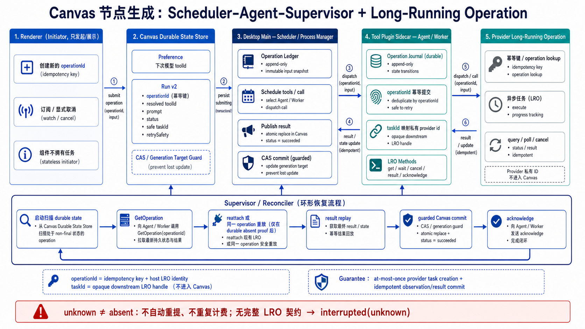

# Canvas Node Generation: Scheduler–Agent–Supervisor and Long-Running Operations

Status: historical implementation record for `origin/convax-next` at
`06f993e6dea3c3cff59ec7d335cf7ebc7b4a2e38`. The Scheduler–Agent–Supervisor and LRO
invariants remain current, but Plugin authoring now uses only `convax.plugin/8`,
immutable ActiveSet snapshots, and code-generated API/Skill references.

This document is the normative design implemented by this change. It applies the
industry-standard **Scheduler–Agent–Supervisor** pattern to a durable
**Long-Running Operation (LRO)**: Desktop Main schedules and persists the operation,
the verified Tool Plugin sidecar executes it, and the Main-owned supervision phase
reconciles it after failures. Submission is idempotent, task recovery is
crash-safe, result replay is byte-verified, and cancellation never requires a second
billable call. Any runtime that cannot satisfy the complete LRO contract stays on
the legacy fail-closed `interrupted(unknown)` path.



## 1. Decision

Convax will not define `resume(operationId, taskId)` as “run the generation tool
again.” The durable unit is a host-created **Long-Running Operation**, and recovery
means getting, waiting for, cancelling, or replaying the result of that already
accepted operation.

The protocol has two distinct identities:

- `operationId` is generated and persisted by Convax before any external effect. It
  is the idempotency key for submission and the recovery key for the window in
  which an external task exists but no `taskId` has reached Canvas.
- `taskId` is a sidecar-issued, host-safe receipt for an already created external
  task. It binds precise get, wait, result, and cancellation requests. It is not
  a submission idempotency key and is not a bearer credential.

The complete guarantee is:

> For one exact operation and request fingerprint, Convax and a
> recovery-capable sidecar create at most one provider task; uncertain state never
> causes an automatic second submission; an accepted task can be queried,
> reattached, cancelled, and have its terminal result replayed after host or
> sidecar restart.

This is not named an “exactly-once architecture.” Distributed systems cannot prove
unconditional mathematical exactly-once execution across an arbitrary provider. The
enforceable guarantee is stated directly: at-most-once provider task creation plus
idempotent LRO observation and result commit.

### Standard pattern vocabulary

The design deliberately uses published architecture and API vocabulary rather than
inventing a Convax-specific architecture name:

| Convax component                     | Standard role                         |
| ------------------------------------ | ------------------------------------- |
| Desktop Main generation service      | Scheduler / Process Manager           |
| verified Tool Plugin sidecar         | Agent / Worker                        |
| Main-owned startup supervision phase | Supervisor / reconciler               |
| Canvas run plus private Main ledger  | durable state store and checkpoints   |
| `operationId`                        | idempotency key and host LRO identity |
| `taskId`                             | opaque downstream LRO handle          |
| revision, CAS, and target guard      | optimistic concurrency control        |

“Agent” in Scheduler–Agent–Supervisor means an execution adapter, not the Convax
product Agent. The protocol surface follows the approved
[Google AIP-151 Long-running operations](https://google.aip.dev/151) shape. Stable
request identities follow the idempotent-API practice documented by
[AWS](https://aws.amazon.com/builders-library/making-retries-safe-with-idempotent-APIs/),
and startup convergence is a reconciliation loop in the sense documented by
[Kubernetes controllers](https://kubernetes.io/docs/concepts/architecture/controller/).
The overall pattern is the
[Scheduler–Agent–Supervisor pattern](https://learn.microsoft.com/en-us/azure/architecture/patterns/scheduler-agent-supervisor).

This design is not Saga, two-phase commit, Transactional Outbox, or Event Sourcing:
the provider is not a transaction participant, no compensating distributed
transaction is defined, no database-and-outbox atomic write exists, and Canvas state
is not reconstructed from an append-only event stream.

## 2. Goals and non-goals

Goals:

- persist the node’s next-run preference separately from its most recent actual run;
- persist bounded portable operation, prompt, resolved tool, task receipt, status,
  and retry-safety state;
- submit only after Canvas state, Desktop’s private ledger, and immutable input
  snapshots are durable;
- recover both task-receipt crash windows:
  - provider accepted the task before the sidecar returned `taskId`;
  - sidecar returned `taskId` before Canvas persisted it;
- reattach to polling without a host-wide timeout;
- replay a completed result without repeating generation;
- make explicit cancellation work before and after a task receipt exists;
- preserve existing Canvas replacement guards and atomic resource-plus-success
  commit;
- support old Tool Plugins without weakening safety or adding vendor branches;
- cover host crash, sidecar crash, Canvas conflict, Plugin update/uninstall, target
  deletion, active Canvas switching, and renderer unmount/remount.

Non-goals:

- Canvas does not understand provider names, provider job identifiers, accounts,
  credentials, URLs, native paths, or sidecar storage;
- cross-device active-task ownership and transfer are outside the current
  single-machine product;
- `taskId` alone never authorizes recovery;
- recovery does not revive a deleted or edited Canvas target;
- Convax does not simulate provider idempotency when neither the provider nor the
  sidecar can prove it.

## 3. Ownership

### `@convax/canvas`

Canvas owns:

- the versioned portable `convaxGenerationRun` schema;
- parsing, migration, size bounds, and non-destructive handling of unknown schemas;
- legal run transitions, terminal retry-safety, and clone semantics;
- typed run application operations;
- the generation-specific content guard;
- atomic generated-resource replacement plus `succeeded`.

Canvas does not own runtime fingerprints, native paths, input snapshots, Plugin
packages, sidecar journals, provider identities, or startup orchestration.

### Desktop Main

Desktop Main owns:

- the private operation ledger and immutable prepared-input store;
- exact Plugin, manifest, executable, authorization, and recovery-capability binding;
- live execution and recovery single-flight coordination;
- launching a pinned runtime for submit or recovery;
- the generic sidecar recovery client;
- startup reconciliation and task/result reattachment;
- cancellation across queue, preparation, submission, polling, and recovery;
- applying every portable transition through Canvas application services.

Renderer never becomes an operation registry.

### Tool Plugin sidecar

A recovery-capable sidecar owns:

- a durable private operation journal;
- translation between safe `taskId` and raw provider task identity;
- provider idempotency or provider operation lookup;
- provider polling and cancellation;
- durable or reproducible terminal results;
- exact handling of repeated requests for the same operation.

Provider-specific behavior stays entirely behind this boundary.

### Desktop renderer

Renderer:

- creates a fresh `operationId` for a genuinely new user submission;
- submits, explicitly cancels, and subscribes through narrow Desktop APIs;
- hydrates prompt, resolved tool, status, and retry safety from Canvas;
- may display a transient Main-reported `recovering` projection.

Renderer does not edit `.convax` JSON, call recovery methods directly, persist
private receipts, or resubmit an indeterminate operation.

## 4. Identity and trust model

The following values are related but not interchangeable:

| Value                    | Creator              | Durable owner                | Purpose                                            |
| ------------------------ | -------------------- | ---------------------------- | -------------------------------------------------- |
| `operationId`            | Convax renderer/host | Canvas + Desktop + sidecar   | submission idempotency and pre-receipt lookup      |
| `requestDigest`          | Desktop Main         | Desktop + sidecar            | reject reuse of an operation with different inputs |
| `taskId`                 | sidecar              | Canvas + Desktop + sidecar   | host-safe receipt for the accepted provider task   |
| raw provider task id     | sidecar/provider     | sidecar private journal only | provider query/cancel                              |
| `executionBindingDigest` | Desktop Main         | Desktop private ledger       | pin the exact authorized runtime and contract      |

`operationId` is unique inside a scoped `{ projectId, canvasId, nodeId }` operation
owner. The request digest covers the canonical tool id, prompt, scalar input,
declared references, immutable input content digests, delivery mode, expected
output contract, and target guard. It excludes volatile paths, process ids,
timestamps, credentials, and renderer state.

The execution binding digest always covers the exact Plugin bytes, authorized
runtime identity, sidecar recovery binding, and base generation tool id. For a
runtime model selection it also covers the Main-owned selector field and value.
Existing schema-1 records remain addressable by their already-persisted digest;
new records never let two tools sharing one sidecar binding reuse a pinned runtime
record.

Every lookup, query, await, result, cancel, replay, and acknowledgement must match:

- the scoped operation owner;
- the original `operationId`;
- the original `requestDigest`;
- the original tool contribution;
- the exact `executionBindingDigest`;
- the original `taskId` when one exists.

Mismatch fails closed and never falls back to a currently installed runtime.

## 5. Portable Canvas state

The existing next-run preference remains independent:

```ts
metadata.convaxGenerationPreference = {
  schema: "convax.node-generation-preference/1",
  toolId: string,
}
```

The current run schema is version 3:

```ts
metadata.convaxGenerationRun = {
  schema: "convax.node-generation-run/3",
  operationId: string,
  toolId: string,
  prompt: string,
  status:
    | "submitting"
    | "running"
    | "succeeded"
    | "failed"
    | "cancelled"
    | "interrupted",
  taskId?: string,
  retrySafety?: "safe" | "unknown",
}
```

Only the most recent run is retained. `retrySafety` is present only on terminal
states:

- `safe` means Main has durable proof that the prior operation cannot later produce
  a second charge or result, so a new operation may be offered;
- `unknown` means the original side effect cannot be disproved or safely queried.
  UI must not offer ordinary retry because a new operation could duplicate a charge.

`interrupted` therefore does not automatically mean “retryable.”

`prompt` is the normalized user-editable draft, not Main's effective model prompt.
It may be empty when selected Canvas text nodes provide the complete prompt context.
Main composes the exact effective prompt transiently and, when recovery is admitted,
retains it only inside its private digest-bound recovery snapshot. Editing and
retrying a run therefore cannot append the same Canvas text twice.

Portable bounds:

- `prompt`: trimmed, no NUL, at most the existing 64 Ki character generation limit;
- `operationId`: printable and at most 128 characters;
- `toolId`: host-opaque and at most 512 characters;
- `taskId`: at most 512 characters and restricted to the portable opaque identifier
  alphabet;
- complete serialized namespace: bounded and structurally exact.

No Cookie, Token, authorization material, URL, native path, raw provider id, raw
stderr, or raw diagnostic may enter Canvas.

An absent namespace stays absent. Unknown or malformed schemas remain unmodified
and unreadable; commands do not overwrite them with defaults. Migration from
`convax.node-generation-run/1` and `/2` preserve every valid field. Version 3
permits the empty editable draft needed by prompt-context-only runs. An active v1 run lacks
the proof required for automatic recovery and is reconciled conservatively unless
a matching private ledger can upgrade it.

## 6. Canvas state machine and replacement boundary

Portable transitions are:

```text
absent or terminal(previous operation)
  -> submitting(new operation)

submitting(same operation)
  -> running
  -> running(first taskId)
  -> failed(safe) | cancelled(safe) | interrupted(safe|unknown)

running(same operation)
  -> running(same taskId or first taskId)
  -> succeeded | failed(safe) | cancelled(safe) | interrupted(safe|unknown)

terminal(same operation)
  -> no transition
```

A different task id for the same operation fails closed. Duplicate lifecycle
events with identical values are idempotent. A new operation cannot replace an
active operation or an `interrupted(unknown)` operation without an explicit
resolution that proves retry safety.

The generated content guard omits only the Canvas-owned run and preference
namespaces. It still protects node type, resource kind, Project reference, MIME,
text, dimensions, duration, Plugin state, label, lifecycle, and all real resource
content. Run/task updates and a next-run preference change do not invalidate the
current generation; real target edits do.

Generated replacement starts from newly admitted resource data and explicitly
preserves only the live, validated preference and run namespaces. The resource and
`succeeded` status are committed by one Canvas command and one repository CAS.

Duplicating an active node copies preference and historical prompt/tool, removes
task ownership, sets `interrupted(unknown)`, and cannot accept callbacks for the
original task. Deleting a node makes every late transition and replacement fail
closed.

## 7. Desktop private operation ledger

Desktop persists one private record before any external request under:

```text
Electron userData/generation-operations/operation-v1/<sha256(scoped-operation-key)>.json
```

The key is a SHA-256 of the canonical project, Canvas, node, and operation identity;
untrusted ids are never used as path components. The directory is private,
symlink-safe, bounded, and updated by atomic replace.

Conceptual schema:

```ts
interface GenerationOperationLedgerV1 {
  schema: "convax.generation-operation-ledger/1"
  projectId: string
  canvasId: string
  nodeId: string
  operationId: string
  requestDigest: string
  toolId: string
  executionBindingDigest: string
  pluginPackageDigest: string
  runtimeAuthorizationDigest: string
  sidecarRecoveryBindingDigest: string
  inputSnapshotId: string
  targetGuardDigest: string
  phase:
    | "prepared"
    | "dispatching"
    | "accepted"
    | "result-ready"
    | "committed"
    | "acknowledged"
    | "cancelled"
    | "failed"
    | "indeterminate"
  taskId?: string
  resultDigest?: string
  createdAt: number
  updatedAt: number
}
```

Time fields are Desktop-private retention data and use an injected clock. They do
not order Canvas domain transitions.

Main's `prepared` phase means immutable inputs and the exact runtime binding are
durable, but the external dispatch has not been authorized. It is therefore proof
that no `tools/call` was written and is never automatically replayed. This is
distinct from a sidecar returning `prepared` after Main has already durably entered
`dispatching`.

The sidecar handshake returns a bounded opaque recovery-binding value representing
the private service/account context that owns its journal. Desktop persists only
its digest. The ledger stores no credentials, account display data, or raw provider
id. Sensitive binding material is represented only by digests or references to
existing Desktop-private authorization snapshots.

All operation mutations are serialized by scoped operation key. Replaying the same
operation with a different request digest fails before sidecar work. A ledger is
not deleted until the sidecar has acknowledged terminal result disposal. The
current retention policy is zero after that durable `acknowledged` transition:
referenced input/runtime state is reclaimed first and the ledger is removed last,
so a crash at any cleanup boundary is restart-safe.

## 8. Immutable prepared-input store

Full recovery cannot replay an exact submission from mutable Project files or
temporary native paths. Before entering `dispatching`, Main:

1. validates current Project references and generation guards;
2. snapshots every external-call input into a private content-addressed operation
   store;
3. records exact size and SHA-256;
4. persists the canonical scalar request and snapshot manifest in the ledger;
5. revalidates the live references and target before dispatch.

The store is below Desktop private state, never `.convax`, and never exposed through
preload. Recovery reopens only verified immutable snapshots. If the snapshots,
ledger, authorization receipt, or pinned runtime are missing or changed, recovery
fails closed.

Snapshot storage is bounded per operation and globally. Terminal acknowledgement
allows immediate reference-aware garbage collection. Crash cleanup never removes
inputs belonging to a non-terminal ledger.

## 9. Long-Running Operation capability admission

Durable LRO support is an atomic capability, not a loose collection of optional
booleans. In the current breaking Plugin ABI it is declared by
`convax.plugin/8` on each generation tool:

```json
{
  "recovery": {
    "schema": "convax.generation-lro/1",
    "mode": "long-running-operation"
  }
}
```

Declaring this mode promises all of the following:

- idempotent submit by `operationId` and `requestDigest`;
- `GetOperation`-style lookup by operation id before a task receipt exists;
- stable safe task receipts;
- get and long-lived wait;
- cancellation by operation, with task receipt confirmation when available;
- durable/reproducible terminal result replay;
- terminal acknowledgement and bounded journal cleanup;
- recovery after sidecar process restart.

The sidecar must independently advertise the same exact capability during MCP
initialization and return its stable opaque recovery-binding value.
Manifest/runtime disagreement or recovery-binding drift fails before submission or
recovery.

Within v8, tools that omit `recovery` are recovery-unsupported. They continue to
persist Canvas run state and task receipts when available, but restart marks an
orphaned active run `interrupted(unknown)` and never invokes the tool.

Convax contains no Plugin-id, provider, model, or vendor branches. A tool either
satisfies the complete durable LRO contract or it does not.

## 10. Generic sidecar LRO protocol

Normal generation remains an MCP `tools/call` to the declared generation tool. A
recovery-capable call carries exact host metadata:

```json
{
  "_meta": {
    "convaxGeneration": {
      "schema": "convax.generation-operation/1",
      "operationId": "<host operation>",
      "requestDigest": "<sha256>",
      "recovery": "required",
      "progressToken": "<live-call token>"
    }
  }
}
```

The sidecar extension surface is versioned, host-neutral, and aligned with the LRO
resource pattern:

```ts
getOperation({ operationId, requestDigest, taskId? })
waitOperation({ operationId, requestDigest, taskId? })
cancelOperation({ operationId, requestDigest, taskId? })
getOperationResult({ operationId, requestDigest, taskId, outputDirectory })
acknowledgeOperation({ operationId, requestDigest, taskId?, resultDigest? })
```

The corresponding fixed JSON-RPC methods are:

```text
convax/generation/operations/get
convax/generation/operations/wait
convax/generation/operations/cancel
convax/generation/operations/result
convax/generation/operations/acknowledge
```

They use exact request and response keys. Responses normalize to:

```ts
type GenerationRecoverySnapshot =
  | { status: "absent" }
  | { status: "prepared" }
  | { status: "submitted"; taskId: string }
  | { status: "running"; taskId: string }
  | { status: "succeeded"; taskId: string; resultDigest: string }
  | { status: "failed"; taskId?: string; error: HostSafeError }
  | { status: "cancelled"; taskId?: string }
  | { status: "unknown" }
```

Semantics:

- `absent` is returned only when the sidecar can durably prove that it never
  accepted or submitted the operation;
- `unknown` means absence cannot be proven and forbids automatic resubmission;
- get, wait, result, cancel, and acknowledge never create a provider task;
- `waitOperation` has no host overall timeout; sidecar bounds individual provider
  requests and owns polling;
- result replay is content-identical by `resultDigest`;
- `outputDirectory` is a fresh Main-private directory accepted only by the result
  method; it never crosses preload or persistence;
- repeated cancellation and acknowledgement are idempotent;
- terminal state never regresses;
- exact operation/request/task mismatch is an error, not `absent`.

The existing structured lifecycle notification remains:

```ts
type GenerationToolLifecycleEvent = { type: "external-started" } | { type: "submitted"; taskId: string }
```

It is an optimization for immediate Canvas persistence, not the recovery source of
truth. Recovery always consults the sidecar journal.

## 11. Sidecar durable journal algorithm

A recovery-capable runtime receives
`CONVAX_GENERATION_LRO_DIRECTORY`, a host-provisioned,
Plugin-and-binding-scoped private state directory. The path never crosses preload
or Canvas. Desktop validates the directory and pins it to the exact runtime
authorization; the sidecar owns journal contents inside that scope. Runtime updates
cannot reuse or migrate another binding’s journal implicitly.

For a first submit, a conforming sidecar:

1. validates operation id, request digest, tool, and arguments;
2. atomically writes a private `prepared` journal record;
3. submits to the provider using `operationId` as the provider idempotency key, or
   an equivalent provider operation-lookup mechanism;
4. atomically records raw provider identity, stable safe `taskId`, and `submitted`;
5. emits the structured `submitted` lifecycle event;
6. polls through bounded provider requests;
7. records terminal state and enough information to reproduce the exact normalized
   result;
8. serves result replay until terminal acknowledgement.

On repeated `tools/call`:

- the same operation and request digest returns or reattaches to the same task;
- a different request digest fails closed;
- it never creates another provider task.

If the sidecar crashes after provider acceptance but before recording the provider
task id, it must reconcile using the provider idempotency key or provider operation
lookup. Until it proves accepted or absent, it returns `unknown`. A provider that
cannot support this proof cannot back a tool declaring full recovery.

Raw provider identifiers, accounts, credentials, response URLs, and diagnostics
remain in sidecar-private state. `taskId` is a stable random handle mapped to that
state.

## 12. Main submission lifecycle

For a node-owning recovery-capable generation:

1. resolve the exact tool and recovery declaration;
2. load the authoritative Canvas target and construct its generation guard;
3. persist Canvas `submitting`;
4. snapshot immutable inputs and persist the canonical request;
5. pin the exact Plugin package, manifest, executable authorization, sidecar
   protocol, and capability into the private ledger;
6. persist ledger `prepared`;
7. revalidate Canvas scope, references, target, cancellation, Plugin identity, and
   runtime identity; perform the bounded service check; then revalidate Canvas
   inputs again;
8. persist Canvas `running`, revalidate the resulting target once more, and persist
   ledger `dispatching` immediately before writing `tools/call`;
9. dispatch with operation metadata;
10. persist a structured `taskId` in the ledger first and Canvas second;
11. await or poll the same operation;
12. retrieve and verify the exact terminal result digest;
13. admit outputs through the existing Project resource boundary;
14. commit generated resource plus Canvas `succeeded` atomically;
15. persist ledger `committed`;
16. acknowledge the sidecar operation; cleanup is asynchronous and cannot turn the
    Canvas success into failure.

For host-created pending output, pending node creation and `submitting` remain one
Canvas CAS. Toolbar, Canvas-generating Agent tools, and Canvas-generating Plugin
operations all use this owner-creating path; they do not add an ownerless generated
node after the external call. For existing-node replacement, failure or cancellation
never alters the prior resource. A declarative text operation with `delivery:
"return"` creates no Canvas node and therefore has no node run namespace; it retains
the same live at-most-once executor and explicit Agent cancellation boundary, but is
outside node-result persistence and Canvas result replay.

If publication succeeds but final Canvas CAS fails, the user-visible Generated file
is retained under the existing partial-success contract. Recovery never silently
replaces a changed or deleted target.

## 13. Startup recovery

Startup recovery runs in Main before renderer hydration:

1. load active Canvas runs and private ledgers;
2. acquire a scoped recovery single-flight lease;
3. cross-check Canvas owner, operation, request, task receipt, and ledger;
4. if Main's ledger is still `prepared`, persist a safe failed/cancelled Canvas
   terminal state and reclaim the local snapshot without launching a sidecar;
5. otherwise launch only the pinned authorized runtime in recovery mode;
6. verify the exact recovery handshake;
7. call `lookupOperation(operationId, requestDigest)`;
8. reconcile from the returned proof:
   - for a `dispatching` or later Main ledger, sidecar `prepared` or `absent`:
     replay the exact immutable `tools/call` with the same operation id and request
     digest;
   - `submitted` or `running`: persist a missing task receipt and reattach polling;
   - `succeeded`: replay and verify the terminal result, then attempt the guarded
     Canvas commit;
   - `failed` or `cancelled`: persist the matching safe terminal Canvas state;
   - `unknown`: persist `interrupted(unknown)` and never resubmit;
9. publish Canvas invalidation, then hydrate Renderer from authoritative state.

Replaying after `absent` is safe only because a full-recovery sidecar proves absence,
uses the same immutable request, and guarantees idempotent submit. It is not a new
operation.

If Canvas already says `succeeded` while the ledger lacks acknowledgement, Main
acknowledges and cleans up without re-admitting output. If the ledger is terminal
but Canvas is active, Main applies the terminal result through Canvas CAS. Every
conflict reloads Canvas, ledger, and sidecar state before a bounded retry.

An active Canvas run without its exact private ledger is
`interrupted(unknown)`. A ledger whose node was deleted never revives the node;
Main best-effort cancels or acknowledges the external operation and retains only
private audit state until cleanup.

## 14. Update, uninstall, single-host lifecycle, and late callbacks

An accepted operation pins an immutable recovery runtime snapshot and authorization
identity. Plugin update or uninstall:

- prevents new calls through the old contribution;
- does not redirect recovery to the new executable;
- retains the minimum private old runtime/journal needed for query, cancel, and
  result replay until terminal acknowledgement;
- fails closed to `interrupted(unknown)` if the pinned runtime cannot be proven.

No provider-specific migration is attempted.

Explicit sign-out first blocks new submissions and attempts operation-scoped
cancellation or terminal acknowledgement for every active ledger bound to that
private service identity. Credentials and private account state may be cleared only
after those operations are terminal, or after the user accepts that unresolved
operations will remain `interrupted(unknown)`. Sign-out never silently switches an
operation to another account.

The current product is single-machine. Recovery authority is scoped to the one local
Desktop installation and its private ledger, pinned runtime, and sidecar journal.
Cross-device Project opening, operation ownership transfer, and multi-host
coordination are excluded from this design and its validation matrix.

Late callbacks are accepted only by the live scoped operation whose Canvas and
ledger still match. Deleted nodes, superseded operations, changed guards, changed
runtime identity, and terminal Canvas state reject late mutation.

## 15. Cancellation

Explicit cancellation is operation-scoped:

- before external dispatch, Main cancels locally and records `cancelled(safe)`;
- during dispatch without `taskId`, Main calls the LRO `cancel` method by operation
  id;
- after receipt, it includes both operation and task ids;
- after restart, it uses the same pinned runtime and ledger;
- cancellation acknowledgement is required before `retrySafety: "safe"`;
- cancellation timeout or `unknown` becomes `interrupted(unknown)`, not safely
  cancelled.

Renderer destruction, node unmount, selection changes, Canvas switches, and panel
changes do not imply cancellation. OpenCode Stop is different: the Agent adapter
turns it into an explicit operation-scoped Main cancellation before detaching its
wait.

## 16. Result replay and acknowledgement

A succeeded task is not complete from Convax’s perspective until its result is
durably committed or explicitly retained as partial success.

The LRO `result` method:

- returns the exact normalized result bound to `resultDigest`;
- contains only bounded text or artifacts written below the supplied
  Main-private `outputDirectory`;
- can be called repeatedly after sidecar restart;
- never repeats provider generation;
- rejects changed operation/request/task identity.

Main canonicalizes normalized MCP content, replaces every staged native location
with a relative name plus byte size and SHA-256, and recomputes `resultDigest`.
The digest therefore stays identical across different host paths but changes with
any content byte. Main also verifies artifact size, type, containment, and stable
bytes before Project publication, then revalidates Canvas references and the target
guard immediately before the atomic generated replacement.

The LRO `acknowledge` method is sent only after:

- Canvas resource plus `succeeded` committed; or
- a terminal failure/cancellation was durably represented; or
- the host deliberately retained a documented partial result that no longer needs
  sidecar replay.

Acknowledgement is idempotent. A crash before acknowledgement causes replay, not a
second generation.

## 17. Security and privacy

- operation and task ids are bounded opaque identifiers, not paths or credentials;
- ledger filenames use hashes, never external ids;
- private directories reject symlinks and permissive permissions;
- request and result digests use canonical serialization and SHA-256;
- runtime recovery uses an exact authorized immutable snapshot;
- renderer/preload never receive private ledger content, native paths, provider ids,
  credentials, or raw diagnostics;
- sidecar recovery responses use exact schemas and bounded host-safe errors;
- no task state is parsed from logs, progress text, stderr, or URLs;
- Project `.convax` contains only Canvas-owned portable state;
- journal and input cleanup are bounded, injected-clock-driven, and serialized with
  active recovery;
- unknown state always fails closed.

## 18. IPC and UI

Desktop protocol exposes:

- generation submission and explicit cancellation;
- authoritative Canvas reconciliation before hydration;
- a bounded subscription/projection indicating `recovering`, without private
  receipt fields.

It does not expose generic sidecar method selection or recovery credentials.
Renderer cannot request “resubmit this old operation.”

UI behavior:

- `submitting`/`running`: active display; after restart Main may project
  `recovering`;
- `succeeded`: historical resolved tool and committed result;
- `failed`/`cancelled` with `retrySafety: "safe"`: modify and retry with a fresh
  operation id;
- `interrupted(unknown)`: explain that the prior external outcome is uncertain,
  disable ordinary retry, and offer only safe inspect/reconnect/cancel actions;
- model preference remains independent from the run’s resolved tool.

## 19. Crash-window proof matrix

The implementation is incomplete until deterministic fault injection proves every
boundary:

| Crash point                                    | Required recovery                            |
| ---------------------------------------------- | -------------------------------------------- |
| before Canvas `submitting`                     | no operation exists                          |
| after Canvas `submitting`, before ledger       | interrupt unknown; no call                   |
| after ledger/input snapshots, before dispatch  | fail safe locally; never call or replay      |
| after Main `dispatching`, before provider call | get, then same-operation replay              |
| after sidecar `prepared`, before provider call | get prepared; same-operation replay          |
| provider accepted, before sidecar task journal | provider idempotency get; never second task  |
| sidecar accepted, before lifecycle receipt     | operation get returns stable task            |
| lifecycle receipt, before Desktop ledger CAS   | operation get restores task                  |
| ledger task CAS, before Canvas task CAS        | ledger/get restores Canvas task              |
| task succeeds, before result journal           | provider terminal get reconstructs result    |
| result journal, before Project publication     | replay same result digest                    |
| Project publication, before Canvas CAS         | retain partial result; no regeneration       |
| Canvas success CAS, before ledger commit       | detect Canvas success; do not republish      |
| ledger commit, before sidecar acknowledgement  | idempotent acknowledgement                   |
| cancellation request, before acknowledgement   | get operation; safe only with terminal proof |

Every row asserts:

- provider task creation count is at most one;
- no request-fingerprint mismatch is accepted;
- unknown never becomes absent;
- deleted or edited Canvas targets are not revived;
- no credential, path, raw provider id, or diagnostic crosses the portable boundary.

## 20. Compatibility and rollout

- Pre-v8 Plugin manifests are rejected at admission and are not normalized into
  the current runtime.
- Full recovery is admitted only by the exact v8 manifest/runtime contract.
- V8 tools without the complete LRO declaration may still return structured task
  receipts, but remain restart-interrupted.
- `convax.node-generation-run/1` and `/2` are read and explicitly migrated; unknown schemas
  remain untouched.
- Desktop protocol and `@convax/canvas` public version must be bumped when the
  corresponding contracts land.
- Recovery is enabled only after private storage, sidecar protocol, startup
  orchestration, UI retry safety, and the complete crash matrix are all present.
  There is no feature flag that enables automatic replay with only part of the
  proof chain.

## 21. Required validation

Canvas:

- v1-to-v2 migration and unknown/invalid schema preservation;
- preference versus resolved tool separation;
- legal and illegal transitions, task immutability, and retry-safety invariants;
- complete string and JSON bounds;
- generated guard stability and atomic success replacement;
- clone/delete/stale revision behavior;
- prohibition on retrying `interrupted(unknown)`.

Desktop private storage:

- atomic ledger and snapshot publication;
- request canonicalization and digest mismatch rejection;
- symlink, permission, truncation, tamper, size, and cleanup tests;
- exact runtime/authorization pinning;
- concurrent operation serialization and terminal GC.

Sidecar protocol:

- initialization capability agreement;
- exact schemas for get/wait/cancel/result/acknowledge;
- idempotent repeated submit and task receipt;
- old Plugin compatibility;
- no overall wait timeout;
- provider-get and result-replay fixtures;
- malformed, oversized, credential-like, path-like, and raw-diagnostic rejection.

Main orchestration:

- the complete crash-window matrix above;
- restart reattachment without a second provider task;
- task recovery before and after both Canvas/ledger receipt CAS boundaries;
- result replay and Canvas atomic commit;
- explicit cancel before/after receipt and after restart;
- Plugin update/uninstall with pinned recovery runtime;
- Canvas switch, renderer unmount/remount, late callback, target deletion, and stale
  revision;
- no native path, credentials, raw provider id, or raw diagnostics in Canvas, IPC,
  logs, or renderer.

Validation commands:

- affected Canvas and Desktop `bun run typecheck`;
- affected Canvas and Desktop `bun run test`;
- root `bun check`;
- package pack/declaration checks;
- Desktop production build and Electron smoke, including one real Canvas CAS race,
  guarded replacement after an unrelated revision, late callback after target
  deletion, restart-style reconciliation of an active legacy run, and terminal-state
  renderer unmount/remount;
- `git diff --check`.

### Validation ownership

The proof is intentionally layered instead of forcing every crash point into one
UI scenario:

| Evidence layer                   | Owned proof                                                                                                                                                                                       |
| -------------------------------- | ------------------------------------------------------------------------------------------------------------------------------------------------------------------------------------------------- |
| Canvas domain tests              | schema migration, transition invariants, bounds, clone/delete semantics, generation-specific guard and atomic replacement                                                                         |
| Desktop generation-service tests | durable ledger/input ordering, at-most-once dispatch, task receipt CAS, restart reattachment, result replay, cancellation, target/reference races and partial publication                         |
| Renderer lifecycle tests         | an accepted Main-owned generation remains alive when switching Canvas unmounts the owning card; remount hydrates active and terminal state from Canvas metadata                                   |
| LRO protocol/runtime tests       | v8 all-or-nothing admission, fixed get/wait/cancel/result/acknowledge methods, pinned executable identity, safe opaque receipts and pre-v8 rejection                                              |
| stdio MCP tests                  | structured lifecycle receipts, compatibility handshake, cancellation, bounded messages, no overall generation/wait timeout and diagnostic non-disclosure                                          |
| built Electron smoke             | real Main/IPC/Project persistence CAS race, unrelated edit preservation, guarded success, terminal-state renderer remount, deleted-target late callback rejection and legacy restart interruption |

The built smoke is representative end-to-end evidence; the deterministic package
tests own the exhaustive crash-window matrix because they can inject each boundary
without relying on timing.
