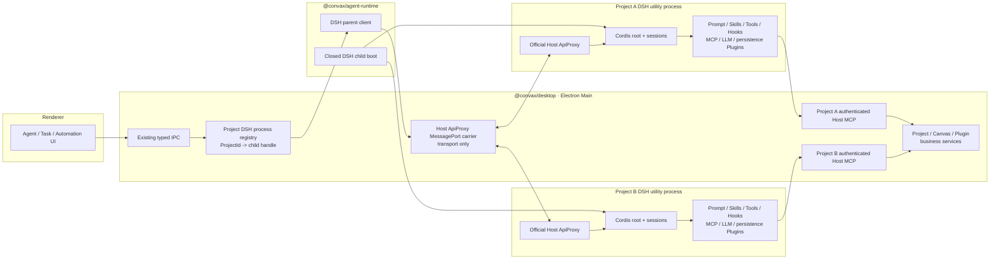

# DeepSeek Harness migration assessment

Status: accepted target design; the macOS arm64 adoption-gate implementation has
passed both Go/No-Go proofs in section 13. Product cutover remains M3 work, so this
document does not by itself authorize removing the current OpenCode product path.

Research date: 2026-08-18.

Implementation proof date: 2026-08-19.

The executable proof is intentionally separate from the product entry. The packaged
gate contains no OpenCode runtime, while the ordinary Desktop product continues to
use its current OpenCode composition until M3 changes the public runtime path.

## 1. Decision

Adopt DeepSeek Harness (DSH) as the single target Agent runtime. Do not build a
dual-backend router, an OpenCode fallback, or a Convax-owned Agent control protocol.

The target topology is:

- at most one independent DSH process for each live Project;
- all sessions for the same Project share that process;
- Desktop Main owns Project-to-process composition, capability issuance, and
  lifecycle, but not Agent session semantics;
- the parent and child reuse the official DSH Host ApiProxy contract over an
  Electron MessagePort carrier;
- DSH/Cordis Plugins own Prompt, Skill, Tool, Hook, MCP, LLM, and session-persistence
  mechanics inside the child;
- Convax product capabilities enter DSH only through an authenticated,
  Project-scoped Host MCP endpoint backed by the existing owner-defined business
  operations; and
- new sessions use DSH only. A DSH failure never replays the prompt through
  OpenCode.

The first implementation is a packaged vertical slice. It is Go only if a real
packaged Electron app proves both the official Host control plane and two-Project
capability isolation. Those are the only adoption gates.

## 2. What changed from the previous assessment

The previous document inspected the narrow SDK JSON-RPC and ACP transports and
concluded that Convax needed a successor SDK protocol. That was the wrong control
plane boundary.

The inspected DSH release already includes `@deepseek-ai/dsh-host-apiproxy`. Its
browser-safe contract defines the four wire quadrants:

1. client request;
2. server response;
3. server request; and
4. client response.

It also exposes the Host-facing session, history, fork, prompt, cancel, model,
event, approval, question, Skill, settings, credential, and related interaction
surfaces needed by a product client. The contract is deliberately separated from
its physical fetch/SSE carrier.

Convax therefore does not need to wait for a new Agent business protocol. It needs
one new transport aspect that carries the official envelopes across a private
parent-child MessagePort, preserving the official schemas, errors, correlations,
streams, and interaction semantics.

The old twelve-gate parity matrix also mixed core adoption blockers with features
that can be intentionally omitted from the first release. Remote MCP OAuth,
OpenCode session conversion, the OpenCode Hook ABI, hot profile replacement, and
automatic child recovery are now explicit deferred features rather than reasons to
retain a second runtime.

## 3. Evidence baseline

| Subject               | Evidence used                                                                                                                                                                                                                                         |
| --------------------- | ----------------------------------------------------------------------------------------------------------------------------------------------------------------------------------------------------------------------------------------------------- |
| Convax                | `origin/main` at `f8440b1d3fd9427b3063a178662106b0d03b1a1a`; the current runtime pins `opencode-ai` and `@opencode-ai/sdk` `1.18.1`                                                                                                                   |
| DeepSeek Harness      | [`dsh-v0.1.0-rc.7`](https://github.com/deepseek-ai/deepseek-harness/releases/tag/dsh-v0.1.0-rc.7), commit [`99f6f02fecdb7dff40c3fbc9470f5907c29f74ca`](https://github.com/deepseek-ai/deepseek-harness/tree/99f6f02fecdb7dff40c3fbc9470f5907c29f74ca) |
| Primary control plane | [`dsh-host-apiproxy`](https://github.com/deepseek-ai/deepseek-harness/blob/99f6f02fecdb7dff40c3fbc9470f5907c29f74ca/packages/host/apiproxy/README.md), not the narrower SDK JSON-RPC or ACP adapters                                                  |
| Runtime composition   | [`dsh-app-boot`](https://github.com/deepseek-ai/deepseek-harness/blob/99f6f02fecdb7dff40c3fbc9470f5907c29f74ca/packages/boot/app-boot/README.md) plus exact-pinned Cordis Plugins                                                                     |

The evidence is time-bounded. Implementation must pin one exact DSH version and
re-run both Go/No-Go proofs against the packaged bytes proposed for release.

## 4. Ownership

The design preserves Convax ownership instead of moving product semantics into DSH.

### `@convax/agent-runtime`

Owns the host-agnostic DSH integration:

- the existing vendor-neutral `AgentRuntime` / `AgentClient` behavior;
- the parent-side Host ApiProxy client and transport-neutral carrier endpoint;
- the child boot entry and closed DSH composition;
- renderer-safe projection of official events and interactions;
- generic configuration inputs such as cwd, state root, Prompt content, Skill roots,
  MCP rows, model routes, and protected execution posture; and
- deterministic disposal of one child handle.

It does not import Electron and does not learn Project, Canvas, Plugin,
Marketplace, ActiveSet, or Automation semantics.

### Desktop Main

Owns the product and native composition:

- `ProjectId -> DshProjectProcessHandle` lifecycle registry;
- stable Project binding and private state-root derivation;
- Electron utility-process startup, MessagePort transfer, health, close, and forced
  termination;
- exact ActiveSet lease resolution and generation of the child configuration;
- Project-scoped Prompt content, Skill roots, model gateway routes, and MCP
  capabilities;
- authenticated Host MCP endpoints and tokens;
- live Project/Canvas/Plugin authority rechecks at each business operation; and
- typed IPC projection to Renderer, Task, and Automation callers.

This registry is not an Agent backend router. It maps one stable Project identity to
one DSH process handle and never selects an execution engine.

### Existing domain and Plugin owners

Project, Canvas, Workbench, Marketplace, Plugin API, and Plugin SDK keep their
current business semantics. DSH does not become the owner of Canvas mutation,
Project persistence, Plugin grants, Marketplace identity, or generation execution.
UI, Agent, and Plugin entry points continue to call the same owner-defined
operations.

## 5. Target architecture

The process boundary is the first Project-isolation layer. The independently issued
Host MCP capability is the second. A bad Prompt, Skill, Tool, or Cordis Plugin
configuration in Project A must still be unable to call Project B because the child
never receives B's endpoint or token and Main revalidates A's live authority on each
call.

## 6. Why one process per Project

DSH can host several sessions and workspaces in one Cordis root. That capability is
not sufficient reason to place separate Convax Project authorities in one process.

One process per live Project gives the product a direct isolation boundary for:

- cwd and environment;
- Prompt and Skill roots;
- Tool and MCP registration;
- MCP endpoint and bearer token;
- model gateway routes and ephemeral credentials;
- session persistence and event streams; and
- Cordis Plugin state and teardown.

It also contains a child crash, loop, memory leak, or teardown failure to one
Project. Closing a Project revokes its MessagePort and Host MCP capability and then
terminates the complete child tree.

All sessions in the same Project share the process. Per-session processes would add
startup, memory, persistence, and recovery cost without improving the product's
actual authority boundary. DSH Agent Presets may still express personas within one
Project child; they do not replace Project isolation.

## 7. Official control plane and Electron carrier

The carrier must reuse official Host ApiProxy types, schemas, errors, and method
maps. A recommended shape is a new `AbstractApiClient` transport aspect on the
parent and `toFetchHandler(ctx.apiProxy)` on the child, joined by one transferred
MessagePort.

The carrier owns only physical delivery semantics:

- bounded frame and queue sizes;
- request correlation;
- both official Host downlink streams and their generation;
- caller cancellation, Project close, and app-quit propagation;
- child `ready`, `fatal`, and `closed` lifecycle;
- malformed, late, duplicate, and unknown frame rejection; and
- deterministic port and process disposal.

It does not own session identifiers, history folding, event vocabulary, approval
policy, question semantics, tool schemas, model selection, Skill discovery, or
Project authorization. It must not redeclare a similar set of DTOs or add a
`convax.agent-engine/*` business protocol.

The first choice is Electron `utilityProcess`. An equivalent independently owned
child process is acceptable only if the packaged proof demonstrates the same private
MessagePort, process-tree ownership, module closure, cancellation, and deterministic
shutdown. DSH must not remain in Electron Main as one in-process Cordis root.

## 8. Project process lifecycle and persistence

1. On the first Agent operation for a Project, Main resolves the stable Project
   binding, derives an owner-only runtime root, creates one authenticated Host MCP
   capability, and starts the packaged child entry.
2. Main supplies only a product-generated, allowlisted profile plus that Project's
   cwd, Prompt content, Skill roots, model routes, state root, and MCP capability.
3. The child completes App Boot, Plugin activation, persistence open, and Host
   ApiProxy readiness before Main reports the runtime ready.
4. Later sessions for the same Project reuse the handle. Another Project receives a
   different child, configuration, state root, endpoint, and token.
5. Project close and app quit first reject new work, cancel in-flight calls, perform
   a bounded DSH flush, revoke Host MCP, close the MessagePort, and terminate a child
   that does not exit within the shutdown bound.
6. In the first release, an unexpected child exit makes that Project's Agent
   unavailable. It does not replay side effects, restart automatically, or fall back
   to OpenCode.

DSH sessions persist below Desktop userData in a private directory partitioned by a
stable Host-derived Project key. They do not enter portable `.convax`, and a raw
Project path is not used as a storage directory name. Renderer and product tasks
store the DSH session id plus their existing Project scope; there is no second native
session-id mapping authority.

## 9. DSH/Cordis Plugin composition

“Plugin” names two distinct boundaries here:

- a DSH/Cordis Plugin composes runtime mechanics inside the isolated child;
- a Convax Plugin is an installed, immutable product capability governed by
  `convax.plugin/8`, ActiveSet leases, grants, and Host business boundaries.

They must not be conflated. Convax Plugins never gain direct access to the Cordis
root, MessagePort, native paths, or another Project.

| Product need              | DSH owner                         | Convax responsibility                                                 |
| ------------------------- | --------------------------------- | --------------------------------------------------------------------- |
| sessions, control, events | Host ApiProxy and session Plugins | typed IPC projection, Project routing, safe redaction                 |
| Prompt                    | system-prompt Plugin              | supply approved product content                                       |
| Skills                    | Skill registry/filesystem Plugins | supply only managed and exact leased read-only roots                  |
| Hooks                     | DSH/Cordis hook Plugins           | accept only a future DSH-native ABI; do not load OpenCode Hook bytes  |
| Host tools                | DSH MCP client Plugin             | issue one authenticated Project-scoped Host MCP capability            |
| remote MCP                | DSH MCP client Plugin             | supply admitted static/managed rows; OAuth rows unavailable initially |
| LLM                       | DSH LLM Plugin                    | supply validated loopback gateway routes and ephemeral credentials    |
| session persistence       | DSH persistence Plugins           | supply the Project-keyed private root and shutdown bound              |

The mechanics live in DSH Plugins, but authority and business execution remain in
their current Convax owners. In particular, using an MCP Plugin for Canvas tools
does not move Canvas validation or persistence out of Canvas/Main.

The current `convax.plugin/8` Hook contribution is an immutable OpenCode Plugin ESM
module and is not compatible with Cordis. The first cutover marks Hook-bearing
installations unavailable. A future DSH-native Hook contribution requires a
separate human-approved Plugin Host change and contract release; this design PR does
not silently reinterpret v8 bytes.

## 10. Closed product profile

The product must not boot DSH's developer default profile. Each Project profile is
generated from exact Host inputs and fails closed:

- only exact-pinned, approved DSH packages and Convax-owned adapter entries exist;
- user profile patches, HMR, ambient Cordis modules, and Project `.dsh`, `.agents`,
  `.claude`, or `.opencode` discovery are disabled;
- Skill providers use `includeDefaultRoots: false` and receive only Host-managed
  roots;
- native filesystem, bash, terminal, LSP, code runtime, subprocess, and arbitrary
  web/network tools are not mounted in the parity profile;
- Project and Canvas access is available only through typed Host MCP tools;
- one child never receives another Project's cwd, configuration, state root,
  endpoint, token, model credential, or session;
- runtime/profile directories are owner-only and durable config contains no
  long-lived credential;
- events, logs, diagnostics, and Renderer projections redact tokens, native paths,
  executable configuration, and raw provider errors; and
- each Host MCP call rechecks live Project binding, Canvas authority/revision,
  protected paths, Plugin principal, and cancellation immediately before effects.

This posture satisfies protected-path isolation by not mounting raw coding tools.
Adding them later requires a separate generic DSH confinement design with lexical,
realpath, symlink-swap, Windows-path, network, process, and cancellation proof.

## 11. OpenCode cutover and deferred features

The first release is a clean runtime cutover:

- every new, resumed, displayed, prompted, and canceled session is a DSH session;
- no call probes two backends and no DSH error triggers an OpenCode retry;
- no OpenCode Data Fixer, session import, neutral archive, or legacy reader is
  required for adoption;
- existing OpenCode session/config bytes remain untouched and are neither decoded,
  rewritten, nor deleted by DSH startup;
- OpenCode OAuth credentials and Hook modules are not imported;
- OAuth-dependent remote MCP installations and Hook-bearing Plugins are projected
  explicitly unavailable; and
- automatic child crash recovery, hot profile replacement, and side-effect replay
  are deferred.

Convax currently also uses the OpenCode-shipped Bun runtime for interpreted verified
Plugin companions. That hidden responsibility must move to an independently packaged
app-owned Bun artifact before the OpenCode executable can be removed. Companion
execution remains a Desktop-owned verified process boundary and is not moved into
DSH.

These omissions are explicit compatibility cuts, not reasons to retain OpenCode.
They may be designed independently after the two adoption proofs.

## 12. Implementation slices

### M0: freeze the child contract

- pin the exact DSH package closure, licenses, integrity, and SBOM inputs;
- implement the transport frame and bound correlation, streams, cancel, close, and
  lifecycle without defining a business method;
- define the Project-keyed private state root and Host MCP capability lifecycle;
- define the closed product profile and package allowlist; and
- decouple app-owned Bun from the OpenCode executable.

### M1: packaged single-Project vertical slice

- launch one DSH child from a packaged Electron app;
- exercise official session create/list/history/fork/prompt/cancel, event streams,
  approval, and question round-trips through the carrier;
- call one read-only and one revision-guarded mutating Canvas tool through the
  authenticated Host MCP capability; and
- prove Project close, app quit, child fatal, MessagePort close, bounded flush, and
  process-tree cleanup.

### M2: two-Project isolation proof

- run Project A and B concurrently with multiple sessions in each;
- exchange Project ids, cwd values, Prompt content, Skill roots, tool names, MCP
  endpoints, bearer tokens, model routes, session ids, state roots, and event
  subscriptions in negative tests;
- prove that closing or crashing A does not affect B; and
- prove that every cross-Project call fails at the Host business boundary even when
  the child sends a syntactically valid request.

### M3: complete the cutover

- compose the production Prompt, Skills, admitted Hooks, managed/static MCP, LLM,
  and persistence Plugins;
- run packaged platform/architecture smoke for DSH ESM, Loader/native peers,
  signing, state durability, cancellation, and exit cleanup;
- delete OpenCode runtime, SDK, configuration, OAuth wiring, and packaged bytes;
- update the canonical architecture, Mermaid map, package contracts, boundaries,
  protocol version, and package/packaged tests in the implementation PR.

## 13. Go/No-Go gates

There are exactly two adoption gates.

### G1: packaged child and official control plane

A real packaged Electron application can start, drive, and close the DSH process.
The official Host ApiProxy envelopes and schemas, bidirectional interactions,
streams, cancellation, close, and persistence all work through the private carrier.
The proof must not use an in-process Cordis root, a development-only source loader,
or re-declared Convax DTOs.

### G2: Project capability isolation

Two concurrent Projects cannot observe or use each other's cwd, Prompt, Skills,
Tools, MCP endpoint/token, model routes/credentials, sessions, persistence, or event
streams. Cross-Project requests fail closed in Main's owner-defined business
operations, and one child failure does not revoke the other's capability.

The implementation is acceptable only if it also demonstrates:

- no OpenCode server, SDK, router, or fallback exists in the new runtime path;
- the carrier contains no DSH business method or duplicate schema;
- the closed profile loads no ambient root or high-authority native tools;
- child close/fatal revokes both the MessagePort and Host MCP capability and never
  replays an external side effect;
- the app-owned Bun responsibility no longer depends on OpenCode; and
- affected package tests, root boundaries/checks, pack checks, and the claimed
  packaged platform smoke pass.

Remote MCP OAuth, OpenCode session import/Data Fixer, OpenCode Hook ABI
compatibility, automatic crash recovery, hot profile replacement, and an additional
Convax control-plane protocol are not Go/No-Go gates.

### Recorded implementation evidence

The implementation on this branch pins DSH `0.1.0-rc.7`, stages its exact dependency
closure and a separate app-owned Bun, and builds a dedicated Electron entry whose
resources contain DSH but no OpenCode directory. On macOS arm64, the packaged entry
reported `DSH_PROJECT_ISOLATION_POC_OK` after:

- creating two concurrent Project children and separate sessions;
- carrying official Host ApiProxy request, response, event-stream, cancellation,
  and reverse approval traffic over private Electron MessagePorts;
- isolating cwd, persona, Skills, tool declarations, Host MCP bearer capabilities,
  provider routes, sessions, persisted event logs, and event subscriptions;
- rejecting cross-Project session-history lookup and keeping bearer-token tool
  discovery scoped to the issuing Project; and
- closing, reopening, and reading each Project's own durable session state.

The staged DSH closure is approximately 271 MiB and the independent Bun artifact is
approximately 60 MiB on this platform. Size reduction, Windows/Linux proof, product
IPC cutover, automatic crash recovery, Remote MCP OAuth, and Hook ABI replacement
remain explicit M3 or later work.

## 14. Canonical architecture impact

This PR remains a design decision and does not change the current production
runtime. Therefore `docs/architecture.md`, the architecture Mermaid map, root
`AGENTS.md`, and the Agent Runtime/Desktop contracts correctly continue to name
OpenCode as the current owner implementation.

The first implementation PR that makes DSH executable must update those files in
the same change. At minimum it must:

- rename `@convax/agent-runtime` ownership from OpenCode integration to generic DSH
  Host integration;
- add the per-Project process and Host ApiProxy carrier to the architecture map;
- change the Agent session, Skill, Hook, MCP, provider, and persistence prose;
- record the private DSH state root under Desktop userData;
- update Desktop Main lifecycle and packaged dependency closure rules;
- update `packages/agent-runtime/AGENTS.md`, `packages/desktop/AGENTS.md`, and
  `packages/desktop/src/main/AGENTS.md`;
- update package-boundary and architecture-coverage tests; and
- update `desktopProtocolVersion` only if the trusted Renderer bridge changes.

No `@convax/plugin-api` or `@convax/plugin-sdk` change is authorized by this design.
A DSH-native Convax Hook ABI, if pursued, is a separate human-approved Host task.

## 15. Primary references

- [Host ApiProxy contract, four-quadrant messages, and fetch carrier](https://github.com/deepseek-ai/deepseek-harness/blob/99f6f02fecdb7dff40c3fbc9470f5907c29f74ca/packages/host/apiproxy/README.md)
- [Host ApiProxy browser-safe API surface](https://github.com/deepseek-ai/deepseek-harness/blob/99f6f02fecdb7dff40c3fbc9470f5907c29f74ca/packages/host/apiproxy/src/api/index.ts)
- [API Gateway separation between Typert Remote and physical connection](https://github.com/deepseek-ai/deepseek-harness/blob/99f6f02fecdb7dff40c3fbc9470f5907c29f74ca/docs/api-gateway.md)
- [App Boot profile, patch, and Cordis Loader composition](https://github.com/deepseek-ai/deepseek-harness/blob/99f6f02fecdb7dff40c3fbc9470f5907c29f74ca/packages/boot/app-boot/README.md)
- [MCP client Plugin transports, headers, timeout, and reconnect behavior](https://github.com/deepseek-ai/deepseek-harness/blob/99f6f02fecdb7dff40c3fbc9470f5907c29f74ca/packages/mcp/mcp-client/README.md)

## 16. Final recommendation

Proceed with one pre-release cutover to DSH using one independently owned process
per live Project, the official Host ApiProxy contract, and an authenticated
Project-scoped Host MCP capability. Reject dual backends, per-session processes, an
in-process Electron Main Cordis root, and a Convax-owned Agent business protocol.

The first implementation PR should prove only the packaged child carrier and
two-Project capability isolation. Both passing is Go; either failing is No-Go.
