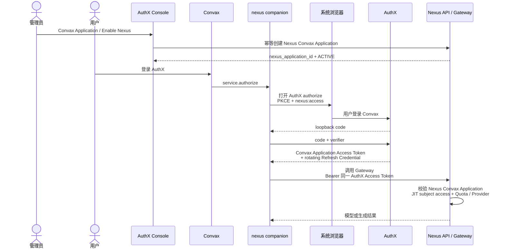

# Convax × AuthX × Nexus 本地集成执行契约

状态：目标架构、跨仓实施契约与执行记录。AuthX、Nexus 和 `convax-plugins` 的本地实现及打包
Convax 三模态验收已完成；生产发布仍受第 16.2 节的外部凭据前置条件阻塞。未满足该前置条件前，
不得把本地通过或任一单仓部署表述为整体上线完成。

本文取代此前的 Nexus Hosted Auth、Hosted Product Session、Data Token、Nexus
Inference Key 和客户端选择 ProviderConnection 方案。旧凭据不得迁移、兼容或回退。

规范关键词“必须”“不得”“应”具有约束力。关联契约：

- [`architecture.md`](architecture.md)；
- [`generation-tool-plugins.md`](generation-tool-plugins.md)；
- [`canvas-node-generation-state-persistence.md`](canvas-node-generation-state-persistence.md)；
- [`plugin-host-change-governance.md`](plugin-host-change-governance.md)；
- [`plugin-skill-platform.md`](plugin-skill-platform.md)。

## 1. 决策

采用下面这一条链路：

```text
AuthX Console / Convax Application
  -> enable built-in Nexus integration
  -> AuthX integration service automatically creates Nexus Convax Application

Convax companion -> AuthX Authorization Code + PKCE S256
  -> AuthX Convax Application Access Token
  -> Nexus Gateway + invisible subject JIT access
```

核心决策：

1. AuthX 是唯一身份 Owner、Authorization Server，也是 **Convax Application 集成 Nexus 的
   唯一管理入口**。
2. 产品体验上，Nexus 是 AuthX Application 可启用的一项内置平台能力；用户只登录 AuthX，
   不再执行“连接 Nexus”、Nexus 登录或 Nexus consent。
3. AuthX Application Integration 负责启用/停用和持有 `nexus_application_id`；启用时自动创建或
   复用 Nexus Convax Application，不要求管理员再进入 Nexus Console。
4. Nexus Convax Application 本身就是产品绑定聚合，固定持有 Workspace、默认 Plan、Quota policy
   和 ProviderConnection；不得再创建一套平行的 Application binding 对象。
5. Convax OAuth Client 的 `aud` 定义为 Convax Application 的 first-party backend 信任域；
   Nexus Convax Application 把 Nexus 明确加入这个信任域。
6. Nexus Gateway 直接验证用户登录 AuthX 后拿到的同一枚 AuthX Convax Application Access
   Token；不执行 Token Exchange，也不签发第二份 Nexus Token。
7. Access Token 必须满足 `aud === Convax client_id`、active Application integration 和
   `nexus:access` scope；其他 AuthX Application 的 Token、ID Token、Cookie、Refresh Credential
   和 Management Key 不得进入 Gateway。
8. AuthX Token 只证明身份、Convax Application 和 Nexus capability scope；Nexus 的 Plan、额度、
   Provider 和密钥不得写入 Token，Gateway 必须读取 Nexus 当前事实。
9. Nexus 在 status 或 Gateway 的首次合法请求中按 Nexus Convax Application 和 `sub` 无感 JIT 创建
   WorkspaceAccess；没有客户端 bootstrap/connect 步骤。
10. Companion 只持久化旋转的 AuthX Refresh Credential；短期 Access Token 只保存在内存。
11. Convax Host 继续只使用通用 Service、LLM、Generation Tool、Checkout、managed
    companion 和 `convax.generation-lro/1` 契约，不增加 AuthX 或 Nexus 分支。

### 1.1 为什么可以直接复用 AuthX Token

这里可以直接复用，是因为 AuthX 明确把 Convax Application 定义成一个 first-party backend
信任域，并由自动创建的 Nexus Convax Application 加入这个信任域：

```text
iss   = exact AuthX issuer
aud   = exact Convax OAuth client_id
scope includes nexus:access
Application integration = ACTIVE
Nexus Convax Application = exact and ACTIVE
```

因此 Nexus 是这枚 Application Access Token 的预期 first-party 接收方。Nexus 仍必须拒绝任意
其他 AuthX Application 的 Token、缺少 `nexus:access` 的 Token 和所有 ID Token。无感来自明确的
服务端 Nexus Application 绑定，不是把 AuthX 的任意 Token 当成万能凭据。

### 1.2 什么时候才需要专用 audience 或 Token Exchange

当前 Nexus 已被定义为 AuthX Convax Application 的 first-party backend，因此不需要专用
`nexus_resource` audience，也不需要 OAuth 2.0 Token Exchange。只有出现以下需求时再单独评审：

- Nexus 同时接入多个上游 IdP，需要统一成 Nexus 自己的 Token；
- Nexus 从 AuthX Application 内部能力变成可被第三方 Client 独立调用的公共 Resource Server；
- Nexus 必须拥有独立的 Token 生命周期、resource audience 或 sender constraint；
- 上游 Token 不可本地验证，只能 introspect，且不适合直接暴露给 Gateway；
- Nexus 的内部服务不得信任或理解任何 AuthX issuer。

Token Exchange 会新增签发端、刷新/撤销语义、故障点和凭据生命周期；在上述需求出现前，它没有
提供足以抵消复杂度的收益。

标准依据：Native App 使用系统浏览器和 PKCE 见
[RFC 8252](https://www.rfc-editor.org/rfc/rfc8252.html)，OAuth 安全基线见
[RFC 9700](https://www.rfc-editor.org/rfc/rfc9700.html)，Token Exchange 仅作为未来可选模型见
[RFC 8693](https://www.rfc-editor.org/rfc/rfc8693.html)。未来若拆出独立 Resource Server audience，
再采用 [RFC 8707](https://www.rfc-editor.org/rfc/rfc8707.html)。

## 2. 简化时序图



运行期间，Access Token 过期前由 companion 使用 Refresh Credential 向 AuthX 刷新；不经过
Nexus 换 Token。用户侧没有 Nexus 登录页、Nexus connect API 或第二次授权确认。

## 3. Owner 与信任边界

| 事实或能力                                               | 唯一 Owner                | 禁止                                             |
| -------------------------------------------------------- | ------------------------- | ------------------------------------------------ |
| Account、MFA、OAuth Grant、pairwise `sub`                | AuthX                     | Nexus 复制登录 Session                           |
| Public Client、Redirect URI、PKCE、Refresh family        | AuthX                     | Nexus 签发身份 Token                             |
| Convax Application 的 Nexus integration 状态和 reference | AuthX                     | Companion/用户在运行时创建 Nexus Application     |
| Convax Application audience 和 `nexus:access` scope      | AuthX 注册；Nexus 消费    | 接受未绑定 Application 或缺 scope 的 Token       |
| Nexus Convax Application 及其 Workspace/Plan/Provider    | Nexus                     | AuthX 保存产品事实副本或另建 binding 对象        |
| WorkspaceAccess、Plan、Quota、Billing                    | Nexus                     | 写入 AuthX Token                                 |
| ProviderConnection、Provider Host、Provider Secret       | Nexus                     | Companion 或 Renderer 选择/读取                  |
| AuthX → Nexus 管理面 provisioning                        | AuthX integration backend | 浏览器或 companion 持有管理 credential           |
| OAuth transaction、Access Token 内存、Refresh Credential | verified companion        | Main、Renderer、Canvas、Project 或 OpenCode 持有 |
| Service/LLM/Generation 适配                              | `convax-plugins`          | Convax Host 命名 Nexus 行为                      |
| Generation executor 与 Host LRO ledger                   | Convax Desktop Main       | sidecar Map 成为恢复事实源                       |
| Project 文件与 Canvas 结果提交                           | Convax domain owners      | Nexus 直接写产品私有状态                         |

允许的依赖方向：

```text
AuthX Console -> AuthX integration backend -> Nexus Management contract

AuthX Convax Application OAuth contract <- verified nexus companion -> Nexus Gateway contract

Convax public Plugin contracts
  <- nexus-service manifest + companion
```

AuthX 只有 Nexus integration adapter 依赖 Nexus 的公开 Management contract；OAuth core 不导入
Nexus 业务源码。Nexus 不依赖 Convax Host。Companion 只能使用 AuthX OAuth 和 Nexus runtime 的
公开 HTTP 契约，不能调用 Management API 或导入私有源码。Convax Host 不依赖 AuthX 或 Nexus。

## 4. Console 最佳实践

### 4.1 主入口选 AuthX Console

**AuthX Console 是唯一启用入口。** 管理员进入：

```text
Applications -> Convax -> Integrations -> Nexus
```

管理员只执行 `Enable Nexus`，不填写 Nexus Workspace、Plan、Provider 或 credential。AuthX
integration backend 使用固定的 `convax-default` 产品模板键调用 Nexus Management API；Nexus
自己把模板解析成 Workspace、默认 Plan、Quota policy 和 ProviderConnection，并自动创建 Nexus
Convax Application。模板键只是 Nexus 产品配置选择器，不包含产品事实或 Secret。

Nexus 管理 credential、原始 Management response 和 Provider Secret 不得进入浏览器。AuthX
backend 以 `authx_integration_id` 为幂等外部键创建或读取 Nexus Application，只在 Nexus 返回同一个
durable `nexus_application_id` 且状态为 `ACTIVE` 后，才把 AuthX integration 标记为 `ACTIVE`。

AuthX Application integration 保存：

```text
integration_id
application_id / oauth_client_id / environment
nexus_application_id + application_version
desired state: ENABLED | DISABLED
observed state: PENDING | ACTIVE | ATTENTION
```

它不保存 WorkspaceAccess、Plan、Quota、ProviderConnection 或 Provider Secret 的权威副本；
这些始终由 `nexus_application_id` 指向的 Nexus Convax Application 决定。失败和跨服务超时保持
`PENDING` 或 `ATTENTION` 并由后台幂等 reconcile，不得在未确认 Nexus Application active 时授予
`nexus:access`。

### 4.2 Nexus Console 的定位

Nexus Console 管理 `convax-default` 产品模板、Provider/Plan、自动创建的 Nexus Convax Application、
只读 AuthX linkage 和审计，但不是集成启用入口。Nexus 可以提供一键紧急停用；它是安全撤销而
不是重新绑定，并使 AuthX integration 收敛到 `ATTENTION`。恢复由 AuthX reconcile 重新激活同一个
`nexus_application_id`，不得偷偷新建第二个 Application。

AuthX Console 同时负责：

- 创建 Native/Public OAuth Client，不创建 Client Secret；
- 注册精确 loopback Redirect URI；
- 把该 Client 的 audience 定义为 Convax Application first-party backend trust domain；
- 允许 Authorization Code、Refresh Token、PKCE S256，并在 active integration 下自动授予
  `nexus:access`；
- 配置用户登录、MFA、Token TTL 和撤销策略；
- 以管理员对 Application integration 的启用作为 Nexus capability 的预授权。

AuthX Console 可以组合展示 Nexus 配置，但不得把展示副本或 Token claim 变成 Nexus 产品授权。

## 5. AuthX Native OAuth 契约

### 5.1 Authorization Code + PKCE

Companion 必须：

1. 先绑定一次性 `127.0.0.1` loopback listener；
2. 生成至少 256 bit 随机 `state`、`nonce` 和 PKCE verifier；
3. 使用 `code_challenge_method=S256`；
4. 通过系统浏览器打开 AuthX，不嵌入 WebView；
5. 在 authorize 请求中携带 `nexus:access` scope；
6. 使用精确 `redirect_uri`、`client_id` 和 verifier 兑换 code；
7. 校验 callback 路径、方法、`state`、issuer 和单次使用；
8. AuthX 只在 Convax Application 的 Nexus integration 为 `ACTIVE` 时把 `nexus:access` 授予
   Convax Application Access Token；
9. 成功后原子替换 Refresh Credential，失败则保留原有可用凭据。

建议请求：

```text
response_type=code
client_id=<convax-public-client-id>
redirect_uri=http://127.0.0.1:<registered-port>/oauth/callback
scope=openid profile email offline_access nexus:access
code_challenge=<base64url-sha256-verifier>
code_challenge_method=S256
state=<single-use-random>
nonce=<single-use-random>
```

AuthX 可使用一个精确固定端口，或按 Native App 规范注册/支持 loopback 动态端口；一次 transaction
选定后，authorize 与 token 请求必须使用完全相同的 Redirect URI。生产 issuer 必须是 HTTPS；
只有本地开发可使用 loopback HTTP。

管理员启用 Nexus integration 已完成 first-party resource 预授权。用户登录页只表达“登录
Convax”，不得再出现“连接 Nexus”步骤；AuthX 仍可按统一安全策略展示 Convax 将使用 Nexus
能力的说明，但这不是第二个 Nexus Session 或由 Nexus 托管的 consent。

### 5.2 Refresh

Refresh grant 必须绑定原始 Convax client、subject 和 scope，不得借刷新扩大 audience 或 scope。
每次刷新都重新检查 Nexus integration 仍为 `ACTIVE`；成功返回新的 Refresh Credential，companion
先原子写入 OS credential store，再使旧值不可达。并发刷新 single-flight。

Refresh Credential 重用导致 AuthX 撤销整个 family。Companion 随后清空本地凭据并投影
`attention`，要求重新登录。

### 5.3 当前 AuthX 的必要改造

当前 Authorization Code Access Token 使用 `aud === client_id` 可以保留；本方案把这个 audience
正式定义成 Convax Application 的 first-party backend trust domain。AuthX 必须增加 Application
Integration owner、Nexus Management adapter、`nexus:access` scope admission 和幂等 reconcile。
只有 `ACTIVE` integration 可以在登录或刷新时获得该 scope；停用时先停止授予/刷新，再把 Nexus
Convax Application 置为 `DISABLED`，使尚未过期的 Token 也无法发起新请求。

## 6. AuthX Convax Application Access Token

推荐 Access Token 为短期 JWT，基线 TTL 为 5–15 分钟。Gateway 必须固定验证：

- 签名算法在 Nexus 配置的 allowlist 内，`kid` 可从精确 issuer 的 JWKS 解析；
- `iss === configuredAuthXIssuer`；
- `aud` 是单一值且 `aud === configuredConvaxClientId`；
- `oauth_client_id` 或规范化的 `client_id === configuredConvaxClientId`；
- `application_id === configuredAuthXApplicationId`；
- `project_id === configuredAuthXProjectId`；
- `environment === configuredAuthXEnvironment`；
- `token_use === "access"`；
- `scope` 包含 `nexus:access`；
- `sub` 是有界、非空、稳定的 pairwise subject；
- `iat`、`nbf`、`exp`、`jti` 有效，clock skew 有界。

Nexus 身份键为：

```text
{ iss, application_id, client_id, project_id, environment, sub }
```

`aud` 同时标识 Convax Application trust domain 和 OAuth client；active Nexus Convax Application
必须进一步证明 Nexus 已被管理员加入该信任域。`email` 和 `name` 只能显示，不能作为账号合并、
WorkspaceAccess 或授权依据。

Token 不得携带或授权下列 Nexus 产品事实：

```text
workspace_id
workspace_access_id
plan_id
provider_connection_id
provider_host
quota
billing
checkout
provider_secret
```

Companion 只能向 AuthX Application integration 配置的精确 Nexus HTTPS origin 发送该 Token。
不得跟随跨 origin redirect，
不得写入 URL、日志、trace、错误、Canvas、Project、browser storage、manifest 或 durable LRO journal。

## 7. 自动创建 Nexus Convax Application

### 7.1 唯一创建接口

AuthX integration backend 使用自己的服务身份调用 Nexus Management API：

```text
PUT /api/v1/integrations/authx/{authx_integration_id}/applications/convax
```

请求是闭合的幂等 desired-state 命令：

```ts
type EnsureNexusConvaxApplication = {
  schema: "nexus.authx-application-integration/1"
  desired_state: "ACTIVE"
  authx_issuer: string
  authx_application_id: string
  authx_client_id: string
  authx_project_id: string
  authx_environment: string
  product_profile_key: "convax-default"
}
```

它不得携带 Workspace、Plan、Quota、ProviderConnection、Provider Host 或 Secret。Nexus 解析当前
`convax-default` 模板并原子创建或读取下面这一个聚合：

```ts
type NexusConvaxApplication = {
  nexus_application_id: string
  authx_integration_id: string
  application_version: number
  state: "ACTIVE" | "DISABLED"
  display_name: "Convax"
  authx_issuer: string
  authx_application_id: string
  authx_client_id: string
  authx_project_id: string
  authx_environment: string
  product_profile_key: "convax-default"
  workspace_id: string
  default_plan_id: string
  quota_policy_id: string
  provider_connection_id: string
}
```

`authx_integration_id` 是外部幂等键；AuthX issuer/application/client/project/environment 是不可变
身份约束，`display_name` 不是身份。首次调用创建，响应丢失后的重试必须返回同一个
`nexus_application_id`。同一个 integration id 携带不同身份返回 `409 integration_conflict`，不得
创建第二个 Application。并发调用也只能提交一个 Application。

Nexus 返回 `nexus_application_id`、`application_version` 和 `ACTIVE` 后，AuthX 才以 CAS 将 observed
state 从 `PENDING` 改为 `ACTIVE` 并允许 `nexus:access`。HTTP 超时或响应丢失保留 `PENDING`；outbox
reconciler 使用同一命令重试，不能猜测创建成功，也不能生成新幂等键。

### 7.2 停用、重启用与删除

- `Disable Nexus` 先让 AuthX 停止授予和刷新 `nexus:access`，再以同一个
  `authx_integration_id` 把 Nexus Application 置为 `DISABLED`。
- 停用不得删除 Nexus Application、WorkspaceAccess、Quota/Usage/Billing 或审计记录。
- 重新启用必须重新激活同一个 `nexus_application_id`；模板兼容性或身份不匹配则进入
  `ATTENTION`，不得自动新建替代对象。
- 删除 AuthX Convax Application 采用相同停用流程并保留 Nexus 历史；物理删除是独立的 Nexus
  数据保留策略，不属于集成事务。
- AuthX 崩溃在任一跨服务阶段后都由 desired/observed state reconcile；没有分布式事务，也不允许
  两边分别成为启用状态的权威。

只有 AuthX integration backend 可以创建、重新激活和停用这个 Nexus Application。Companion、
Convax Host 和普通用户 Token 不得访问 Management API，也不得提交 Workspace、Plan、Provider 或
`nexus_application_id` 来影响运行时选择。

### 7.3 无感运行时接口

所有接口和 Gateway 请求都使用：

```http
Authorization: Bearer <AuthX Convax Application Access Token>
```

这些 Application Access 路由和 Gateway 都是 Nexus Convax Application 中声明的
first-party backend。若未来某个接口脱离这个受控 trust domain、向第三方 Client 开放，则它必须
改用独立 resource audience；不得继续接受 Convax Application Token。

用户运行时的最小 Application Access surface：

```text
GET  /api/v1/application-access/status
POST /api/v1/application-access/checkout
```

`status` 和 Gateway 共用一个 Nexus 内部的 `ensureApplicationSubjectAccess` 事务：按验证后的
Application + subject 身份键解析唯一 active Nexus Application，并幂等创建或读取
WorkspaceAccess。JIT 是 Nexus 服务端内部实现，不是客户端可见的 connect/bootstrap API；创建
冲突、Application version 变化或产品授权失败都 fail closed。

`status` 只返回有界 account/plan/status/checkout 显示数据，不返回任何 Token、Key、Provider Host
或 Provider Secret，并在每次读取时重新解析当前 Application、WorkspaceAccess、Plan 和 Billing。
`checkout` 只能接受当前 status 广告的有界 `plan_key`，返回
`convax.plugin-service-checkout/1` 的 HTTPS URL；URL 只进入 Main 并由系统浏览器打开。Checkout
会话由 Nexus 根据当前 AuthX subject 创建，不要求用户再次登录 Nexus。

不再存在：

```text
POST /api/v1/application-access/connect
POST /api/v1/application-access/bootstrap
POST /api/v1/application-access/inference-key/rotate
nexus.application-access-bootstrap/1
nexus.application-inference-key/1
Nexus Inference Key
```

## 8. Gateway 授权

Gateway 只接受 AuthX Convax Application Access Token。每个潜在计费请求开始前必须：

1. 完整验证第 6 节 Token；
2. 用 Application + subject 身份键解析唯一启用的 Nexus Convax Application；
3. 通过同一个 `ensureApplicationSubjectAccess` 事务 JIT 创建或读取 WorkspaceAccess，再读取当前
   Plan、Quota 和 Billing 状态；
4. 在 Nexus 内部解析固定 ProviderConnection、Host 和 Secret；
5. reserve quota，调用 Provider，按实际结果 settle；
6. 写入审计和 `external_provider_calls` 计量事实。

Token 中即使出现 Plan、Quota 或 Provider claim，Gateway 也必须忽略。应用停用、WorkspaceAccess
撤销或 Quota 耗尽必须阻止新请求，不等待 AuthX Access Token 过期。Nexus 可以用带单调
authorization epoch 的有界缓存优化读取，但不得用普通 TTL cache 延迟明确撤销。

文本、图片、视频均走同一 Gateway 授权和计量边界。本地端到端只允许
`nexus/tests/fake-provider`；不得调用真实或付费 Provider。

## 9. Companion 与 Convax Service

`convax-plugins` 的 Nexus Plugin 使用 `convax.plugin/8` 和当前通用贡献。固定动作至少包括：

```text
service.status
service.authorize        # 仅在 AuthX 未登录或 Refresh family 失效时登录 AuthX
service.reauthorize      # 仅修复 AuthX credential
service.signout
service.checkout
llm.gateway.start
generation tools
convax/generation/operations/get
convax/generation/operations/wait
convax/generation/operations/cancel
convax/generation/operations/result
convax/generation/operations/acknowledge
```

登录动作稳定标识为 `authx:convax:interactive-login`，不是 Nexus connect。Companion 通过当前
`convax.plugin-service-external-authorization/1` 请求 Host 打开系统浏览器；Host 不解析 Token。
如果有效 AuthX credential 已存在，Service 启动直接刷新 Convax Application Token 并读取 status，
不得再打开浏览器或要求用户确认 Nexus。

Credential 边界：

| 数据                           | 持久化位置                       | 可见方                      |
| ------------------------------ | -------------------------------- | --------------------------- |
| AuthX Refresh Credential       | companion 的 OS credential store | companion                   |
| AuthX Convax Application Token | companion 内存                   | companion、Nexus HTTPS 请求 |
| PKCE verifier/state/nonce/code | 单次 transaction 内存            | companion、精确 callback    |
| Main-only local gateway bearer | 内存                             | Main、companion loopback    |
| Service status / plan / usage  | 有界 disposable display cache    | Renderer                    |
| Provider Secret                | Nexus server secret store        | Nexus Gateway               |

Refresh Credential 不得进入环境变量或明文配置文件。Access Token 不得进入 Main、Renderer、
Preload、OpenCode、Canvas 或 Project。Local LLM Gateway 继续返回 Main-only、ephemeral
`127.0.0.1` base URL 和随机 bearer；这个 bearer 不是 Nexus credential。

`service.status` 只映射当前 `convax.plugin-service-status/2`。Disconnected 状态仍可展示安装的模型；
真正执行前，companion 和 Nexus Gateway 都重新验证实时状态。

## 10. Generation 与 LRO

Generation、pending node、文件发布、`operationId`/`taskId` 分离、取消和恢复继续遵守：

- [`generation-tool-plugins.md`](generation-tool-plugins.md)；
- [`canvas-node-generation-state-persistence.md`](canvas-node-generation-state-persistence.md)。

视频恢复继续使用 `convax.generation-lro/1` 和 Host 注入的
`CONVAX_GENERATION_LRO_DIRECTORY`。Private sidecar journal 可以保存 opaque provider task
receipt、请求 digest 和状态，但不得保存 AuthX Access/Refresh Token；恢复时必须从 OS credential
store 刷新出新的短期 Access Token，再调用 Nexus。

取消支持下游时，companion 调用：

```text
DELETE /v1/videos/{providerTaskId}
```

取消结果、未知结果和 billable 边界仍按通用 LRO 契约处理，不因 Nexus 集成产生特例。

## 11. 过期、撤销与退出

- Access Token 临近过期：companion single-flight refresh，然后重试一次尚未越过 billable
  boundary 的请求。
- `401 invalid_token`：刷新一次；再次失败则清除凭据并进入 `attention`。
- `403 integration_disabled` / `application_disabled` / `access_revoked`：不得刷新重试，立即停止新请求；
  UI 指向 AuthX Convax Application 的管理员配置，而不是提供“连接 Nexus”。
- `429 quota_exhausted`：不重试潜在计费调用，刷新 status。
- 显式 sign-out：先尽力撤销 AuthX Refresh family，再清除 OS credential、内存 Access Token、
  local gateway 和 display authority。
- 管理员在 AuthX Console 停用 Nexus integration：AuthX 先停止授予/刷新 `nexus:access`，
  再由 integration backend 幂等停用同一个 Nexus Convax Application；Nexus 立即阻止新
  Gateway 请求。普通用户没有 Nexus disconnect 动作。

本地 JWT 验证无法仅凭 Refresh family 已撤销就瞬时识别一枚尚未过期的 Access Token。基线用
5–15 分钟短 TTL 限制窗口；若业务要求 AuthX 侧“立即全局登出”，必须增加 AuthX cutoff/
introspection 或 sender-constrained Token 的独立设计，不能假装 Token Exchange 自动解决该问题。

## 12. 破坏性迁移

这是凭据协议替换，不做静默迁移：

1. 删除旧 Hosted Auth / Data Token / Nexus Inference Key 读取与回退代码；
2. 首次启动只识别并安全删除旧 secret，不把它兑换成新凭据；
3. AuthX 管理员为 Convax Application 启用 Nexus integration；
4. Service 仅在没有有效 AuthX credential 时显示“登录 AuthX”；
5. 用户完成一次新的 AuthX 登录后，同一枚 Convax Application Token 即可无感访问 Nexus；
6. Plugin major、schema 和 fixture 必须拒绝旧字段及旧响应；
7. 更新/卸载清除 Refresh Credential 和中断的 OAuth transaction。

不得让旧方案和新方案并行工作，也不得让 Gateway 临时同时接受未绑定的 AuthX Application
Token、Nexus Inference Key 和新的 Convax Application Token 规则。

## 13. 验收矩阵

| 场景                                             | 必须结果                                                     |
| ------------------------------------------------ | ------------------------------------------------------------ |
| AuthX Application 未启用 Nexus integration       | 不授予 `nexus:access`；无 Gateway call                       |
| 管理面 provisioning 尚未 active                  | 登录/刷新 fail closed；不暴露半完成 Application              |
| Enable 请求响应丢失后重试                        | 返回同一 `nexus_application_id`，总数仍为 1                  |
| 同一 integration id 携带不同身份                 | 409；不创建第二个 Nexus Application                          |
| 登录已有 active integration 的 Convax            | 只登录一次 AuthX，无 Nexus 页面或 connect 请求               |
| 其他 AuthX Application Token                     | Nexus 401，零 Provider call                                  |
| Convax Token 缺少 `nexus:access`                 | Nexus 403，零 Provider call                                  |
| AuthX ID Token                                   | Nexus 401，零 Provider call                                  |
| 正确 Convax Application Token，首次 subject 请求 | Nexus 内部 JIT access，status/Gateway 成功                   |
| issuer/client/project/environment/scope 任一错误 | 401/403，零 Provider call                                    |
| Nexus Application 缺失、重复或 disabled          | fail closed                                                  |
| WorkspaceAccess 被撤销但 Token 尚有效            | 新请求立即失败                                               |
| 客户端伪造 Workspace/Plan/Provider               | schema 拒绝或完全忽略                                        |
| Refresh rotation/reuse                           | 原子替换；reuse 撤销 family 并要求重登                       |
| Access Token 过期                                | 单次刷新，不重复 billable 调用                               |
| Quota 耗尽                                       | 429，reserve/settlement 一致                                 |
| 文本/图片/视频                                   | 均经过 Usage Inspector 和 fake-provider                      |
| sidecar/Host crash                               | LRO 恢复，不持久化 Token，不重复提交                         |
| sign-out/update/uninstall                        | 清凭据、关 gateway、终止授权 transaction                     |
| AuthX 管理员停用 integration                     | 停止 scope 刷新；同一 Application disabled；历史保留         |
| 重新启用 integration                             | 复用同一 `nexus_application_id`，不得新建                    |
| 泄漏扫描                                         | 日志、trace、Canvas、Project、缓存和 journal 无 Token/Secret |

本地最终验收必须使用打包 Convax、真实本地 AuthX/Nexus 进程、实际安装的不可变
Plugin/companion 和 `nexus/tests/fake-provider`。测试桩或单元测试通过不能替代整链路证据。

## 14. 跨仓交付

### AuthX

- 为 Convax Application 增加 `Integrations -> Nexus` owner、Console 页面和状态机；
- 用 AuthX 后端持有的服务身份调用 Nexus Management API，支持幂等 create/update/disable 与 reconcile；
- 保留 Native/Public Authorization Code + Refresh flow 的 `aud === Convax client_id`；
- 只有 active Nexus integration 可以给该 grant 授予 `nexus:access`；
- 签发第 6 节闭合 claim（包括 `application_id` 和 `environment`）的短期 Access Token；
- 支持 Refresh rotation/reuse detection、撤销和精确 loopback Redirect URI；
- 停用顺序为停止 scope 授予/刷新、停用同一个 Nexus Application、更新 observed state；失败进入
  可重放 reconcile。

### Nexus

- 为 AuthX integration backend 发布自动创建 Nexus Convax Application 的最小 Management API、
  服务身份、外部幂等键、Application version 和审计；
- Nexus Console 管理 `convax-default` 模板、产品事实和只读 linkage，AuthX Console 是唯一启用入口；
- 保证一个 `authx_integration_id` 永远映射同一个 `nexus_application_id`，并实现
  `ensureApplicationSubjectAccess` 原子 JIT；
- 实现 `status/checkout` 与 Gateway 的同一 Token verifier 和 JIT 事务；
- 删除 bootstrap、Inference Key 签发/轮换和多凭据 Gateway 路径；
- Gateway 实时解析 WorkspaceAccess、Plan、Quota、Billing 和 ProviderConnection；
- 完成 fake-provider 的文本、图片、视频、取消、计量和泄漏验收。

### `convax-plugins`

- companion 实现系统浏览器、PKCE、loopback callback、`nexus:access` request 和 Refresh rotation；
- 已有有效 AuthX credential 时直接进入 Nexus status/Gateway，不调用 connect、不弹第二个登录页；
- Refresh Credential 只入 OS credential store，Access Token 只驻内存；
- 实现固定 Service/LLM/Generation/LRO surface 和旧凭据破坏性迁移；
- 本地产品锁验收输入继续使用 `marketplace:local-product-lock-input`；
- 对外显示 profile 使用 `convax.nexus-public-profile/1`，且不含 credential。

## 15. Convax Host change 与完成状态

本方案不需要 Convax Host change。当前通用 external authorization、Service、Checkout、managed
companion、loopback LLM Gateway、Generation Tool 和 LRO 边界足以承载具体集成。AuthX
Application Integration 与 Nexus Management provisioning 位于服务端控制面；AuthX OAuth、
Nexus runtime HTTP 协议和 OS credential store 由 verified companion 消费或拥有。不得为 Nexus
增加 Host IPC、Plugin id 分支、Token 存储或 Renderer 字段。

本次文档修改不改变 Convax package owner、依赖图、持久化 owner、Electron IPC 或架构图节点；
它只收紧已有外部 public-client authorization 的 credential、预配置 Application integration 与
Application-token 规则。

AuthX、Nexus、`convax-plugins` 三仓实现、测试和打包本地验收已经完成。生产数据库迁移、Secret
一致性、Worker 发布和线上 smoke 必须作为一个发布单元完成；当前执行状态见下一节。

## 16. 2026-08-14 执行记录

### 16.1 已完成

- AuthX Console 已成为唯一 Nexus integration 启停入口；启用命令写入 durable desired state，后台
  reconcile 使用同一外部幂等键自动创建或复用 Nexus Convax Application。
- AuthX 只保存 `nexus_application_id`、Application version 和 desired/observed state；Nexus 继续拥有
  Workspace、Plan、Quota policy、ProviderConnection、Usage 和 Billing 事实。
- Nexus 直接验证 AuthX Convax Application Access Token。没有 AuthX Token 换 Nexus Token、Nexus
  Inference Key、客户端 bootstrap/connect 或第二个登录/consent。
- 停用先阻止 AuthX 新授予/刷新 `nexus:access`，再把同一个 Nexus Application 置为 `DISABLED`；
  重新启用复用同一个 `nexus_application_id`，Application version 单调推进。
- 本地生命周期验收通过：首次启用后 direct AuthX Token 的 Nexus status 为 `200`；停用后旧 Token
  返回 `401 application_disabled` 且 AuthX 拒绝签发新的 Nexus scope；重新启用后同一个 Nexus
  Application 使用新 direct AuthX Token 再次返回 `200`。
- 打包的 macOS Convax Dev 应用通过真实本地 AuthX、Nexus、companion 和 fake-provider 生成并提交：
  PNG 4,431 bytes、WAV 7,724 bytes、MP4 37,809 bytes。Nexus 记录 8 次 invocation、8 次 settlement、
  0 个 active reservation；没有调用真实或付费 Provider。
- AuthX Cloudflare production preflight 通过；Nexus deployment adapter 77 项测试、类型检查、Wrangler
  类型生成和 API/Gateway/Worker/Console 四项 dry-run 通过。既有 Application Access Binding 管理接口
  保持在 Management OpenAPI/SDK 中，避免 Console 兼容性回退。
- AuthX 生产 D1 已在迁移前完成全量 SQL 导出和 Time Travel bookmark；远端 Worker 的当前 100%
  active version 已记录为发布回滚基线。

### 16.2 生产发布阻塞项

本次没有执行半套生产发布。唯一不可由仓库或 Cloudflare只读接口恢复的前置条件是 Nexus 生产
PostgreSQL 凭据：生产数据库只通过 Hyperdrive/VPC 暴露，Cloudflare 不回传 Origin password；本机
钥匙串、进程环境和仓库外 `.env` 检查均没有非本地 `DATABASE_URL`。现有连接全部指向
`127.0.0.1` 或 `localhost`，仓库的生产迁移门禁会正确拒绝它们。

继续发布时，外部 Operator 必须通过 Secret Manager 向当前 shell 注入 Nexus 生产
`DATABASE_URL`，不得把值写入 Git、文档、命令行参数或日志。还必须满足：

1. 先备份 Nexus PostgreSQL，并执行且验证 additive migration
   `20260814000000_authx_convax_application_integration`；
2. 向 AuthX API、AuthX Jobs 和 Nexus API 注入同一份新 integration credential；
3. 向 Nexus Gateway 补齐与现网 API/Worker 相同的 `NEXUS_INTERNAL_SERVICE_CREDENTIAL`，若旧值无法
   从 Secret Manager 取得，则必须单独批准 API/Worker/Gateway 三方原子轮换，不得猜值；
4. 按 Nexus API/Gateway/Console、AuthX D1 migration、AuthX Jobs/API/Console 的受控顺序发布；
5. 以 direct AuthX Token 重跑 enable/disable/reenable、status 和图片/音频/视频线上 smoke，并确认
   invocation/settlement 对齐、active reservation 为 0 后，才把整体状态改为已上线。

阻塞期间不部署 AuthX Console 或任一新 Nexus Worker，避免把可见的 Enable 开关指向尚未迁移的
Nexus 数据库，也避免制造无法按同一回滚点恢复的跨服务半状态。
