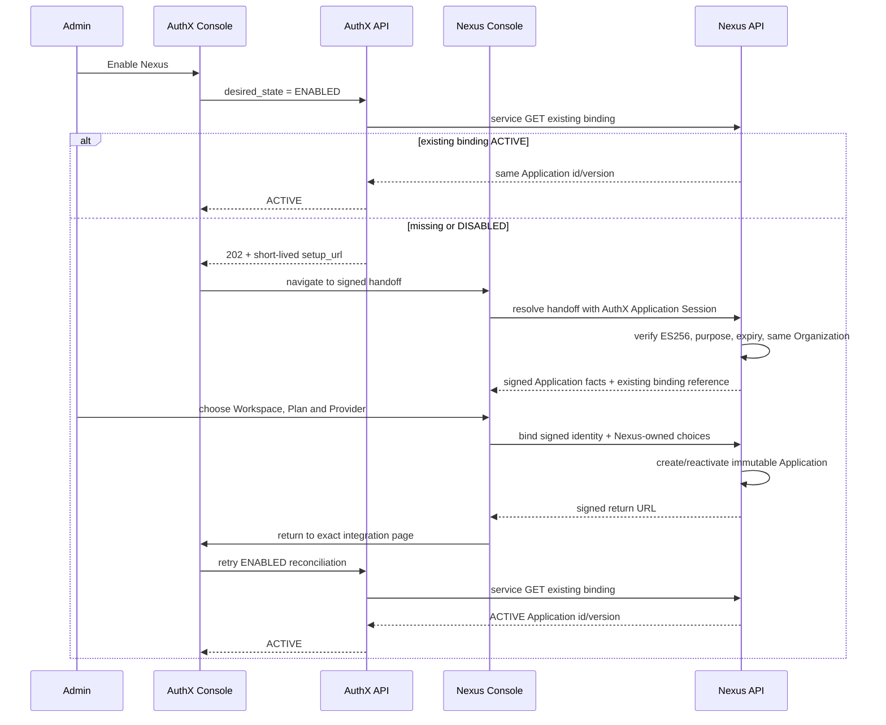

# Convax × AuthX × Nexus 集成契约

状态：当前目标架构与跨仓实施契约。AuthX、Nexus 和 Convax 的本地改动必须遵守本文；本次管理员绑定
流程与 Application identity cutover 尚未发布到生产，生产启用必须在 AuthX、Nexus 和 Convax plugin
同窗口发布后重新验收。本文中的确定性 Project ID 只是 bootstrap target，不证明远端资源已经存在。

本文取代旧的 `convax-default` 自动产品模板、AuthX 后台自动创建 Nexus Application、Nexus Hosted
Auth、Hosted Product Session、Data Token 和第二份 Nexus Token 方案。

## 1. 产品结果

集成有两个不同阶段：

1. **管理员启用阶段**：管理员在 AuthX Console 点击 Enable，浏览器跳转到 Nexus Console，选择
   Workspace、Plan 和 Provider，再回到原 AuthX Application 页面完成激活。
2. **最终用户运行阶段**：Convax 用户只登录一次 AuthX。Companion 取得短期 AuthX Convax
   Application Access Token，并直接调用已绑定的 Nexus Resource Server；没有第二次 Nexus 登录、
   consent、connect、bootstrap 或 Token Exchange。

“一次登录”约束只描述最终用户运行时，不得被解释为管理员不能进入 Nexus 完成产品绑定。

## 2. 权威与数据所有权

| 事实                                                                             | Owner                                     | 禁止事项                                    |
| -------------------------------------------------------------------------------- | ----------------------------------------- | ------------------------------------------- |
| Account、MFA、Organization、OAuth Grant、pairwise `sub`                          | AuthX                                     | Nexus 复制登录 Session                      |
| Convax Application、OAuth Client、环境、Nexus integration desired/observed state | AuthX                                     | Nexus 接受浏览器填写的 Application 身份     |
| Nexus Workspace、Plan、Quota、ProviderConnection、Provider Secret                | Nexus                                     | AuthX Token 或 AuthX 数据库存储产品事实     |
| Nexus Application binding 与版本                                                 | Nexus；AuthX 只保存引用                   | 根据固定模板自动猜测产品配置                |
| 管理员绑定 handoff                                                               | AuthX 签名；Nexus 校验                    | 浏览器改写 issuer/client/project/return URI |
| AuthX Refresh Credential                                                         | verified companion 的 OS credential store | Renderer、Preload 或 Main 保存              |
| 短期 Access Token                                                                | companion 内存                            | 持久化或发送到非精确 Nexus origin           |

`authx_integration_id` 是跨服务唯一键。它永久映射同一个 Nexus Application。Workspace、Plan、
Provider、TTL 与 Checkout policy 在首次绑定后不可变；需要迁移产品配置时必须走独立、显式、可审计的
Nexus 管理流程，而不是重放 Enable。

### Application identity 与租户边界

Convax Application 保留现有 AuthX Project
`project_OKnlkG5kU1lNrOqJs0GFTu4JM2SwNkHz`，其
`ProjectApplicationPolicy.tenantModel = NONE`。Nexus Console 使用独立的 planned Project
`project_8CTrOpIkozdhK7EkndKbR210ZU1NUYvW`，其
`tenantModel = BOUND_ORGANIZATION`。两个 Project 必须始终不同，不能重新共用 pairwise subject
命名空间。

Convax 的最终用户准入只依赖该 Project 的 ACTIVE `ProjectUser`，不要求用户是 Convax 开发者
Organization 的 `Member`，也不读取 `Project.ownerTenantId` 或浏览器 Session 的
`activeTenantId`。`ownerTenantId` 只表示 Project 配置与账单管理权，永不进入最终用户 token。

Convax Access Token 必须同时缺少：

- `organization_id`
- `tenant_id`
- `selected_team_id`

verified companion 在保留 issuer、audience、Project、Application、OAuth client、environment、
token use、subject、session 与生命周期全部现有 pin 的同时，对上述任一 tenant claim fail-closed。
Nexus Console 的 Session Token 则必须按 `BOUND_ORGANIZATION` 携带真实用户租户的 `org_id`；该值来自
ACTIVE Application binding 与 ACTIVE Organization Member，不能取 Project owner Organization。

## 3. Enable 控制流



关闭浏览器、回跳丢失或重复点击不得创建第二个聚合。AuthX Jobs 只通过 service-authenticated GET
观察现有绑定并收敛状态；它不能创建或重新选择 Nexus 产品事实。

## 4. 签名 handoff

AuthX 使用当前 ES256 JWKS 私钥签发最长 10 分钟的 JWT：

```text
aud       = nexus-integration-binding
sub       = authx_integration_id
token_use = nexus_integration_binding
```

载荷固定包含：

- `authx_integration_id`
- `authx_application_id`
- `authx_client_id`
- `authx_project_id`
- `authx_environment`
- `authx_organization_id`
- 精确 AuthX Console `return_uri`
- `iat`、`exp`、`jti`

Nexus 必须固定 AuthX issuer、JWKS、ES256、audience、purpose 和最大生命周期；拒绝 `jku`、`x5u`、
不安全 return URL、跨 Organization 会话和过期 handoff。管理 API 请求仍需当前 AuthX Application
Session Token，并要求对应 `nexus:access:read` 或 `nexus:access:write` 权限。单独拿到 handoff 不能
完成绑定。

Nexus Console 表单只能提交 `WorkspaceId` 路径参数、`planId` 和 `providerConnectionId`；所有 AuthX
身份事实都从签名 handoff 推导。handoff 只在路由/Container 内存中使用，不进入序列化 Console Model。

## 5. Nexus 管理契约

公开、生成 SDK 覆盖的管理端点：

```text
POST /api/v1/integrations/authx/binding-sessions/resolve
POST /api/v1/workspaces/{workspaceId}/integrations/authx/bind
```

第一个端点验证签名和 Organization，并返回只读 Application facts 与可选现有绑定引用。第二个端点
再次验证签名、Workspace 权限、active Plan 和 active Provider，然后创建或重新激活 Nexus
Application。

AuthX 后台使用闭合的服务凭据端点：

```text
GET /api/v1/integrations/authx/{integrationId}/applications/convax
PUT /api/v1/integrations/authx/{integrationId}/applications/convax
```

GET 只观察；PUT v2 只允许 `desired_state = DISABLED`。AuthX 服务凭据不能创建或激活 Application。
服务响应只包含 Nexus Application id、integration id、版本和 `ACTIVE | DISABLED`。

## 6. Disable 与 re-enable

- Disable 先让 AuthX 停止新授予或刷新 `nexus:access`，再通过 service PUT 将同一个 Nexus
  Application 置为 `DISABLED`。
- Disable 不删除 Application、WorkspaceAccess、Quota、Usage、Billing 或审计记录。
- Re-enable 再次打开 Nexus Console。管理员确认原绑定后，Nexus 重新激活同一个 Application id；
  不允许 AuthX Jobs 或服务凭据静默重新激活。
- 身份或产品配置冲突返回 409 并保持原聚合不变。

## 7. 最终用户 OAuth 与 Gateway

Companion 使用系统浏览器完成 AuthX Authorization Code + PKCE S256：

```text
iss            = exact AuthX issuer
aud            = exact Convax public client / managed first-party trust domain
application_id = exact Convax Application
project_id     = exact Convax Project
environment    = exact environment
scope          contains nexus:access
token_use      = access
```

Nexus 还必须实时解析唯一 `ACTIVE` Application binding。ID Token、Cookie、Refresh Credential、
Management credential、其他 AuthX Application Token 或缺少 `nexus:access` 的 Token 都不是 Gateway
凭据。Convax Token 不携带 tenant claim、Workspace、Plan、Quota、Provider 或 Secret。

Nexus 在 status/Gateway 的内部事务中按 Application + `sub` 幂等创建或读取 subject access。JIT 是
Nexus 服务端实现，不是用户可见的 connect API。

## 8. Convax Host 边界

具体 AuthX/Nexus 适配仍属于 `convax-plugins` 的 verified companion。Convax Host 只提供通用 Skill、
MCP、Tool、Canvas、Service status、Checkout 与系统浏览器能力：

- Renderer、Preload、Main 不读取或保存 AuthX/Nexus token；
- companion 不调用 Nexus 管理端点，也不选择 Workspace/Plan/Provider；
- Host 不按 Nexus id、vendor 或模型分支；
- 生成任务继续使用通用 `convax.generation-lro/1` 与现有 durable commit 边界。

因此本控制面修复不增加 Convax package dependency，也不修改 Plugin Host ABI。

## 9. 失败与恢复

| 场景                                       | 必须结果                                     |
| ------------------------------------------ | -------------------------------------------- |
| Nexus 没有绑定                             | AuthX 返回 setup URL；Jobs 保持 PENDING      |
| Integration 为 PENDING 或 ATTENTION        | 显示管理员尚未完成绑定的可解释错误与恢复动作 |
| handoff 过期/签名错误                      | Nexus 401；回 AuthX 重试 Enable              |
| 活跃 AuthX Organization 不匹配             | Nexus 403；不暴露其他 Organization Workspace |
| Plan/Provider 不属于 Workspace 或非 ACTIVE | Nexus 404；零写入                            |
| 同 integration id 身份不同                 | 409；不创建第二个 Application                |
| 同 integration id 产品选择不同             | 409；原绑定不变                              |
| 回跳丢失                                   | 再次 Enable 的 GET 观察 ACTIVE 并收敛        |
| Disable 重试                               | 幂等返回同一 DISABLED Application            |
| Re-enable                                  | Nexus 管理员确认后复用同一 Application id    |

## 10. 发布与验收

本流程是协调发布，不能只上线一个仓库：

1. 重新读取 AuthX production D1 的 live migration journal。仓库 README 的历史基线是 production
   仅应用前 6 条、当前仓库共 17 条，因此预计有 11 条 pending；该历史记录不是生产事实，live journal
   不一致时必须停止。
2. 导出可恢复的 AuthX D1 snapshot，并备份 Nexus PostgreSQL；验证两侧隔离恢复。
3. 通过 AuthX 仓库根 `deploy/cloudflare-remote.sh` 的受控路径按序应用经 live journal 证明的全部
   pending migration；不得绕过 `@authx/database` 的 remote guard。应用并验证 Nexus 现有
   Application integration migration 与 `20260814010000_authx_console_application_binding`。
4. 先公开发布破坏性合同 `@microvoidio/authx@0.3.0`，再让 Nexus 从 public registry 生成真实
   integrity-pinned lockfile。未发布 SDK、伪造 integrity 或本地 tarball 都是 `NO-GO`。
5. 同一 hard-cut 窗口发布 AuthX Worker/Console、Nexus API/Console 与 Convax plugin
   `nexus-service@1.0.2`。Convax host 只有本文档变化，不增加 runtime 接入。
6. 使用生产管理员完成首次 Enable、丢失回跳恢复、Disable、Re-enable，并确认 Application id 不变；
   PENDING/ATTENTION 必须显示配置未完成，而不是裸 `401 application_disabled`。
7. 使用新的 AuthX Convax Access Token 验证 Nexus status/Gateway；断言三个 tenant claim 均不存在。
   Disable 后旧 Token 必须立即失败，Re-enable 后新 Token 恢复。
8. 验证 AuthX 数据库没有 Workspace/Plan/Provider facts，Nexus 日志没有 handoff、token 或 Provider
   Secret 明文。

回滚必须是 AuthX D1 snapshot 恢复、Nexus PostgreSQL 恢复和 AuthX/Nexus/Convax plugin 三仓 release
tag 同时回退。tenant claim 合同不能按单仓回滚。在上述协调迁移和发布前，不得把本地实现描述为生产
已修复或 production ready，也不得单独发布可见的 Enable 跳转。
