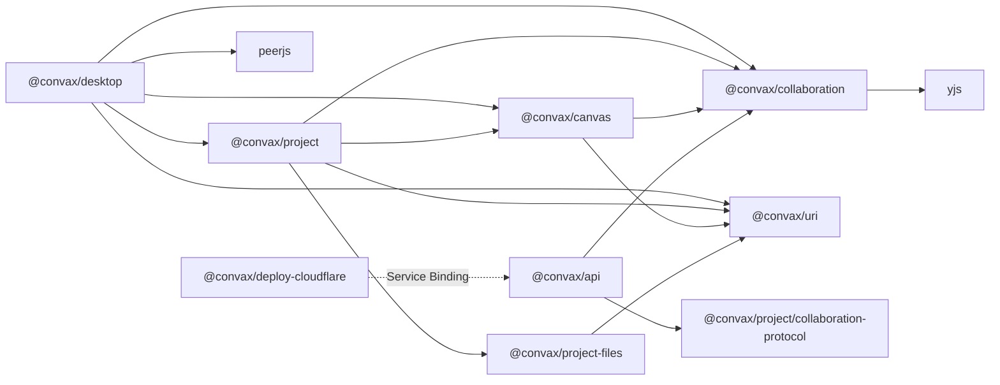
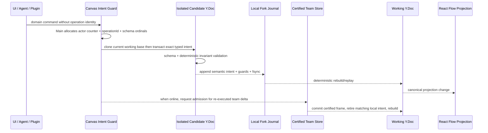

# Convax Project Collaboration Architecture

状态：架构门禁草案。只有三名独立架构评审者对同一 diff digest 全部批准后，本文才能成为实现依据。

## 1. 决策摘要

Convax 团队协同采用：

- Yjs 作为 Project/Canvas 结构化状态的合并协议与唯一可信源；
- React Flow 作为无持久权力的渲染和手势适配层；
- PeerJS 作为设备间传输通道，而不是身份、排序或持久化层；
- ProjectIndexYDoc 与 per-Canvas CanvasYDoc 分片；
- 本机 binary journal fsync 作为本地提交点；
- 远端 durable ACK 作为“已复制”的独立状态；
- content-addressed blob protocol 同步当前引用文件；
- 服务端签名 membership/admission/checkpoint 证明团队成员和历史可接纳性，但不保存或排序文档内容。

没有在线权威文档副本，也没有全局业务操作顺序。当前没有设备在线时，已有完整本地副本的成员仍可离线编辑；
新设备 bootstrap 或缺失 blob 获取必须等待至少一个数据持有者在线。

## 2. 包所有权和依赖方向

新增两个独立发布包：

| Package                 | Owns                                                                                                                          | Must not own                                              |
| ----------------------- | ----------------------------------------------------------------------------------------------------------------------------- | --------------------------------------------------------- |
| `@convax/uri`           | Stateless URI components, codec, canonicalization and static scheme grammar                                                   | Resolver, I/O, auth, current Project, dynamic registry    |
| `@convax/collaboration` | Generic certified/working Y.Doc kernel, binary frames, state-vector sync, journal/snapshot ports and session undo coordinator | Canvas/Project schema, PeerJS, auth, Electron, filesystem |

新增一个 private delivery application：

| Application                    | Owns                                                                                                                                                                             | Must not own                                                                                    |
| ------------------------------ | -------------------------------------------------------------------------------------------------------------------------------------------------------------------------------- | ----------------------------------------------------------------------------------------------- |
| `@convax/api` under `apps/api` | Web-standard Project membership/invite/session endpoints, server-issued peerId/signaling config, admission MMR, route fences, checkpoint orchestration and durable service ports | Project/Canvas content, blob bytes, edit order, Desktop/UI, Plugin code, deployment credentials |

现有包扩展：

- `@convax/project-files`：`ProjectEntryId`、`ProjectFileId`、`ProjectDirectoryId` 与 project-entry URI contract。
- `@convax/canvas`：CanvasYDoc schema、typed intents、incarnation、纯 canonical projection 和业务不变量。
- `@convax/project`：ProjectIndexYDoc schema、Canvas shard routing/tombstone；公开 browser-safe
  `@convax/project/collaboration-protocol` subpath，机械组合 Project/Canvas pure validators 并产出
  content-addressed portable validator artifact。该 entry 不得包含 Node、React、I/O、clock 或 randomness。
- `@convax/project/node`：binary journal/snapshot、跨进程单 writer lease、internal durable-head CAS、reset 和 blob native I/O。
- `@convax/desktop`：PeerJS、signed credential、IPC、online/offline lifecycle、renderer composition 和 protocol adapters。
- `@convax/deploy-cloudflare`：只通过 Cloudflare Service Binding 把 `/api/**` 路由到部署后的
  `@convax/api`，不复制 API domain logic。



禁止反向依赖、source import、Desktop service locator 和让 generic collaboration 包解释 Canvas schema。
`@convax/api` 使用 Web Standard Request/Response 与注入的 membership/MMR/attester stores；Cloudflare
Durable Object、database 或 dedicated attester compute 都是 adapter，不进入 portable domain rules。
`package-boundary-check.ts` 必须把 `apps/api` 纳入静态 dependency policy，允许它只依赖
`@convax/collaboration` 与 `@convax/project/collaboration-protocol` 的公开 browser-safe entry；这是
实现新 app 的前置验收，不得因 checker 当前主要扫描 `packages/*` 而漏检。

## 3. Canonical state

| State                                                                              | Canonical owner                                                                               |
| ---------------------------------------------------------------------------------- | --------------------------------------------------------------------------------------------- |
| Project membership/role/epoch lease                                                | Collaboration service signed credential                                                       |
| Project catalog, Canvas tombstone/shard route, Project entry identity/current blob | ProjectIndexYDoc                                                                              |
| One Canvas nodes/edges/metadata/generation/Plugin state                            | That CanvasYDoc                                                                               |
| Certified team frontier                                                            | Main-owned `certifiedTeamDoc`, reconstructed only from certified checkpoint + admitted frames |
| Offline/unadmitted work                                                            | Durable `localForkJournal` of typed intents and their guards, never a team Yjs frontier       |
| Current local editing projection                                                   | Main-owned `workingDoc`, rebuilt from certified team state plus replayable local intents      |
| In-flight command                                                                  | Isolated `candidateDoc` cloned from the current working base                                  |
| Undo/redo selection                                                                | Working session UndoManager; wire mutation is an explicit semantic intent                     |
| Selection, drag preview, measured size, camera, menu, Awareness cursors            | Renderer transient state                                                                      |
| Current referenced file bytes                                                      | Blob store addressed by SHA-256                                                               |

Yjs 文档是结构和文字元数据的唯一可信源。JSON document、React Flow nodes、renderer history 和
document-wide revision 都不是第二份 canonical state。

Yjs 只负责 transport/merge substrate，不能让同 key 的 clientId tie-break 偷渡成业务规则。ProjectIndex/
Canvas 每个可变 logical field 使用 `actorId -> StampedValue` 的 bounded actor-slot register；跨 actor
winner 由 schema 的 ActorStamp total order 选择，同 actor 只能在包含上一 scoped counter 的 exact base
上覆盖自己的 slot。identity/tombstone/version DAG 使用独立封闭形态。Main 是 operationId allocator，
所有 entity/relation/incarnation/version identity 从 `{project/doc scope, actorId, operationId, ordinal}`
派生，UI/Agent/Plugin 不能提供。operation receipt key 也包含 actorId，两个 actor 的相同 operationId
永不碰撞。

## 4. 分片和生命周期

ProjectIndexYDoc 只包含：

- `projectId`、`projectEpoch`、ProjectIndex 自身的 `shardEpoch` 和 schema/protocol digest；
- Canvas catalog；
- 每个 Canvas 的 `{canvasId, shardEpoch, deleted?}` route/tombstone；
- Project primary entry identity/location/tombstone、conflict reservation links 与 content-family
  version/blob references（current 是 projection，不复制字段）；
- 不含 Canvas head、nodes、edges 或 active Canvas。

`docEpoch` 是 shard-local checkpoint generation，只存在于 frame/snapshot/head/certificate scope，不写入
ProjectIndex 或 Canvas logical Y.Doc。checkpoint 因此不会制造一次跨 shard Index mutation。
ProjectIndex doc id 固定为 `project-index`；它的 shardEpoch 在 Project 初始化/reset 时生成且在该
projectEpoch 内永不改变。

每个 CanvasYDoc 独立持久化和同步。v1 不提供跨 Y.Doc 原子业务事务：

- create Canvas：先取得 service reservation 并 fsync 空 shard，再写 staged route；Index checkpoint/fence、
  Canvas genesis checkpoint、activation 与第二次 Index checkpoint/fence 完成后才成为 live；崩溃留下的
  staged route/shard 可显式关闭后 GC，不能自动提升；
- delete Canvas：先提交 Index tombstone，再停止 projection/ACK 并延迟清理 shard；
- Canvas id 永不复用；恢复创建新 canvasId；
- tombstone 包含 `{canvasId, shardEpoch, deletionId}`；
- 旧 shard 的迟到 update 进入 quarantine，不能投影、ACK 或复活 Canvas。

Canvas frame 和 checkpoint 必须绑定一个 attested ProjectIndex frontier 与 exact live route digest。
未 durable 该 Index frontier 的 peer 只能 buffer Canvas frame。团队 delete 必须先使 Index tombstone
durable、admitted、attested，再由 service close exact Canvas shard admission；这是一条跨 shard causal
fence，不是跨 shard 原子业务事务。

## 5. 团队认证、本地分支与提交恢复



规则：

1. 所有 UI/Agent/Plugin 进入同一个 typed intent application service。
2. `certifiedTeamDoc` 只应用 admission certificate 完整且连续的 exact frame。它是 checkpoint、
   remote validation、结构 durable ACK 和团队 bootstrap 的唯一 base；provisional bytes 永不写入它。
3. `localForkJournal` 为每 operation 保存一条自包含的
   `replayable | blocked | abandonment-pending | retired-admitted | retired-abandoned` 状态。
   replayable/blocked 保存 exact typed intent（guard 封闭在其中）和 blob refs；pending/terminal 保存
   exact operation/request identity 与对应 proof/digest，不把 provisional Yjs delta 当作可跨重启重放的
   业务事实。`workingDoc` 是
   `certifiedTeamDoc + 按 actor logicalCounter 排序且仍可重放的 local intents` 的确定性结果，也是
   UI/Agent/Plugin 唯一读取的 projection source。
4. async preparation 不得持有 candidate。进入 per-shard final-commit mutex 后，从当前 working base
   克隆 isolated candidate，在一个 transaction 内执行 intent。调用方不能提交任意 raw Yjs update。
5. schema、纯不变量和 resource guards 通过后，先 append local-fork record、fsync segment、CAS+fsync
   local-fork durable head，再重建 workingDoc 并验证 projection hash；全部成功才返回“本地已保存”。
   intent 新增 blob reference 时，blob 必须在进入该步骤前已按 Project resource protocol 本地 durable
   publish；file/blob 与 Yjs 仍不是一个事务，结构提交失败时保留无引用 blob 供 delayed GC。
6. 在线 admission 仍从 latest certified team base 重新执行同一个 semantic intent，不能给 provisional
   delta 补证书。申请前必须把 exact core header/payload/client signature 写入独立 admission outbox 并
   fsync；service 只 durable 保存小型 exact admission certificate/receipt。若 service commit 后客户端
   在响应前崩溃，重启可用 outbox core 和 operations endpoint 返回的 certificate 重建同一个 final
   frame。admitted exact frame 先进入 certified team journal/head，随后移除同 operationId 的 local-fork
   record并从 team base 重建 workingDoc；禁止把同一个 update 同时 apply 两次。
7. remote frame 先验证 admission proof，并从 bound checkpoint + certified suffix 在隔离 verification
   Y.Doc 重建 exact base。portable pure reducer 从 typed intent 计算 expected logical post-state；
   verifier 另行 apply exact delta、观察 actual write-set，并要求 schema/invariants/canonical post-state
   与 expected result 一致。它不尝试重新生成字节相同的 Yjs update，因为 Yjs struct/client identity
   不是可移植业务语义。通过后才 append certified journal、fsync/head barrier、apply
   `certifiedTeamDoc`、重放 local intents 并验证 projection，之后才 ACK。
8. 每次 certified frontier 前进，所有 local intents 按原 operation identity 逐个 rebase/replay。guard
   失效的 intent 进入有界 `blocked-local-change`，不进入 team frontier；用户可以丢弃或导出，不能把
   本地 fork 伪装成团队状态。用户丢弃先 durable 写 `abandonment-pending`，再从 working projection
   隐藏；它必须跨 compaction/crash 保留 exact scope/counter/operation/request/intent digest。在线后先
   fsync abandonment outbox，再为该 counter 取得 service-signed terminal receipt；receipt 作为不改变
   Y.Doc/MMR 的 certified terminal record durable/复制后才写 retired-abandoned。response-loss 通过
   exact operation lookup 恢复。后续 admission 停在最早 pending，不能静默跳号或复用 operationId。
   恢复时先用 certified snapshot 的 scoped actor high-water/recent receipts 屏蔽所有已消费 counter 的
   local record，再处理显式 retire；因此 certified head durable 后、local retire 前崩溃也不会双重
   replay。recent receipt 若存在但 requestDigest 不同，进入 equivocation quarantine；receipt 已裁剪时
   team projection + high-water 是权威结果，本地 record 只可标记 already-consumed。
9. working/candidate 重建、docEpoch 变化、local intent rebase 或 quarantine 会清空 session undo stack。
10. candidate mutation 后在 durable head 前任一步失败，必须销毁 candidate。journal record 已 fsync
    但 head 未提交时，writer 立即 fail-stop，在旧 head 的 committed end offset 截断/隔离 tail 并 fsync；
    清理成功前禁止下一次 append，避免后续 head 把失败记录一并提交。
11. durable head 成功后，`certifiedTeamDoc` apply、working rebuild 或 projection hash 任一失败都进入
    quarantine/recovery-required，禁止继续 projection、GC、ACK 或新写入；不能重新执行已提交 intent。

内部 journal durable head 可以用 CAS/lease 防止两个本机进程同时写；这不是 Canvas document-wide version。
任何 wire id 都先经过 schema 的 kind-specific parser，再以 domain-separated SHA-256
`NativeStoreKeyInput` 映射成固定 ASCII native stem；canvasId、shardEpoch、docEpoch、operationId 和
用户 path 不得直接拼入 `.convax/collaboration` 目录名。打开后从 envelope header 重算 key，仍执行
no-follow、containment、no-clobber 和 directory fsync；hash filename 不能替代 native path 防护。

## 6. React Flow 边界

React Flow 只消费纯 `CanvasProjection`：

- domain `CanvasNode`、`CanvasEdge`、`CanvasPoint` 不再 import `@xyflow/react` 类型；
- working Y.Doc 更新经过 canonical projection 后单向进入 React Flow；
- selection、drag preview、resize measurement、camera、menu、hover 和 Awareness 不写 Y.Doc；
- drag stop 产生一个 `nodes.set-geometry` typed intent；
- renderer 不保存完整 document，不先保存 stale projection，也不拥有 undo/history/reload conflict arbitration。

React Flow update 必须携带 domain entity identity/incarnation，不能用数组下标或 renderer object identity 回写。

## 7. PeerJS 与服务端边界

### 7.1 API owner 与成员模型

v1 不把可选 Nexus Plugin、Plugin identity 或 Desktop installation 当作团队身份。一个 Project
collaboration membership principal 是 service-generated `memberId` + member Ed25519 public key；多设备
需要分别加入并得到不同 memberId。首次启用协同时，设备创建 service Project membership，获得
Main/OS credential-vault 保存的 membership-admin capability。该 capability、invite secret 和 session
private key 都不得写入 Project、Yjs、renderer storage 或日志。
每个 service-signed object 由 Project 初始化时固定的 trust bundle 验证；bundle 通过 Host 内置 offline
root public key 验签并在 `.convax/collaboration/service-trust/<digest>.bin` 保存 immutable bundle、
`service-trust/active-head` 保存 sequence/digest high-water。旧 bundle 只在 current checkpoint、retained
suffix 或 credential 仍引用时保留，之后可 GC；签名 object 的 issuedAt 必须落在所引用 key 有效期内。
unknown key、bundle rollback、断裂 rotation chain 或过期 purpose key全部 fail closed，HTTPS 不能替代
object signature trust。

trust bootstrap 使用 schema-defined closed page request：从本机 durable
`{afterBundleSequence,afterBundleDigest}` 开始，每页最多 8 个连续 root-signed bundle，并在第一页固定
最长 5 分钟的 target bootstrap digest；只有逐页到 exact active head 后才原子推进 local high-water。
离线超过 8 次 rotation 的 Host 也必须按同一 page cursor 逐个验证，不能跳到 latest。按 digest 获取
historical bundle 不推进 active head。bundle 对
membership/admission/checkpoint/peer-ticket 使用 purpose-separated key；每个 service-signed format
只有 schema 固定的唯一 purpose，public key 禁止跨 purpose 复用。challenge、membership、frontier、
operation lookup 和 checkpoint response 都先附 trust carrier，再验证 signed body；TLS/HTTP 字段只做
carrier hint。

`@convax/api` 的 v1 Web API 至少包含：

```text
POST /api/collaboration/service-trust/bootstrap-pages
GET  /api/collaboration/service-trust/bundles/{trustBundleDigest}
POST /api/collaboration/projects/challenges
POST /api/collaboration/projects
POST /api/collaboration/projects/{projectId}/bootstrap-receipts/{bootstrapOperationId}/recovery-challenges
POST /api/collaboration/projects/{projectId}/bootstrap-receipts/{bootstrapOperationId}/recover
POST /api/collaboration/projects/{projectId}/invites
POST /api/collaboration/projects/{projectId}/invites/{inviteId}/revoke
POST /api/collaboration/invites/{inviteId}/join-challenges
POST /api/collaboration/invites/{inviteId}/join
POST /api/collaboration/projects/{projectId}/members/{memberId}/role
POST /api/collaboration/projects/{projectId}/members/{memberId}/revoke
POST /api/collaboration/projects/{projectId}/members/{memberId}/session-challenges
POST /api/collaboration/projects/{projectId}/sessions
GET  /api/collaboration/projects/{projectId}/membership
GET  /api/collaboration/projects/{projectId}/membership/active-peers
POST /api/collaboration/projects/{projectId}/membership/peer-tickets
POST /api/collaboration/projects/{projectId}/admissions
POST /api/collaboration/projects/{projectId}/counter-abandonments
POST /api/collaboration/projects/{projectId}/operations/{actorId}/{operationId}/lookup
POST /api/collaboration/projects/{projectId}/checkpoints
POST /api/collaboration/projects/{projectId}/canvas-genesis-reservations
POST /api/collaboration/projects/{projectId}/checkpoints/epoch-reservations
GET  /api/collaboration/projects/{projectId}/frontiers/{docKind}/{docId}/{shardEpoch}
POST /api/collaboration/projects/{projectId}/checkpoints/{checkpointOutboxDigest}/lookup
POST /api/collaboration/projects/{projectId}/checkpoints/{checkpointOutboxDigest}/published
GET  /api/collaboration/projects/{projectId}/project-index-route-fences/{indexCheckpointDigest}/{canvasId}/{canvasShardEpoch}
POST /api/collaboration/projects/{projectId}/epoch-rollover-challenges
POST /api/collaboration/projects/{projectId}/epoch-rollovers
```

invite 是 single-use、short-lived、role-bound capability；join proof 同时绑定 member public key。
membership-admin capability 只能创建/撤销 invite、改 role 和执行 epoch rollover，不能替成员签 edit
frame 或建立编辑 session。join 和 session 都必须验证 member 长期 Ed25519 key 的 proof-of-possession；
session 请求还绑定客户端新生成的 Ed25519/X25519 session public keys、单次 nonce、递增 member counter
和请求 TTL。验证成功后才分配一次性随机 `peerId`、untrusted PeerJS signaling config 和短期 signed credential。
signaling/ICE/relay 基础设施只路由 bytes，不是身份或 authority。
Project create 前 Main 先生成 32-byte admin secret并 durable 保存到 OS credential vault，create proof
只提交 domain-separated digest；service 从不在 response/recovery 中回传或静默轮换该 secret。
create invite 同样由 Main 先 durable 保存 32-byte invite secret 与 mutationId，只发送 secret digest；
service 按 mutationId + exact request digest 幂等返回 signed ProjectInvite。invite revoke、member role
change/revoke 返回 purpose-separated signed receipt 与（涉及 membership 时）新的 signed membership
snapshot；同 mutationId 不同 request fail closed，不能把未签 HTTP success 当作权限状态。

create/join/session 都是两步 challenge protocol：service 先签发 60 秒、single-use challenge，包含
purpose、server nonce、project/epoch 和预分配 memberId（create/join）或已有 memberId（session）；client
再用 long-term member key 签 challenge + client nonce + requested keys/TTL。没有预分配 challenge 的
memberId 不可加入。

每个 member/projectEpoch 只有一个由 service challenge 预分配的随机 256-bit actorId，并写入
membership snapshot/credential；client public key、Plugin、Agent 都不能选择或轮换 actorId。actor
counter scope 是 exact
`{projectEpoch, docKind, docId, shardEpoch, actorId}`，跨 Canvas 不串行；同一 member 不能注册任意新
actorId 绕过 high-water，active actor 数天然受 256 member hard limit 约束。

API authorization matrix：

| Endpoint                          | Required proof                                                                                       | Rejected substitute        |
| --------------------------------- | ---------------------------------------------------------------------------------------------------- | -------------------------- |
| issue identity challenge          | rate-limited create/join request or active member identity                                           | caller nonce alone         |
| issue epoch-rollover challenge    | membership-admin capability + active member PoP + observed old frontier                              | old session alone          |
| create Project                    | signed challenge + new owner key PoP + bootstrap authority + staged genesis hashes                   | peerId                     |
| create/revoke invite, role change | membership-admin capability bound to exact project/epoch                                             | member edit signature      |
| join                              | signed challenge + live invite secret + new member long-term key PoP                                 | admin signature for member |
| session                           | signed challenge + active member key PoP + monotonic member counter + fresh nonce                    | admin capability           |
| GET membership/frontiers          | current active credential or admin capability; response is signed                                    | peerId/invite              |
| operation lookup                  | signed closed request with exact doc scope/requestDigest + active credential bound to path actorId   | GET path/another actor     |
| bootstrap recovery challenge      | immutable bootstrap record identity + rate limit；response 60-second/single-use signed challenge     | old session/admin alone    |
| bootstrap exact recovery          | recovery challenge + original member long-term key PoP + exact bootstrap operation                   | peerId/old session         |
| peer freshness ticket             | two current active credentials + current membership high-water                                       | cached old snapshot        |
| admission                         | valid session credential + session key signature + next scoped actor counter                         | peer presence              |
| counter abandonment               | same bound actor/session + exact next scoped counter + terminal reason                               | admin/another actor        |
| checkpoint                        | active editor session + durable checkpoint outbox + complete certified prefix; attester signs result | unsigned editor snapshot   |
| checkpoint publication            | active member credential + bound session signature + exact awaiting-holder checkpoint record         | peerId/bare outbox digest  |
| epoch rollover                    | admin capability + member key PoP + staged genesis + reset digest + observed old service frontier    | old session credential     |

表中 active/editor 是 service 当前 membership record 的实时谓词，不是 credential payload 的自我声明。
所有 credential endpoint 在签名/提交同一 transaction 内重查 current epoch、member/actor/key、
state=active 和 exact current role；role/revoke 原子关闭 target sessions。admission/checkpoint 要求当前
editor，其余有凭证的 read/lookup/abandonment/publication/peer-ticket 至少要求 current active member。

epoch rollover 是 reset 的服务端 fence。admin 先提交 schema-defined、member-long-term-key-signed
challenge request并同时出示 membership-admin bearer；该请求绑定 observed membership/Index frontier，
且与 session memberCounter 分离。service 再签发 single-use rollover challenge，其中预分配
new project/membership/ProjectIndex shard/doc epochs；native 才能用这些 exact ids 构造并 durable staging
genesis bytes 和 genesis checkpoint outbox。create/rollover proof、checkpoint certificate 和
membership-purpose bootstrap receipt 都绑定同一 checkpointOutboxDigest。response-loss 使用原 member
long-term key、single-use recovery challenge 与 bootstrapOperationId 恢复 exact tagged receipt，不依赖
已 fence 或尚未建立的 session。create recovery 返回 exact genesis certificate；rollover recovery 返回
完整 ProjectEpochRolloverReceipt，不能只返回摘要。
最终 service 在一个 durable transaction 中：

1. 比较 observed old membership/index/checkpoint frontier；
2. 关闭旧 projectEpoch 的 sessions、admissions、routes 和 durable ACK eligibility；
3. 验证客户端已 durable staging 的 exact ProjectIndex genesis full-update/state-vector bytes及空 catalog
   canonical state，生成新的 projectEpoch、membershipEpoch、ProjectIndex shard/doc epoch 与唯一
   genesis checkpoint；
4. 把仍 active 的 member public keys/roles投影进新 epoch，为每个 member 预分配新 actorId，并要求每台
   设备重新做 session PoP；
5. 返回 service-signed rollover receipt。native reset 只有取得并 durable 保存该 receipt 后才能发布新
   `.convax` tree。genesis bytes 不由 service durable 保存；bootstrap 从 holder 获取 exact bytes并按
   certificate hash 验证。旧 epoch 永久 fail closed；service 不可用时 reset 可以准备 staging，但不能
   完成团队 epoch 发布。

membership-admin capability/digest 与 adminCounter 归 stable projectId，不随 epoch 重建；rollover 与
invite/role/revoke 共用一个 Project-scoped monotonic adminCounter。每个成功 admin mutation 原子推进一，
same mutationId + same request digest 幂等回放，session memberCounter 不能替代。v1 不在 rollover 中
静默轮换 admin secret。

service durable state 仅包括 root-signed trust bundle publication chain、membership/invite consumption、lease/session high-water、
`{nextLeaf,peaks,root}`、每 scoped actor counter high-water 与最近 4096 个 exact receipts（其中 recent
admission receipt 保留完整 certificate）、ProjectIndex route
fences、checkpoint exact certificate/outbox lookup/holder publication state、checkpoint rollback high-water
和 epoch rollover/bootstrap receipts。operation admission 要求每 scoped actor
counter 严格为 high-water + 1；已裁剪的旧 operation 只能返回
`already-committed/reload-projection`，不能重新接纳。它不保存 Yjs snapshot/frame payload 或 blob。
API request bodies 可能把 frames 暂时交给
AttesterExecutionPort；请求结束必须丢弃，生产 adapter 可通过独立 service binding 使用满足内存/CPU
上限的 dedicated attester compute，不能把大文档验证偷偷塞进 routing worker。

admission 不是“先占一个 MMR leaf、以后 checkpoint 再发现是否合法”。service 先建立有 TTL 的非 durable
reservation，attester 用请求临时携带的 certified checkpoint、必要 suffix、typed intent 和 exact delta
完成第 5 节全部验证；只有 verdict 成功才在一个 durable transaction 中比较 MMR/actor high-water、append
leaf并签 certificate。失败/超时 reservation 不产生 leaf。attester 可以按 checkpoint digest 使用有界
ephemeral cache，但 cache miss 必须由请求补齐完整验证材料；service 仍不 durable 保存 payload。这样获权
editor 的 malformed frame 不能永久 poison append-only prefix。

客户端 admission outbox 在发请求前 durable 保存 exact core/payload/signature；operations lookup 返回
same operation 的完整 certificate，直到该 actor 后续 checkpoint 证明至少一个 holder durable 保存该
frame 后才可从 recent window 裁剪。service durable commit 与 caller response 之间的 crash 因此不会制造
无法恢复的 missing leaf。

service retention 也是协议的一部分：每个 Project 只有一个 active projectEpoch，任何不等于 active
epoch 的请求先于 credential lookup 被拒绝；因此 rollover 后只需保留
`{activeEpoch, priorEpochFenceDigest, rolloverSequence}`，不保留所有旧 epoch MMR。每个 live shard 只保留
current docEpoch MMR 和一个尚未完成 holder/checkpoint handoff 的 sealed prior epoch；handoff 完成后仅保留
checkpoint digest、actor high-water 和最近 receipt window。tombstoned route 的 terminal digest 保留到
projectEpoch rollover，且计入 4096 route hard limit。过期 invite/session 定时清除；任何 limit 达到时
拒绝创建，不得通过驱逐仍有效 authority 来“腾空间”。

checkpoint/genesis 同样使用 durable outbox：请求前 holder 先 fsync exact full-update/state-vector/
receipt-index payload、hashes 与 exact ProjectIndex binding。ProjectIndex genesis 绑定 null；
ProjectIndex rollover 绑定自身 prior frontier；Canvas rollover 绑定完整 live Index frontier；
Canvas genesis 使用两阶段 route：service 先签短期 Canvas genesis reservation，Main fsync 空 Canvas
descriptor并创建 staged route，ProjectIndex checkpoint 后 service 签 staged fence；Canvas genesis
checkpoint 只能绑定该 staged fence，随后一个独立 activate-route intent 绑定 exact genesis certificate，
再次 checkpoint 后 service 才签 live fence。普通 Canvas frame/rollover 只接受 live fence。
certificate 签入 checkpointOutboxDigest、
bindingDigest 和逐字段相同 frontier；Index tombstone 先到则拒绝，service 不能另选“当前 frontier”。
pure validator 必须从 signed Index checkpoint 唯一派生 frontier，并要求 binding.frontier、
routeFence.frontier、routeFence.route 和 service 当前 exact-state route-fence record exact JCS 相等；三份各自
合法但来自不同 frontier 的对象不能混搭。
regular checkpoint 的 newDocEpoch 也不能由客户端选择：active editor 先用 prior checkpoint 请求最长
5 分钟的 service-signed epoch reservation，outbox/certificate 必须逐字段绑定它，service 只允许一个
reservation 对 prior frontier CAS 成功。首个 Canvas 因而存在一条无循环 trace：
reservation → staged route → Index checkpoint/fence → Canvas genesis checkpoint → activation →
Index checkpoint/live fence。
service durable 保存小型 exact certificate/outbox lookup/holder state，不保存 snapshot bytes。
response-loss 后 holder 按 outbox digest 取回 exact certificate并发布原 staged payload；snapshot/head
fsync 后发送 active credential/session-signed holder publication receipt。receipt scope/outbox/
certificate/snapshot digest 必须等于 awaiting-holder record；它是 holder 的 durable assertion，不是
service 对物理磁盘的证明。至少一个 holder-confirmed 前不得裁剪 mapping；每 scope 16 个
awaiting-holder hard limit，达到时拒绝新 checkpoint。credential/session 轮换后，同一 holder 可对原
checkpoint/snapshot 做 publication renewal：以 prior receipt digest CAS 替换自己的 holder proof，
service 重新签 current frontier receipt；current viewer/editor 都允许，因为 renewal 不授予编辑权，
revoked member 拒绝。无需为了 credential TTL 创建新 checkpoint。每 checkpoint
最多 16 个 holder member，renewal 不增加 member 数。frontier lookup 是封闭 signed union：
not-committed 的 certificate fields 全 null，committed 的 digest/scope/binding/frontier 必须逐字段匹配
embedded certificate。service 绝不要求客户端重新编码“逻辑等价”的 Yjs full update。

### 7.2 Peer channels

PeerJS data connections 分离为：

| Channel   | Payload                                                                      | Priority/backpressure |
| --------- | ---------------------------------------------------------------------------- | --------------------- |
| control   | hello, credential, state vectors, checkpoint, terminal receipt, flow control | highest               |
| update    | typed intent envelope + binary Yjs delta + admission proof                   | high                  |
| awareness | cursor, selection, presence; lossy and expiring                              | best effort           |
| blob      | manifest, chunks, hash proof and durable ACK                                 | bounded low priority  |

大文件不得与 update/awareness 共用队列，避免视频阻塞编辑。PeerJS/WebRTC adapter 可以位于
Desktop renderer，但只转发有界 opaque encrypted frames；Main 保管 session key、执行签名/验证、
维护 certified/working/candidate、持久化并决定 ACK。renderer 不能据 peer presence 宣称已复制。
MMR range 只复制 admitted kind-1 frames；每个 inventory document 另携带从 checkpoint ReceiptIndex
high-water 起算的 per-actor terminal frontier。receiver 以有界 actor-terminal-range 复制每个 counter
的 exact kind-1 admission 或 kind-8 abandonment，重算 terminal root 后才推进 ReceiptIndex。kind-8
不占 MMR leaf，也不携带伪造 leafIndex；同一 admitted frame 在两条流重复出现时按 exact digest 去重。

服务端发放的不是裸 `peerId`，而是 schema 文档定义的规范
`MembershipCredentialV1`。本文件不复制一份容易漂移的类型；所有时间和 sequence 字段都采用规范中的
decimal string 形态。

`peerId` 只用于 rendezvous，不是身份。每个 update frame 由 session key 签名，并携带服务端
admission certificate，绑定 purpose、Project/member/lease、protocol/schema/canonicalizer digest、
doc kind/id、shard/doc epoch、intent core digest、MMR transition 和 server sequence。certificate 位于
intent core digest 外层，禁止形成 self-hash。

连接建立采用规范化 mutual handshake：双方交换 service credential、32-byte fresh challenge、
service-signed current peer freshness ticket 和 credential-bound X25519 public key，按
`(credentialDigest, peerId)` byte order 固定 initiator/responder，各自用 credential-bound Ed25519 key
签同一 transcript digest。两份 proof 都验证成功且 membership snapshot/epoch 未回滚前，禁止交换
inventory/state vector。freshness ticket 绑定双方 credential digest、当前 membership
sequence/snapshot digest 和握手期限，最长 60 秒；连接每 60 秒重新向 service 取票，过期或 revocation
立即关闭。service 不可用时不能建立/续租 team peer session，但本机 local fork 不受影响。

X25519 shared secret 必须为 32 bytes且不能全零。HKDF-SHA-256 的 IKM、salt、每 direction/channel 的
info、key 切片顺序均由 schema 固定；四个 channel × 两个方向各有独立 32-byte key。AES-256-GCM nonce
是 `u32be(0) || u64be(sequence)`，sequence 在每 direction/channel 从 1 严格递增。outer envelope、AAD、
tag、重放窗口和断线重连语义也由 schema 固定；重连必须用新 challenge/transcript/key 并把 sequence
重置到 1，禁止复用 nonce。PeerJS renderer 只看到 ciphertext，可以丢弃/延迟/重放但不能读取或伪造
authenticated plaintext。

服务端为每个 `{projectEpoch, docId, shardEpoch, docEpoch}` 保存 append-only MMR high-water
`{nextLeaf, peaks, root}`，不保存 document 或 blob。Checkpoint Attester 使用与 Desktop 完全相同、
content-addressed、签名且无 I/O/time/random 的 portable validator artifact 验证完整 MMR prefix，
再签发 checkpoint 和新 docEpoch。它验证“这段历史由获授权的 typed intents 构成并满足确定性不变量”，
不决定业务到达顺序。服务端 attester 会在验证期间看到 frame logical payload，因此 v1 不能宣称
对 membership/attestation service 端到端保密。

Attester 对 ProjectIndex checkpoint 额外发布每个 Canvas route 的 signed admission high-water
`{checkpointSequence, routeDigest, state}`。service 只保存这份派生 admission fence，不保存 Index
document。Canvas admission 必须绑定该 route 当前 latest live high-water；stale proof 或 closed route
被拒绝。credential/control handshake 暴露 latest Index checkpoint sequence，使 receiver 在接受 Canvas
frame 前先同步更高 Index frontier。

离线规则：

- credential 过期后本机仍可把 typed intent 和 provisional delta 写入独立 local-fork journal，
  UI 必须显示 offline/unreplicated；只有 semantic intent 是跨重启事实，provisional delta 可丢弃重建，
  这些 bytes 不是 admitted team history；
- 重连先刷新 membership，撤销成员的分支不能发送；
- 有效成员重新加入时逐个把 offline typed intent rebase 到 latest certified team projection 并重新执行；
  新 delta 获取新的 docEpoch/admission certificate，原始 actor/operation identity 保留。禁止只给旧 delta
  补证书；
- 没有 holder 在线时已有副本继续编辑，新设备和缺失 blob 显示 waiting-for-holder；
- bootstrap 只接受 attested checkpoint + 后续 MMR suffix，不接受未经证明的 peer snapshot。

## 8. Blob 协议

Yjs 只同步 URI/blob reference。blob channel 同步实际 Project 文件：

1. sender 发 session-signed manifest：
   `{format, projectId, projectEpoch, fileId, canonicalUri, blobHash, byteLength, mediaType,
chunkSize, chunkCount, chunkMerkleRoot, referencingOperationId, structuralFrontier, credentialDigest,
sessionNonce, sessionSequence}`；
2. receiver 按缺失 chunk 拉取；每个 chunk 携带 index、byte length、SHA-256 和有界 Merkle inclusion
   proof，receiver 对 manifest 的 `chunkMerkleRoot` 验证后在独立 staging 中写入；
3. 完整字节验证 SHA-256，fsync staging file，no-replace atomic publish 到 content-addressed store，
   再执行 platform durable-directory barrier；不支持可靠 barrier 的平台必须用经 crash-conformance
   验证的等价 adapter，否则不能发送 durable ACK；
4. 更新并 fsync blob durable index 后发 session-signed
   `BlobDurableAck{projectId, projectEpoch, peerMemberId, credentialDigest, sessionNonce,
structuralFrontier, referencingOperationId, fileId, canonicalUri, blobHash, durableIndexDigest,
ackSequence, signature}`；
5. “已复制”要求同一个远端 peer 对本次 Yjs frontier 及其新增 current blob reference 全部 durable ACK。

chunk partition/Merkle 算法固定：非空 blob 的 chunkSize 只能是 1 MiB，chunkCount 必须是
`ceil(byteLength/1MiB)` 且不超过 65536；非末 chunk 正好 1 MiB，末 chunk 正好是 remainder。第 `i`
个 leaf 为
`SHA-256("convax.blob-merkle-leaf/1\0" || u32be(i) || u32be(chunkLength) || chunkBytes)`；每层 parent 为
`SHA-256("convax.blob-merkle-node/1\0" || left || right)`。某层为奇数时最后一个 hash 作为 left/right
各使用一次；单 leaf 的 root 就是 leaf。零字节唯一 tuple 是
`{byteLength:"0",chunkSize:"0",chunkCount:"0"}`，root 固定为
`SHA-256("convax.blob-merkle-empty/1\0")`，blobHash 必须等于 raw empty bytes SHA-256。duplicate-last
proof 把 current node 作为 left、duplicate 作为 right，故 sibling=self 且 side=`"right"`。proof 是从
leaf 向上的 exact sibling/side sequence，长度
必须等于 `ceil(log2(chunkCount))` 且不超过 16；不能接受另一种 partition、padding 或 odd-node 规则。

`BlobStructuralFrontierV1`、`BlobManifestV1`、chunk request/data/cancel、
`BlobDurableAckV1`、`ReplicaDurableAckV1` 与 `BlobDurableIndexV1` 的唯一 normative JCS shapes 在 Yjs
schema 的 Peer plaintext registry 中定义；本文件不复制第二套类型。manifest 和 chunk message 都受
对应 direction 的 exact `PeerFlowCreditV1.grantId` 约束，并使用统一 64 KiB encrypted fragment grammar。

只有 `ReplicaDurableAckV1` 的 `blobAckDigests` 精确覆盖该 structural frame 新增的全部 current blob
references 时，sender 才能把 `replication-pending` 改为 `replicated`。

BlobDurableIndexV1 entries 按 blobHash byte order 严格排序、hash 唯一；native path/handle 不进入 wire
index，adapter 在恢复时必须按 hash 重新打开并验证 content。digest 固定为
`SHA-256("convax.blob-durable-index/1\0" || JCS(index))`。blobAckDigest 固定为
`SHA-256("convax.blob-durable-ack-digest/1\0" || JCS(full signed BlobDurableAckV1))`；
replicaAckDigest 同理使用 `"convax.replica-durable-ack-digest/1\0"`。blobAckDigests 必须按 digest
bytes 排序去重；未知、重复或不对应本 structural frontier 的 ACK fail closed。

manifest、chunk、ACK 的 Project/epoch/URI/fileId/hash/frontier 任一不匹配都 fail closed。receiver 重启后
只有能从 durable index 按 hash 重新打开并验证的 blob 才能恢复 ACK；renderer memory、PeerJS delivery
和 staging bytes 都不算 durable。

manifest、blob ACK 和 replica ACK 都使用 JCS，digest 为 lowercase hex、signature 为 unpadded
base64url；session Ed25519 分别签对应 format domain 加 unsigned JCS SHA-256。签名字段不进入自身
preimage。

默认 immutable 资产与生成结果永不覆盖；新结果创建新 fileId。普通文本的每次 write intent 在提交时
从 host-owned `{actorId, operationId, ordinal}` 派生一份 version identity 和一份 reservation
ProjectFileId，在同一 ProjectIndex transaction 中只写一份 family version record与一个引用它的
reservation entry；绝不把同一 version 复制进两个 entry。version 的 supersedes 必须等于 intent
causal guard 指向的 certified historical frontier 的完整 live set，attester 必须重建证明；历史 material
不可用时进入 blocked，不能改写成 latest set。未被任何新 version supersede 的记录才 live：
顺序 A→B 只剩 B；同一 A base 的并发 B/C 都保留并显示一个稳定 conflict reservation；B/C→D 只剩
D。reservation 自身不拥有 blob/version/path，需编辑时显式 promote 为新的 primary entry。projection
绝不凭空创建 identity，也不复制 blob ownership。明确
overwritable binary 才使用 logical counter + actorId register。

当前引用 blob 后台同步。结构元数据完整持久化即可离线编辑；尚未下载视频时可以编辑 Project 但不能播放。
所有 current referenced blobs 完成后才显示“可完整离线使用”。

产品状态必须区分：

- `local-saved`：本机 journal 和新增本机 blob 已 durable；
- `replication-pending`：未得到一个完整远端副本的 durable ACK；
- `replicated`：同一远端已 durable 保存结构 frontier 和新增 blobs；
- `available-offline`：本设备持有 canonical projection 当前引用的全部 blobs。

## 9. Plugin schema 和 creation group

Canvas 持久化 Plugin state 的唯一形式：

```ts
interface PluginStateEnvelope {
  format: "convax.plugin-state/1"
  pluginId: string
  snapshotDigest: string
  pluginStateSchemaDigest: string
  payload: JsonValue
}
```

- ProjectIndex 保存 exact required `{pluginId, snapshotDigest, portable bounded state schema}` set；schema
  descriptor 必须使用 schema 文档定义的封闭 `PortableBoundedValueSchemaV1` grammar、canonical digest
  和全局 limits；未知 keyword、递归/ref、额外属性、非整数 number 全部拒绝；
- Host/peer/attester 只解释固定 declarative schema，不执行 Plugin code；
- 两个 peer 的 exact installed Plugin snapshot/schema digest 不一致时，整个 Project 在不兼容端进入
  observer/read-only；禁止旧 Plugin 把新 payload 序列化回旧 schema；
- Plugin 安装/版本不是 collaboration authority；manifest compatibility 在 Main 重新验证。

Plugin 创建节点和边必须是一个 creation-group intent、一个 candidate transaction、一个 frame 和一个 undo item。
如果 source node delete 与 creation group 并发，canonical projection 删除该 group 在 Canvas 中创建的所有节点和边；
已经发布的普通 Project 文件保留为无引用文件，managed blob 进入延迟 GC。

## 10. Threat model

v1 防护 peerId spoof、stale/replayed credential/session/frame、membership/project epoch rollback、frame/blob
substitution、operation equivocation、MMR gap/rollback、renderer ACK forgery、旧 Plugin schema overwrite 和
bounded resource exhaustion。

v1 明确不防：

- 当前获权 editor 主动泄露内容或持有 session private key 的端点已被攻陷；
- membership/attester trust root 被攻陷；
- 已经交付字节的 retroactive revocation；
- 当前获权 editor admission 一个 frame hash 后拒绝提供或立即丢失 bytes。因为 service 不保存 payload，
  这种 admitted missing leaf 会让 checkpoint 停在 `waiting-for-holder`，不能跳过或自动恢复；
- service 对验证 payload 的瞬时可见性和 signaling/relay traffic analysis。

这是带在线 membership/admission/checkpoint authority 的 P2P content replication，不是纯 serverless 或
对该 service 端到端私密的协议。

## 11. Breaking cutover 顺序

1. 固化 URI、collaboration protocol、Yjs schema 和 portable validator digest。
2. 添加新包、`apps/api`、包边界、独立 pack smoke 和 API store/attester contract tests。
3. Project open 先识别旧 portable schema，只提供显式 reset。
4. 写入 ProjectIndexYDoc/per-Canvas binary store 和 certified/local-fork/working/candidate kernel。
5. React Flow 切到纯 projection 与 transient gesture。
6. 接入 PeerJS、membership/admission/checkpoint/blob。
7. UI/Agent/Plugin 全部切到 typed intent。
8. 删除 JSON Canvas repository、renderer history 和 Canvas `expectedRevision`/revision retry。

切换期间禁止双写 JSON 和 Yjs，也禁止从 JSON 自动 hydration 成 Yjs；这会形成两个可信源。

## 12. 资源上限和故障状态

- 单 update frame：1 MiB；
- physical transport fragment：64 KiB；
- journal segment：16 MiB；
- 单 doc 未 checkpoint：256 MiB；
- 单 Project 未 checkpoint：1 GiB；
- Project 成员：256；active invites：256；每 member active sessions：16；
- 每 member active identity/rollover challenges：8；peer ticket 每连接每 60 秒一张并按 Project 限流；
- 每 Project Canvas routes：4096；每 scoped actor recent exact receipts/outbox certificates：4096；
- typed intent：512 KiB；guard：256 KiB；expected writes：2048；
- 每 Project pending abandonment：4096；达到上限 read-only，不驱逐；
- service invite TTL：7 天；session credential TTL：15 分钟；
- Plugin schema descriptor：64 KiB；Plugin state canonical payload：256 KiB；
- service trust bundle：64 KiB、4–8 purpose-separated signing keys；bootstrap carrier 最多 8 bundles；
- checkpoint ProjectIndex binding：48 KiB；outbox header：64 KiB；
- blob manifest：64 KiB；blob chunk count：65536；Merkle proof depth：16；
- attester 单 doc logical bytes：256 MiB；单请求工作内存：1 GiB；60 秒后 fail closed；
- 保留可用空间：`max(2 GiB, filesystem capacity * 5%)`；
- awareness payload：16 KiB，TTL 30 秒；
- blob chunk：1 MiB，单 peer 同时 4 个 chunk，按 Project 有界队列。

无法 checkpoint、磁盘空间不足或 journal corruption 时进入 storage-pressure/read-only，不能继续承诺本地保存。
quarantine 有大小和时间上限，超限时要求 checkpoint/bootstrap，不得无限保留攻击者字节。

## 13. 可证伪验收

以下任一结果出现即否定本架构：

1. React Flow、renderer JSON 或 remote peer 能成为 working/certified state 的第二 writer。
2. 两个 agent 同时修改不同节点仍因 document revision 冲突。
3. 任意 raw Yjs update 可绕过 typed intent、candidate validation 或 admission proof。
4. journal fsync 后崩溃恢复丢失“本地已保存”的 update。
5. revoked member 可在不重新授权时让 peer 接受离线 branch。
6. 没有 holder 在线时新设备被错误标记为已同步，而不是 waiting-for-holder。
7. 视频传输让 awareness/update channel 无法满足有界延迟。
8. Plugin schema mismatch 仍允许旧端写入。
9. Canvas tombstone 被旧 shard update 自动复活。
10. reset、checkpoint 或 GC 删除普通 Project 文件。
11. service/attester 离线时已有设备不能继续 local fork，或产品仍宣称 attester 不接触 logical payload。
12. provisional Yjs bytes 混入 certified team frontier，或 remote validation 使用含 local fork 的 base。
13. session 可仅凭 admin capability/peerId 建立，而没有 member long-term key proof-of-possession。
14. reset 后旧 epoch session/admission/durable ACK 仍被接受，或新 epoch 有两个不同 genesis frontier。
15. conflict copy 没有持久 ProjectEntryId/URI，或只能作为 projection 中的虚拟条目存在。
16. journal 在失败 record 后继续 append，并由后续 durable head 意外提交失败 tail。
17. service admission/checkpoint durable 后 caller 在 response 前崩溃，exact outbox + certificate/frontier
    仍无法恢复同一 frame/snapshot。
18. 同一 member 可提交任意 actorId，或一个 Canvas 的 abandonment 推进另一个 Canvas counter。
19. 使用旧 membership snapshot 的 revoked credential 可以取得 peer freshness ticket或继续连接。
20. sequential A→B 文本写被误判 conflict，或同 base 的并发 B/C 被静默折叠。
21. unknown/rollback trust bundle key 能验证 service object，或 historical object 缺少其 exact bundle。
22. 未参与 create/reset 的 peer 无法从 holder exact genesis bytes + signed checkpoint bootstrap。
23. 两个 actor 的相同 operationId 让 entity/receipt/native outbox identity 碰撞。
24. discard 后、abandonment receipt 前 crash/compaction 让 scoped counter 永久卡住或被跳过。
25. 新设备没有 trust cache 时只能依赖 HTTPS 接受 service signing key，或一个 purpose key 可签另一类对象。
26. Canvas checkpoint outbox 与 certificate 绑定不同 Index frontier，或 response-loss lookup 返回 latest
    而非 exact outbox result。
27. 可变 field winner 依赖 Yjs clientId，或任一 typed intent/payload/write-set 需要实现者自行发明 schema。
28. 同 path primary、creation-group redo 或 generation output 在两个 portable reducer 中产生不同结果。
29. Peer handshake/attach/message/fragment/blob chunk 任一 wire byte 需要 adapter 私有约定，或 fragment
    reassembly/credit 无硬上限。
30. trust rotation 超过一页后无法连续 catch-up，role/revoke 后旧 credential 仍可直调 service mutation，
    或 rollover 的 adminCounter 与 session counter 混用。
31. checkpoint response-loss 只能查询 latest frontier，不能按 original checkpointOutboxDigest 取回 exact
    signed result。
32. holder credential 轮换后不能用 current session 对原 checkpoint/snapshot 做 CAS publication renewal，
    导致空闲 Project 的新 peer 永久无法 bootstrap。
33. manifest 的 byteLength/chunkSize/chunkCount 不满足固定 1 MiB partition 仍被接受，或零字节 blob 有
    多个合法 tuple/Merkle root。
