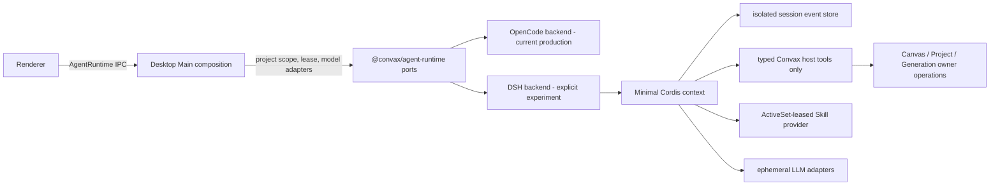

# Convax 从 OpenCode 迁移到 DeepSeek Harness 的方案研究

> 状态：研究结论，尚未改变当前产品架构
> 日期：2026-08-14
> 决策：不直接替换生产 OpenCode；先在 `@convax/agent-runtime` 内建设一个最小、隔离、可撤销的 DeepSeek Harness 实验后端，达到全部生产门槛后再做单向切换。

## 1. 结论

DeepSeek Harness（下文简称 DSH）可以成为 Convax 下一代 Agent Harness 的候选基础，但当前不能安全地作为 OpenCode 的等价替换。

推荐路线是：

1. `@convax/agent-runtime` 继续拥有 Harness 适配、Session、资源、工具桥和 protected-path enforcement；Desktop 继续只做组合、策略注入和 Electron 适配。
2. 在现有 `AgentRuntime` 后面增加一个 **launch-scoped、开发者显式开启** 的 DSH 后端。一段进程生命周期和一个 Session 只允许一个 Harness 成为事实来源，不双写、不热切换。
3. 使用 DSH 的公开 `boot()`、in-process API proxy/client 和 Cordis 插件组合，静态构造一个 Convax 专用最小 Profile；不启动 `dsh web`，不把 localhost HTTP 当进程内权限边界。
4. 只挂载 Convax 的 typed host tools、受 ActiveSet lease 约束的 Skills、用户审批/提问、Session 日志和动态模型适配器。默认不挂载 shell、filesystem、LSP、web、subagent、workflow、goals、默认遥测和默认本地 Skill 扫描。
5. OpenCode 继续服务生产会话，直到 DSH 完成 MCP OAuth、Hook ABI、权限语义、Electron 打包、历史会话保留和跨平台恢复验证。生产切换时只让 DSH 创建新会话；旧 OpenCode 数据先只读保留或显式导出，不把两种事件日志“猜测性转换”。

这条路线不是长期维护两个生产 Harness。实验期间有两个实现，但生产事实来源仍只有 OpenCode；切换完成后删除 OpenCode 二进制、SDK、配置、UI 名称和旧适配代码。

## 2. 调研基线与证据

### 2.1 上游状态

本研究固定到以下可复查基线：

- 官方仓库：[deepseek-ai/deepseek-harness](https://github.com/deepseek-ai/deepseek-harness)，研究时源码提交为 [`47f943859bef60e4160492346772ded9b24f765a`](https://github.com/deepseek-ai/deepseek-harness/tree/47f943859bef60e4160492346772ded9b24f765a)，提交日期 2026-08-13。
- 仓库根版本是 `0.1.0-rc.5`；npm 的 `@deepseek-ai/dsh` `next/latest` 已是 `0.1.0-rc.6`。源码提交、npm 包和 tag 尚未形成易于审计的一一对应关系。
- 上游 README 明确标记为 Developer Preview，并声明可能发生 breaking changes；因此不能把 RC API 当作稳定 Plugin ABI。
- 上游要求 Node.js 22.19+ 或 24+。Convax 当前 Electron 42.4.1 的嵌入 Node 版本仍需要通过实际 packaged runtime probe 证明兼容，不能只根据本机 `node` 或 `bun` 推断。
- DSH 是 MIT 许可、Cordis 驱动、插件化的 Agent Harness。其[架构文档](https://github.com/deepseek-ai/deepseek-harness/blob/47f943859bef60e4160492346772ded9b24f765a/docs/architecture.md)将 Session 定义为追加式事件日志，并把 model adapter、tool registry、agent loop、storage 等能力放入插件组合。推荐的进程内接缝可在公开的 [`app-boot`](https://github.com/deepseek-ai/deepseek-harness/blob/47f943859bef60e4160492346772ded9b24f765a/packages/boot/app-boot/src/index.ts) 和 [`host/apiproxy`](https://github.com/deepseek-ai/deepseek-harness/blob/47f943859bef60e4160492346772ded9b24f765a/packages/host/apiproxy/src/index.ts) 源码中复查。

DeepSeek 模型本身不是本次迁移的充分理由。OpenCode 也可以接 DeepSeek-compatible API；本方案评估的是 Harness 的 Session、tool loop、审批、Skills、MCP、打包和可恢复性，而不仅是模型供应商。模型工具调用和 thinking 行为仍需遵守 [DeepSeek Tool Calls](https://api-docs.deepseek.com/guides/tool_calls)、[Reasoning Model](https://api-docs.deepseek.com/guides/reasoning_model) 和 [Chat Completion API](https://api-docs.deepseek.com/api/create-chat-completion) 的约束。

### 2.2 Convax 当前事实

当前代码中约有 73 个文件、651 处 `opencode` 命中；这不是一个依赖替换，而是跨运行时、打包、Host 工具、MCP、Skills、Hooks、Renderer 和文档的迁移。

| 当前能力                                                                                      | 事实来源/所有者                                     | 迁移含义                                                  |
| --------------------------------------------------------------------------------------------- | --------------------------------------------------- | --------------------------------------------------------- |
| `AgentRuntime` 的会话、prompt、abort、status、model、permission、question API                 | `@convax/agent-runtime`                             | 应保持调用侧稳定，让 DSH 在 owner 内适配                  |
| `OpenCodeAgentRuntime`、OpenCode SDK/server、受保护路径和工具 server                          | `@convax/agent-runtime`                             | 不能把 DSH loop 或私有 Session 状态搬到 Desktop           |
| Project scope、ActiveSet lease、Plugin Skills/Hooks/MCP、动态 LLM providers、typed host tools | Desktop Main 组合根                                 | 继续通过窄端口注入，不允许 DSH 自行发现产品状态           |
| `userData/opencode` 与 OpenCode Session                                                       | OpenCode runtime                                    | 新后端必须用隔离目录，不能原地接管或改写                  |
| remote MCP HTTP/OAuth 和持久凭据                                                              | 当前 OpenCode runtime                               | DSH 没有等价标准 OAuth 生命周期，是生产阻断项             |
| OpenCode Plugin ESM Hook                                                                      | Plugin SDK/ActiveSet + Desktop validator + OpenCode | DSH Cordis plugin 不兼容，必须单独决定 ABI 迁移           |
| packaged OpenCode 二进制及完整性校验                                                          | Desktop scripts/electron-builder                    | DSH 的动态插件加载与自包含 Main bundle 冲突，需要专门验证 |
| Agent UI 中的 OpenCode 名称与配置                                                             | Renderer/Desktop IPC                                | 先中性化产品语义，不能让 Renderer 选择或配置后端          |

现有架构中，Agent Harness 不是 Canvas/Project 的持久化权威。Canvas/Project 的 durable command 仍经 owner operation、candidateDoc 和 durable barrier；DSH 只能调用同一组 typed host tools，不能直接读写 Yjs、`.convax` 或文件系统。

## 3. DSH 能力映射

### 3.1 可直接利用的公开边界

| DSH 能力                                                                   | Convax 映射                                         | 评价                                                  |
| -------------------------------------------------------------------------- | --------------------------------------------------- | ----------------------------------------------------- |
| `@deepseek-ai/dsh-app-boot` 的 `boot()`                                    | 启动一个隔离 Cordis Context                         | 可用，但加载配置树的 API 仍是 RC                      |
| `@deepseek-ai/dsh-host-apiproxy` 的 `createApiProxy`、`InProcessApiClient` | 无 socket 的 Request/Response API 边界              | 推荐作为 adapter seam                                 |
| Session create/list/history/prompt/cancel/fork/rename                      | `AgentRuntime` 会话和消息 API                       | 大体可映射；事件语义需严格转换测试                    |
| append-only Session event log + JSONL/SQLite storage                       | 新 DSH Session 事实来源                             | 符合可恢复方向；不可与 OpenCode 日志双写              |
| scoped tool registry 和 tool pipeline                                      | Convax typed host-tool bridge                       | 适合；只注册 Project scope 内的工具                   |
| correlated approval/question server requests                               | permission/question UI                              | 可映射；permission `always` 语义仍不等价              |
| model adapter registry                                                     | Plugin sidecar loopback OpenAI/OpenRouter providers | 需要 Convax-owned adapter，配置与密钥仅驻留 Main 内存 |
| Skill provider registry                                                    | exact ActiveSet lease 下的 Skill dirs               | 使用自定义 provider，禁止默认发现                     |
| macOS Seatbelt、Linux bwrap/Landlock、Windows ACL sandbox                  | defense in depth                                    | 不能替代不挂载 shell/fs 工具的 capability boundary    |

### 3.2 不能直接继承的默认行为

DSH 的“everything is a plugin”提高了组合灵活性，也意味着 Convax 必须明确拒绝上游通用开发 Agent 的默认能力：

- 不整体引入 `dsh-base`。其默认组合包含 shell、filesystem、web、subagent、workflow、goals、Skills、sandbox、telemetry 等，远大于 Convax 产品 Agent 的最小权限。
- 不使用默认 filesystem Skill provider 扫描项目中的 `.dsh/skills`、`.agents/skills` 或用户目录。打开任意 Project 不得因此加载项目本地 Skill；只能消费 Desktop 从 exact ActiveSet lease 解析出的批准目录。
- 不允许模型直接获得 shell、filesystem 或 LSP。protected path 不能只靠字符串 denylist；若工具根本未注册，`.convax` 对 Harness 就是不可达的。
- 不开启上游默认遥测。若未来需要诊断，只能经过 Convax 明确的数据分类、用户设置和可审计 adapter。
- 不把默认 DeepSeek provider/model 写成产品策略。模型来源继续由 Desktop 的动态 provider 解析和选择策略注入。

## 4. 推荐目标结构

### 4.1 所有权

- **Owner：`@convax/agent-runtime`。** 新增 DSH adapter、事件投影、Session port、host-tool registry bridge、Skill provider、模型 adapter 和 protected-path capability policy。
- **Composition root：Desktop Main。** 选择实验后端、提供 Project directory/id、ActiveSet lease、工具集合、动态 provider、持久化根目录和 UI reply ports。
- **Renderer：保持 Harness-neutral。** Renderer 只看到运行状态、模型、Session、消息、permission/question；不传 DSH plugin 名、配置树、存储路径或凭据。
- **Plugin：不直接依赖 DSH。** Plugin 继续提交已发布 manifest/Skill/Hook/MCP 契约。若 Hook ABI 需要改变，必须单独经过 Plugin-to-Host change gate。

不建议创建 `@convax/deepseek-harness` 新包。它没有独立于 Agent Runtime 的领域所有权，只会把 adapter 与 runtime policy 人为拆散。

### 4.2 后端选择

后端选择只允许是 Desktop Main 启动时解析的、开发者显式 opt-in 设置，例如 `CONVAX_EXPERIMENTAL_AGENT_HARNESS=deepseek`。它不是 Renderer 参数、Project 文件字段、Plugin manifest 字段或 durable Session 字段。

约束：

- 后端在该进程生命周期内固定；修改设置后重启。
- 一个 Session 的所有写入只进入创建它的 Harness。
- DSH 使用新的 namespace 和目录，例如 `userData/agent-runtime/deepseek-harness/rc6/`；绝不复用 `userData/opencode`。
- 实验后端失败时，允许下次启动重新选择 OpenCode，但不把同一 Session 自动回退给 OpenCode。

### 4.3 最小 DSH Profile

PoC 只允许组合以下能力：

1. Session service、append-only log、projection 和隔离持久化。
2. Agent loop、system prompt、context management 和模型 adapter。
3. Convax typed tool registry；tool name、schema、scope、abort 和结果 codec 都从现有 host-tool port 派生。
4. 用户 permission/question request 与 reply correlation。
5. 只读取 Desktop 已验证目录的 `ConvaxSkillProvider`。
6. in-process API proxy/client；不监听端口。

PoC 明确不包含：shell、filesystem、LSP、web、subagent、workflow、goals、默认 MCP、默认 Skill provider、默认 telemetry、OpenCode Hook 兼容层、历史 Session 转换。

## 5. 生产切换的硬阻断项

### 5.1 MCP OAuth 与凭据

DSH 当前 MCP client 支持 stdio、Streamable HTTP、静态 headers、动态 tool sync/reconnect，但源码未提供与 Convax 当前 OpenCode 合约等价的标准 remote MCP OAuth、登录状态和持久凭据生命周期。只支持 headers 不等于 OAuth。

在以下能力完成前，DSH 不能成为生产默认：

- host-agnostic MCP auth/status/connect ports；Desktop 不依赖具体 Harness class；
- OAuth callback/state/PKCE、凭据加密持久化、撤销、过期刷新和重启恢复；
- Renderer 只能通过窄 IPC 触发认证，不接触 token；
- MCP server 配置仍来自 exact ActiveSet lease，lease 改变会原子刷新或拒绝陈旧调用。

不得为了过门槛把 MCP OAuth 临时搬进 Desktop 或 Plugin。

### 5.2 Hook ABI

现有 Plugin Hook 是 OpenCode Plugin ESM，Desktop validator 也检查 OpenCode export。DSH 的 Cordis plugin/event 不是同一 ABI，不能通过重命名或包一层 `any` 保持兼容。

只能选择其一：

1. 将 Hook 能力收敛成 Convax 自有、Harness-neutral、可验证的声明式 Hook ABI，再分别做 OpenCode/DSH adapter；或
2. 明确废弃现有 Hook contribution，提供版本化 manifest 迁移、拒绝理由和发布门槛。

这属于公开 Plugin surface 变更，必须单独走 Plugin Host change governance，不包含在实验 adapter PR 中。

### 5.3 权限语义

DSH 核心 approval 更接近 allow-once/reject；当前 Convax/OpenCode 暴露 once/always/reject。不能把 `always` 偷偷降级为 once，也不能在 DSH 外维护无边界的全局白名单。

需要先定义：permission 的 scope（Session、Project、Plugin snapshot 或 tool schema digest）、有效期、撤销、重启恢复和 ActiveSet 变化后的失效规则。若暂时只支持 once/reject，UI 和 capability 必须准确反映降级。

### 5.4 Electron 构建与供应链

Convax Desktop Main 当前是自包含 bundle，打包时不依赖 ASAR 内 `node_modules`；而 DSH 的常见 boot/profile 通过配置中的包 specifier 动态装载插件。直接复制 YAML profile 很可能在 packaged app 中产生 bare-import 或资源缺失。

推荐 PoC 采用**静态 import + 代码构造最小 Cordis tree + in-process client**，并验证这些公共包能被 electron-vite 正确 bundle。若上游公开 API 无法支持静态组合，再评估一个完整性校验的官方 DSH sidecar；不要先 fork 或复制上游实现。

供应链门槛包括：

- npm 版本、源码 commit、tag、lockfile 和 integrity 可对应；
- 所有 DSH 依赖经 license、postinstall、native addon 和网络行为审计；
- macOS arm64/x64、Windows x64 packaged smoke；
- offline restart 不下载插件或模型 adapter；
- Electron 内置 Node 版本通过真实 package probe，而非文档推断。

### 5.5 历史 Session 与恢复

OpenCode 和 DSH 都可能使用事件式 Session，但事件类型、tool call identity、message part、compaction 和恢复语义不同。禁止直接逐字段转换后宣称等价。

生产切换的安全默认值：

- 切换时只由 DSH 创建新 Session；
- OpenCode Session 存储保留只读，可由旧 runtime 在明确的 legacy viewer/export 流程中打开；
- 导出内容包含来源 Harness、原 Session id、时间、消息、tool/approval 证据和无法表达的事件；
- 只有定义了版本化、幂等、可回滚的迁移 codec 后，才允许用户显式复制为一个新的 DSH Session；原数据始终保留。

## 6. 分阶段实施

### Phase 0：中性化现有边界

目标是先消除 Desktop 对 `OpenCodeAgentRuntime` 具体类和 OpenCode 名称的非必要依赖，不改变当前行为。

- 把 Desktop 使用的 refresh、MCP status/auth/connect 等能力提升为 `@convax/agent-runtime` 公共 typed ports。
- 将 Renderer 的产品文案和持久键改为 Harness-neutral；不暴露后端选择。
- 为 `AgentRuntime` 的 Session、permission、question、model capability 增加契约测试。
- 保持 OpenCode 是唯一实现和生产事实来源。

### Phase 1：隔离 PoC

- 在 `@convax/agent-runtime/node` 增加 `DeepSeekHarnessAgentRuntime`，只使用 DSH 公开 API。
- 使用独立 storage root、fake/model fixture 和 fake host tools；先不接真实 Plugin Hooks/MCP OAuth。
- 通过 Desktop Main 的 launch-scoped dev flag 选择；默认关闭，release build 默认拒绝。
- 增加重复 prompt、abort、stale response、tool timeout、restart replay、corrupt log 和 storage unavailable 测试。

PoC 的成功标准不是“能聊”，而是：重启后投影一致、取消不产生迟到提交、工具只经 host port、Skill 不发生 ambient discovery、日志损坏 fail closed、关闭 DSH 后 OpenCode 完全不受影响。

### Phase 2：产品能力对齐

- 接入 ActiveSet-leased Skill provider 和动态模型 adapter。
- 完成 typed host tools 的 schema/result/cancellation 映射。
- 对齐 permission/question、model capability、Session fork/rename/list。
- 解决 MCP OAuth；完成 Hook ABI 的独立架构决策。
- 运行 OpenCode 与 DSH 的同一组 deterministic contract fixtures，但不共享真实 Session 数据。

### Phase 3：打包、恢复与评测

- packaged macOS/Windows 离线启动、重启、升级、崩溃恢复和卸载 Plugin 后的数据保留测试。
- 对比 cold start、常驻内存、首 token、tool round-trip、长会话 context/token 成本、compaction 后任务正确率。
- 对 Project/Canvas/Generation 场景做可复现 eval：成功率、错误工具率、重复副作用率、取消后副作用、权限误授予率。
- 对网络断开、provider 401/429/5xx、MCP 重连、磁盘满、损坏日志和 ActiveSet lease 变化做 fault injection。

### Phase 4：受控生产切换

- 架构文档、package boundary、Desktop/Agent Runtime contracts、Plugin 文档和 packaged smoke 在同一变更中更新。
- 新会话默认进入 DSH；旧会话仍按来源 Harness 只读打开/导出。
- 设置可回滚到 OpenCode **创建新的 OpenCode Session**，但不接管已经由 DSH 写入的 Session。
- 观察期内保留 OpenCode runtime 资源，但禁止同一 prompt 双发或同一 tool 双执行。

### Phase 5：删除遗留实现

- 删除 OpenCode SDK/runtime 依赖、binary staging、config directory、专属 validator、UI 名称和 boundary exception。
- 对旧存储执行显式保留/导出/归档策略，不静默删除。
- 删除实验 flag，DSH 成为 `AgentRuntime` 的唯一当前实现。

## 7. PoC 变更边界

首个实现 PR 的建议范围：

| 区域                            | 允许变更                                                                               | 不允许变更                                           |
| ------------------------------- | -------------------------------------------------------------------------------------- | ---------------------------------------------------- |
| `packages/agent-runtime`        | DSH adapter、公共 lifecycle/MCP ports、事件投影、custom Skill/model/tool adapter、测试 | Convax Project/Canvas/UI 策略，私有 DSH 源码复制     |
| `packages/desktop/src/main`     | 启动期选择、目录和现有策略端口注入                                                     | DSH Session reducer、工具业务规则、OAuth 凭据逻辑    |
| `packages/desktop/src/preload`  | 仅在现有 IPC 无法表达准确 capability 时扩展                                            | 传 plugin package、schema、凭据、路径或后端配置      |
| `packages/desktop/src/renderer` | 显示准确的 capability/降级状态                                                         | 选择 Harness、加载 plugin、持有 token                |
| `packages/plugin-*`             | 首个 PoC 不改                                                                          | DSH 专属 manifest、具体 vendor id、私有 escape hatch |

建议先做一个独立、可删除的 spike，再决定是否提交生产代码。Spike 也必须尊重 package boundary，不应成为 Desktop 里的临时代码桶。

## 8. 验收矩阵

| 维度           | 必须证明                                                  | 失败判定                                            |
| -------------- | --------------------------------------------------------- | --------------------------------------------------- |
| Session        | restart/replay 投影逐事件一致；fork/rename/list 正确      | 重启丢消息、重复执行、靠 UI cache 恢复              |
| Prompt/cancel  | abort 传播到模型和工具；迟到结果不提交                    | UI 显示取消但工具仍产生 durable side effect         |
| Tool           | 仅 exact Project scope 的 typed tools；schema/result 闭合 | shell/fs 可见、模型能构造 Yjs/完整 Canvas node      |
| Protected path | `.convax` 对 Harness 不可达，额外 sandbox 测试通过        | 依赖 prompt 或字符串过滤保护                        |
| Skills         | 只加载 exact ActiveSet lease 的批准目录                   | 扫描 Project `.agents/skills` 或用户全局目录        |
| Providers      | secret/config 仅 Main 内存；切换 lease 后旧 adapter 失效  | token 进入 Renderer、Session log 或普通 config 文件 |
| Permission     | once/always/reject 语义准确、可撤销、可审计               | 静默升权或降级、scope 不清                          |
| MCP            | OAuth 登录、刷新、撤销、重启恢复、lease refresh           | 只用静态 header 冒充 OAuth parity                   |
| Hooks          | 有版本化、可验证的 Harness-neutral 决策                   | 直接执行 OpenCode Hook 或 DSH plugin `any` wrapper  |
| Packaging      | macOS/Windows 离线 packaged smoke                         | 运行时查找未打包 `node_modules` 或联网下载 plugin   |
| Supply chain   | 版本/源码/integrity 对应，RC 更新受 Renovate/人工审阅     | `latest` 浮动安装、无法追到源码                     |
| Migration      | 旧 OpenCode 数据可恢复、可导出、可回滚                    | 自动改写、删除或猜测性转换旧 Session                |
| Eval           | 相同 fixture 下质量、成本、延迟和副作用均可比较           | 只凭一次聊天 demo 宣称替换成功                      |

## 9. 被否决的捷径

### 9.1 只把 OpenCode 的模型改成 DeepSeek

适合快速验证模型质量，但没有替换 Harness；Session、tool loop、MCP、Skills 和打包仍属于 OpenCode。可以作为独立、低成本实验，不能代替本迁移方案。

### 9.2 直接调用 DeepSeek Chat Completion 自建 loop

会重新实现 tool loop、Session 日志、审批、重放、compaction、MCP、Skill、sandbox 和 streaming correlation，增加 Convax 自有基础设施面积。除非 DSH 的公共 API 无法稳定嵌入且业务价值已被实验证明，否则不选。

### 9.3 在 Desktop Main 里直接拼 DSH

违反 package ownership，并让 Electron、Project 策略与 Harness 私有状态耦合。DSH 必须在 `@convax/agent-runtime` 内适配。

### 9.4 整体使用 `dsh-base`

能力过宽，会引入 ambient Skills、shell/fs/web/subagent/workflow/telemetry 等默认行为。Convax 需要最小白名单组合，而不是再靠 denylist 收口。

### 9.5 启动 `dsh web` 本地 sidecar

为进程内产品能力新增端口发现、鉴权、生命周期、升级和故障域，且 localhost 不是权限边界。只有静态 in-process 组合被上游公共 API 实质阻断时，才重新评估完整性校验的 sidecar。

### 9.6 Fork DSH 或复制源码

Developer Preview 更新频繁，fork 会让安全修复、协议变更和许可证审计变成长期负担。首选固定官方包、公共 API 和薄 adapter；若需要私有 API 才能实现，视为上游阻断而不是复制许可。

## 10. 决策记录与下一步

当前批准的下一步仅是一个 docs-backed PoC 任务，不是生产替换：

1. 先提交 Phase 0 的 Harness-neutral lifecycle/MCP port 设计，证明 Desktop 不再依赖具体 runtime class。
2. 单独实现最小 in-process DSH spike，固定 npm 版本与 integrity，验证 Electron 42 packaged build、Session replay 和 typed host tool round-trip。
3. 用验收矩阵形成 OpenCode/DSH 对比报告，再决定是否进入 Phase 2。
4. 在 MCP OAuth 和 Hook ABI 未解决前，不创建“迁移完成”或“可默认开启”的 MR。

### 文档影响检查

本研究 PR 不修改 `docs/architecture.md`、根/包级 `AGENTS.md` 或 package boundary，因为当前实现和生产架构仍然是 OpenCode。任何 Phase 0 之后的实现 PR 都必须重新阅读并同步更新：

- `docs/architecture.md` 的 Agent tools/Skills、MCP runtime boundary、Electron boundary 和 package dependency graph；
- `packages/agent-runtime/AGENTS.md` 与触及的 Desktop process contracts；
- `docs/plugin-skill-platform.md`；若改变 Hook/API/manifest，还包括 `docs/plugin-host-change-governance.md` 和对应 Catalog/SDK 产物；
- `scripts/package-boundary-check.ts`、打包脚本和 packaged smoke。

该文档只证明“方案和门槛已定义”，不证明 DSH 已可运行、已通过打包、已达到能力对齐或已适合生产。
