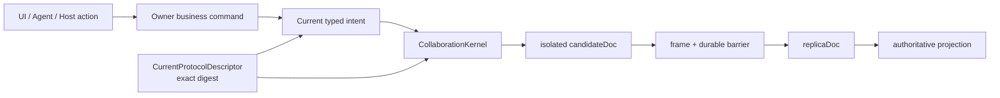

# Convax 单一 Current Protocol 重构执行书

状态：**已执行，并于 2026-08-06 修正 local-first authority 缺口**。本文不是新的 V12、R6、兼容层或
authority release。它明确撤销“生产运行时同时承载 V2/V3、V10/V11、R5 与
successor promotion”的方向。

日期：2026-08-05

## 0. 执行结论

Convax 协作栈只保留一套当前实现：

- 一个 `CollaborationKernel`；
- 一个 `CanvasReducer`；
- 一个 `ProjectIndexReducer`；
- 一个 frame codec；
- 一个 current protocol descriptor；
- 一个 Project/Canvas genesis 路径；
- 一个 Desktop composition；
- 一个 Plugin Canvas root-surface 业务能力。

生产源码、文件名和公开符号中不再使用 `V2`、`V3`、`V10`、`V11`、`R5`、
`successor`、`historical`、`promotion` 来选择运行行为。序列化的协作协议名称也
不再用 `/2`、`/3` 表示并存版本，而改成无数字后缀的 current 名称。精确协议
身份由一个 `protocolDigest` 决定，不由版本号决定。

本次最初选择现有 R5/V2 实现作为代码来源，但该选择包含一个已证伪的隐含
假设：R5/V2 的生产 mutation 与 Canvas genesis 只接受 Team enrollment，不能
支撑本文同时要求的 local-first 产品模型。修正后的 current 实现仍不恢复
V11/V3 successor runtime 或 fallback；它把必要的 local-owner 语义并入无版本
current 协议，使 causal frame 与 Canvas genesis 都显式接受
`local-project-owner | team-replica` authority。未共享 Project 直接由 durable
local owner 离线创建和编辑，Team 仅通过同一协议的 durable handoff 追加共享
能力。

2026-08-06 的执行验证还证伪了两个组合层假设：空的 current ProjectIndex 不会
自行产生可编辑 surface，Canvas genesis 持久化也不能在未注册 Canvas owner
materializer 时写入。因此 Desktop 的 Workbench 协调器现在通过同一个 Project
typed command 创建并打开首张 Canvas；Genesis 仅在 exact-scope materializer
注册期间越过持久化屏障，成功帧同时进入 live causal index。Canvas 当前资源
证明则只从 ProjectIndex 的 current-resource projection 验证，不从路径或 UI
prepared item 推断。

同日的真实旧 Project 重置再次证伪了“只有 pristine bootstrap 才能由本地
authority reset”的假设。已有本地帧或前一次 reset records 并不等于 Team
authority。用户明确确认后，只要 durable Team store 精确为 `missing` 且 Project
私有树不存在 Team/control 或 sharing-handoff namespace，Desktop 就准备一枚
新的 current local owner，在新 genesis 与旧树 byte-exact archive 均验证完成后
才激活；unsupported bytes 全程不解码。Team record 为 active/rejected 或存在
Team namespace 时仍必须走 control-plane rollover。

这是一次 pre-release rebaseline。旧实验协作数据不会通过保留旧 decoder 来
兼容；它只能原样归档、导出或经用户明确确认后 reset。若存在必须无损保留的
生产数据，本方案立即停止，不能一边要求单运行时、一边偷偷保留多版本 decoder。

## 1. “只有一个版本”的严格定义

### 1.1 必须归零

在下列生产依赖闭包中：

```text
packages/collaboration/**
packages/canvas/src/collaboration/**
packages/project/src/collaboration/**
packages/project/src/collaboration-protocol/**
packages/project/src/node/collaboration/**
packages/desktop/src/collaboration/**
packages/desktop/src/main/**collaboration**
packages/desktop/src/main/**authority**
packages/desktop/src/main/**successor**
packages/desktop/src/main/**promotion**
apps/api/** collaboration consumers
scripts/** collaboration authority tooling
```

以下内容必须为零：

1. 公开或内部 TypeScript 标识符尾缀 `V1`、`V2`、`V3`；
2. 文件名尾缀 `-v1.ts`、`-v2.ts`、`-v3.ts`；
3. `successor-*` 运行时文件；
4. 同一协议的多个 decoder、selector、kernel 或 reducer；
5. `V10/V11/R5` runtime 分支；
6. historical decoder fallback；
7. protocol promotion bridge；
8. 新建 Project 先建旧 genesis、再 promotion 的流程；
9. production bundle 从 `docs/superpowers/specs/authorities/**` 加载运行时字节；
10. Canvas intent、state、frame 等 current wire discriminator 中的 `/2`、`/3`。

### 1.2 不等于“所有独立产品协议都叫同一个数字”

`convax.plugin/8`、`convax.package/2`、Marketplace Registry、Desktop IPC 是独立
发布合同，不是 Collaboration 的并行 decoder。本重构不把这些无关协议强行改成
同一个数字；那只会制造另一次无关的全仓破坏。

统一规则是：

- 源码符号使用语义名，不携带版本尾缀；
- 每个独立协议在生产中只能有一个 current decoder；
- 旧格式不得以 fallback 形式常驻生产；
- Collaboration/Canvas/Project 这次整体 rebaseline 为无数字后缀的 current
  wire identity。

若后续还要清理 Plugin/Marketplace 等独立 ABI，另开任务，不能夹带在本次
Canvas 修复里。

## 2. 当前问题与证据

当前仓库不是“V11 已替代 V10”，而是双运行时：

- `packages/collaboration/src/authority-selector.ts` 选择 V10/R5；
- `packages/collaboration/src/authority-selector-v3.ts` 选择 V11，同时强制装载
  V10/R5 historical closure；
- `packages/collaboration/src/kernel.ts` 与 `successor-kernel.ts` 分别实现两套
  kernel；
- `packages/collaboration/src/protocol-codec-strategy.ts` 同时暴露 V2 与 V3
  codec；
- `packages/desktop/src/main/collaboration-authority-loader-v3.ts` 同时加载两套
  release；
- Desktop resolver、exact-base、new-project factory 和 Project native store
  均含 successor/promotion/fallback；
- 新项目的 V11 路径仍以 V10 genesis 为前置；
- Canvas owner language 仍是 `convax.typed-intent/2`；
- `canvas.nodes.create/2` 的名字像通用创建，实际只创建 Agent 根节点；
- Plugin SDK 却允许 `renderer.create:true`，Renderer 点击后走本地
  `insertNode`，最终被协作 adapter/reducer 拒绝。

初步扫描显示带版本标识符的文件至少分布于：

```text
packages/canvas:        29 files
packages/collaboration: 50 files
packages/desktop:      145 files
packages/project:       80 files
```

这些数字不是完成指标；执行模型必须在修改后重新全量扫描。

## 3. 目标架构



### 3.1 Current protocol descriptor

新增一个代码所有、可确定性生成的描述符，例如：

```text
packages/collaboration/protocol/current.json
packages/collaboration/src/current-protocol.ts
```

建议形状：

```ts
interface CurrentProtocolDescriptor {
  format: "convax.current-protocol-descriptor"
  frameMagic: "CVXCOLL"
  typedIntentFormat: "convax.typed-intent"
  artifacts: readonly {
    name: "collaboration-kernel" | "canvas-schema" | "project-index-schema" | "project-persistence"
    digest: Digest
  }[]
  yjsWireCodec: {
    package: "yjs"
    packageIntegrity: string
    updateCodec: "v1"
  }
  protocolDigest: Digest
}
```

要求：

- descriptor 由源码 schema 生成并在 CI 重算；
- Desktop 打包这一份 descriptor；
- runtime 只接受与构建内 descriptor 完全相等的 digest；
- descriptor 不包含 V10、V11、R5、previousSelection 或 historical pin；
- descriptor 不是可在 Renderer 或 Plugin 中切换的配置；
- schema 改变会改变 digest，但不会在代码中新增第二套 decoder。

### 3.2 单 codec、单 kernel

删除 protocol strategy 的多实现选择。`CollaborationKernel` 直接依赖当前 codec。

目标 API 示例：

```ts
export class CollaborationKernel { /* one implementation */ }
export interface CausalEditFrame { /* one shape */ }
export interface CausalContext { /* one shape */ }
export interface DocumentScope { /* one shape */ }
export type Digest = string & { readonly __digest: unique symbol }

export function parseDigest(value: unknown): Digest
export function encodeRestrictedJcs(value: unknown): Uint8Array
export function decodeCausalEditFrame(bytes: Uint8Array): CausalEditFrame
```

禁止继续保留别名：

```ts
// 禁止
export const parseDigest = parseDigestV2
export type Digest = DigestV2
```

执行时必须真正重命名定义与调用者；临时 alias 只能存在于单个未合并 commit 内，
最终仓库不得出现。

### 3.3 Current wire names

协作依赖闭包内的 wire names 改为无数字后缀，例如：

```text
convax.causal-edit-frame
convax.causal-context
convax.typed-intent
convax.canvas-node-data
convax.canvas-plugin-state
convax.canvas-operation-receipt
convax.project-index-state
convax.document-scope
convax.replica-checkpoint
```

frame magic 只保留 `CVXCOLL`。删除 `CVXCOLL2`、`CVXCOLL3`。

旧字节不会被猜测解析。magic、format 或 protocol digest 不匹配时返回统一的
`unsupported-project-data`，不得尝试另一个 decoder。

## 4. 数据与切换政策

### 4.1 本方案的明确代价

本方案不提供旧 Collaboration 数据的透明兼容。原因不是“暂时没做”，而是单
运行时目标与常驻旧 decoder 本身冲突。

允许的处理只有：

1. 原样归档旧 private tree；
2. 导出用户可见资源；
3. 显式提示数据不受支持；
4. 用户明确确认后创建新 epoch/current genesis；
5. reset 完成后保留旧字节的可恢复备份，直到用户主动删除。

禁止：

- 启动时静默 reset；
- 用 current decoder 猜测解释旧 frame；
- 重签、重编号或重写旧 frame；
- 为了“能打开”把旧 decoder 藏到 migration helper；
- 通过目录存在性选择 runtime。

### 4.2 执行前 stop condition

执行模型必须先给出证据证明以下至少一项成立：

- 尚未发布，不存在必须无损保留的用户协作数据；或
- 产品负责人已明确接受旧实验数据只能 archive/reset。

否则停止，不得开始删 decoder。

## 5. Canvas 通用 Plugin Surface

单版本重构必须同时修复最初的产品缺口，不能只做命名清理。

### 5.1 不再扩 `nodes.create`

删除带版本后缀且含义误导的 `canvas.nodes.create/2`。当前语言保留语义化命令：

```text
canvas.agent.create
canvas.resources.add
canvas.plugin.creation-group.create
canvas.plugin.surface.create
```

`canvas.plugin.surface.create` 是一次性建立的通用能力；以后新增故事版、3D 导演台
或其他 Plugin，只改变 manifest 和 schema-valid state，不新增 Plugin 专属 intent、
node kind 或 reducer 分支。

### 5.2 固定语义

该 intent 一次创建：

- 一个独立顶层节点；
- `role: "file"`；
- `data.kind: "plugin-surface"`；
- 一个由 Host 精确 lease 派生的 Plugin requirement；
- 一个由精确 validation artifact 验证的初始 state；
- 一个 Canvas 派生的 node id/incarnation；
- 一个 Canvas 计算的确定性位置；
- 一个 candidate transaction；
- 一个 durable frame；
- 一个 semantic history root。

它不得携带 source、edge、parent、creation group、caller-selected node id、raw Yjs、
actor、protocol digest 或 schema digest。

### 5.3 数据模型

```ts
interface PluginSurfaceNodeData {
  kind: "plugin-surface"
  title: string
}

interface PluginSurfaceCreateSpec {
  title: string
  size: CanvasSize
  plugin: PluginRequirement
  initialState: PluginStateEnvelope
}
```

`PluginRequirement` 和 `PluginStateEnvelope` 必须绑定同一个 Plugin snapshot、schema
digest 与 validation artifact。artifact 缺失或 state 不通过时零写入。

Plugin 卸载后节点和 state 保留；projection 使用 unknown-file fallback，不重置数据。

### 5.4 Host 调用链

```text
Capability Center
  -> preload canvas.pluginSurfaces.create({ projectId, canvasId, pluginId })
  -> trusted Main IPC
  -> Main 获取 current ActiveSet exact lease
  -> Main 从 manifest 派生 renderer/size/schema/artifact/snapshot
  -> Canvas business command canvas.plugin.surface.create
  -> current kernel durable commit
  -> receipt + created node id
```

Renderer 请求只能包含 Project、Canvas 和 Plugin id。禁止 Renderer 传 version、
snapshot digest、schema digest、node id、position、完整 node 或 initial state。

删除以下旁路：

- Capability Center 调 `editor.insertNode(plugin.*)`；
- Web Plugin renderer 按 `renderer.create` 注册本地 node factory；
- Desktop 构造完整 `CanvasNode` 再塞给 Canvas；
- 复用 `nodes.materialize-connected` 创建独立 root。

## 6. 执行工作包

每个工作包单独 commit，前一个通过后才进入下一个。禁止多个模型同时改同一包。

### WP0：先改治理合同

所有权：root architecture。

修改：

- `AGENTS.md`；
- `docs/architecture.md`；
- `packages/collaboration/AGENTS.md`；
- `packages/canvas/AGENTS.md`；
- `packages/project/AGENTS.md`；
- `packages/desktop/AGENTS.md`；
- `packages/desktop/src/main/AGENTS.md`。

要求：

- 删除 active V11/R1 + pinned V10/R5 双运行时要求；
- 明确旧 authority 目录仅为历史评审材料，不是 runtime selector；
- 写入 single-current、no-fallback、explicit-reset 政策；
- 写入 Plugin surface 的 Canvas/Host ownership；
- 不改旧 sealed artifact 字节；它们留档即可。

验收：生产代码可以在不读取旧 authority 路径的情况下构建。

### WP1：建立 current descriptor，删除 authority release 运行依赖

所有权：`@convax/collaboration` + build tooling。

主要修改：

- 新增 `packages/collaboration/protocol/current.json`；
- 新增/重写 `packages/collaboration/src/current-protocol.ts`；
- 重写 `packages/collaboration/src/authority-selector.ts` 为单 current descriptor
  validator，或直接删除 selector 概念；
- 删除 `packages/collaboration/src/authority-selector-v3.ts` 及测试；
- 删除 `scripts/collaboration-authority-v11/**`；
- 退役 `scripts/collaboration-authority-v11-release.ts` 及测试；
- 将 `scripts/collaboration-authority/**` 重写为 current descriptor generator；
- 更新 `scripts/package-boundary-check.ts`；
- 更新 `packages/desktop/scripts/stage-collaboration-authority.ts`，只 stage 一份
  current descriptor；
- 更新 `packages/desktop/electron-builder.config.ts` 及测试。

禁止从 `docs/superpowers/specs/authorities/**` 复制生产 runtime 输入。

### WP2：Collaboration 单 kernel、无版本 API

所有权：`@convax/collaboration`。

以当前 V2/R5 kernel 为代码基线，完成：

- `CollaborationKernelV2` -> `CollaborationKernel`；
- `VerifiedProtocolAuthorityV2` -> `CurrentProtocolAuthority`；
- `CausalEditFrameV2` -> `CausalEditFrame`；
- `DigestV2` -> `Digest`；
- 所有 `parse*V2`、`encode*V2`、`*DigestV2` 改为无尾缀；
- 测试和 fixtures 同步改名；
- `kernel.ts` 直接使用唯一 codec；
- 删除 `protocol-codec-strategy.ts` 的多实现选择；若保留该文件，也只能导出一个
  无版本 current codec；
- 删除全部 `successor-*.ts`、对应测试与 test support；
- 删除 `authority-selector-v3*`；
- 删除 `index.ts` 中所有 V3/successor exports；
- 更新 `scripts/pack-check.ts`，只校验无版本 public API。

注意：`dist/**` 是构建产物，先通过源码重构，再由 `clean/build` 重建；不得手改。

### WP3：Project 直接 current genesis

所有权：`@convax/project`。

删除：

- `packages/project/src/node/collaboration/successor-*`；
- `local-owner-project-index-genesis-v3*`；
- Project protocol state 中的 promotion claim、bridge、historical head；
- ProjectIndex V2/V3 runtime dispatcher。

重构：

- 新 Project 一次生成 current ProjectIndex genesis；
- 每个新 Canvas 一次生成 current Canvas genesis；
- sharing 直接使用 current Project/Canvas scope；
- resolver 只有 `current | unsupported-project-data | recovery-required`；
- 不存在 `legacy | successor | promoted` 状态；
- 所有类型、函数与测试文件移除版本尾缀。

### WP4：Desktop 单 composition

所有权：Desktop Main。

删除或合并以下家族：

```text
collaboration-authority-loader-v3*
claim-bound-provisioning-authority-v3*
electron-local-owner-signing-vault-v3*
local-owner-authority-source-v3*
main-*-v3*
node-pristine-v10-successor-*
pristine-v10-successor-*
successor-*
verified-v10-promotion-*
```

目标：

- `loadCurrentCollaborationProtocol()` 只加载 packaged current descriptor；
- `CollaborationProductionRuntime` 只组合一个 kernel；
- `CollaborationDocumentSession` 不接受 kernel union；
- route/runtime registry 不按版本选择；
- new/open/recover/share 走同一 composition；
- 不读取 `collaboration-v10` 或 `collaboration-v11` 路径；
- 不从目录存在性推断协议；
- 旧数据统一返回 `unsupported-project-data`。

### WP5：Canvas 去版本化 + generic Plugin surface

所有权：`@convax/canvas`。

机械改名：

- `application-command-adapter-v2.test.ts` -> `application-command-adapter.test.ts`；
- `command-construction-v2.test.ts` -> `command-construction.test.ts`；
- `external-facts-v2.test.ts` -> `external-facts.test.ts`；
- `history-schedule-v2.test.ts` -> `history-schedule.test.ts`；
- `intent-validation-v2.test.ts` -> `intent-validation.test.ts`；
- `operation-id-v2.test.ts` -> `operation-id.test.ts`；
- `projection-document-v2.test.ts` -> `projection-document.test.ts`；
- `reducer-v2.test.ts` -> `reducer.test.ts`；
- `schema-v2.test.ts` -> `schema.test.ts`；
- `session-v2.test.ts` -> `session.test.ts`；
- 删除 `local-owner-genesis-v3*`，或将必要能力并入无版本 `genesis.ts`。

语义修改：

- `types.ts`：新增 `plugin-surface` data variant 和 current intent；
- `validation.ts`：严格验证 node data、Plugin envelope、history；
- `intent-validation.ts`：exact-key 分支；
- `command-construction.ts`：构造 `canvas.plugin.surface.create`；
- `reducer.ts`：一次 atomic create；
- `projection.ts`：installed/unknown Plugin 投影；
- `ydoc.ts`：沿用同一 node/plugin register topology；
- `session.ts`：只绑定 current descriptor；
- `application/commands.ts`：增加 Host-owned business command；
- `collaboration/application-command-adapter.ts`：映射该 command；
- 删除/退役 `nodes.materialize-connected` 的 root-create 用途。

### WP6：Host/Preload/Renderer 正确接入

所有权：Desktop。

建议新增：

```text
packages/desktop/src/plugin-surface-contracts.ts
packages/desktop/src/main/plugin-surface-service.ts
packages/desktop/src/main/plugin-surface-service.test.ts
packages/desktop/src/main/plugin-surface-ipc.ts
packages/desktop/src/main/plugin-surface-ipc.test.ts
```

修改：

- `packages/desktop/src/main/index.ts`；
- `packages/desktop/src/preload/index.ts`；
- `packages/desktop/src/renderer/env.d.ts`；
- `packages/desktop/src/renderer/index.tsx`；
- `packages/desktop/src/renderer/capability-center.tsx`；
- `packages/desktop/src/renderer/web-plugin-node-renderer.tsx`；
- `packages/desktop/src/desktop-protocol.ts` 及测试；
- `packages/desktop/src/plugin-canvas-node.ts`：删除 Host 外 node factory。

Main 必须在 commit 前重新检查 ActiveSet exact lease。Renderer refresh 失败不能回滚
已 durable 的创建。

### WP7：两个具体 Plugin 补 state schema

所有权：`../convax-plugins`，不得把具体 Plugin id 写进 Host。

目标：

```text
packages/plugins/storyboard-studio
packages/plugins/storyai-3d-director-desk
```

故事版：

- schema 接受 `{}` 或完整 closed storyboard state；
- 字符串、枚举和安全整数使用现有 bounded-value schema；
- manifest/package/convax-package SemVer 同步提升；
- 第一次 state replace 必须通过。

3D 导演台：

- 不得把浮点数谎报为 integer；
- 在 bounded-value 还没有 finite-number 前，使用严格 envelope：

```json
{
  "schemaVersion": 1,
  "encoding": "base64-json-utf8",
  "payload": "..."
}
```

- schema 接受 `{}` 或该 closed envelope；
- Plugin 写前验证完整 scene、所有 number 有限、大小受限，再编码；
- Plugin 读后解码并重复完整校验；
- 原始 JSON 大小上限必须给 base64 膨胀留余量；
- 同步提升三份 package identity 和测试。

若不接受 envelope 妥协，应先单独设计 bounded-value finite-number；不得把它夹带成
Canvas reducer 特例。

### WP8：全依赖闭包去版本尾缀

所有权：各包 owner，串行执行。

Canvas、Project、Desktop、API 的 collaboration consumers 全部改用无版本 API。
删除过渡 alias 后，执行全仓扫描。测试文件名、fixture、mock、注释和错误文案也必须
清理，避免下一位开发者复制旧模式。

不要机械替换以下独立合同：

- `convax.plugin/8`；
- `convax.package/2`；
- Plugin API Catalog 自身 SemVer；
- Marketplace Registry；
- 与 Collaboration 无关的媒体/生成持久格式。

这些合同如果也存在并行 runtime，应另开审计；不能只因数字相同或不同就替换。

### WP9：删除 authority packaging 与死文档引用

所有权：build/Desktop/docs。

- Desktop 构建不再 stage 15/16 个 authority snapshot 文件；
- Electron resources 只包含一份 current descriptor；
- `package:boundaries` 不再验证 V10/V11 T0 ancestry；
- canonical architecture 只描述 single current；
- 旧 `docs/superpowers/specs/authorities/**` 保留为历史材料，但所有索引明确标注
  `non-runtime archive`；
- 生产源码和打包脚本不得引用这些目录。

## 7. Commit 顺序

建议严格按以下顺序：

1. `docs: adopt single current collaboration contract`
2. `refactor(collaboration): replace authority releases with current descriptor`
3. `refactor(collaboration): remove successor runtime and versioned APIs`
4. `refactor(project): create current scopes without promotion`
5. `refactor(desktop): collapse collaboration composition`
6. `refactor(canvas): remove versioned owner language names`
7. `feat(canvas): add generic plugin surface creation`
8. `feat(desktop): route plugin surface creation through Main`
9. `feat(plugins): add persistent state schemas`
10. `chore: remove remaining collaboration version suffixes and dead fixtures`

每个 commit 都必须可构建；不要留下“先加 alias，后面再删”的跨 commit 债务。

## 8. 测试矩阵

### 8.1 Collaboration

- current descriptor 重算稳定；
- frame/JCS/signature/digest golden tests；
- duplicate delivery 幂等；
- unrelated concurrent frames 收敛；
- object/outbox/journal/head 每个 crash point 恢复；
- protocol digest mismatch 统一拒绝且不调用其他 decoder；
- package external-consumer pack check 只见无版本 API。

### 8.2 Project/Desktop

- 新 Project 不生成旧 genesis 或 bridge；
- 第二个 Canvas 与 default Canvas 走同一 current 路径；
- sharing 不触发版本切换；
- restart/recovery 只加载 current；
- 旧实验 tree 原样保留并返回 unsupported；
- 显式 reset 创建新 epoch，不删除旧 tree；
- packaged app 中不存在 V10/V11 release inventory。

### 8.3 Plugin surface

1. 空 Canvas 创建一个且仅一个 `file/plugin-surface`；
2. 一个 intent、一个 frame、一个 receipt、一个 history root；
3. Renderer 请求只含 Project/Canvas/Plugin id；
4. stale lease、无 schema artifact、state invalid 均零写；
5. 双击只有一个在途请求或两个可区分幂等 command；
6. 删除无关 Agent/resource 不影响 surface；
7. unload/uninstall Plugin 后数据保留；
8. undo/redo 遵守 incident-edge guard；
9. Host 源码无具体故事版/3D id；
10. 两个 Plugin 首次 state replace 成功。

## 9. 机械验收门禁

以下命令应由执行模型运行并把完整结果交付评审。

### 9.1 禁止多 runtime/版本标识

```bash
rg -n 'V10|V11|R5|successor|historicalV2|promotion' \
  packages/collaboration/src \
  packages/canvas/src/collaboration \
  packages/project/src \
  packages/desktop/src/main \
  apps/api
```

预期：生产代码零命中。允许的 archive/doc 命中不得被生产 import。

```bash
rg -n '\b[A-Za-z_$][A-Za-z0-9_$]*V[0-9]+\b' \
  packages/collaboration/src \
  packages/canvas/src/collaboration \
  packages/project/src/collaboration \
  packages/project/src/collaboration-protocol \
  packages/project/src/node/collaboration \
  packages/desktop/src/collaboration \
  packages/desktop/src/main
```

预期：零命中。若 Main 中有与 Collaboration 无关的独立协议符号，必须逐项列出并
缩小扫描路径，不能用批量 ignore 掩盖。

```bash
find packages/collaboration packages/canvas/src/collaboration \
  packages/project/src packages/desktop/src/main \
  -type f \( -name '*-v[0-9]*' -o -name '*successor*' \)
```

预期：源码与测试零命中；`dist` 必须由 clean build 重建后再查。

```bash
rg -n 'convax\.[A-Za-z0-9._-]+/[23]' \
  packages/collaboration/src \
  packages/canvas/src/collaboration \
  packages/project/src/collaboration \
  packages/project/src/collaboration-protocol
```

预期：零命中。

### 9.2 禁止 runtime 读取历史 authority

```bash
rg -n 'docs/superpowers/specs/authorities|collaboration-v10|collaboration-v11' \
  packages apps scripts \
  -g '*.ts' -g '*.tsx' -g '*.json'
```

预期：生产与 packaging 零命中。只允许专门的 archive validation 工具，但该工具
不得进入 package scripts、Desktop build 或 runtime imports。

### 9.3 包和全仓检查

```bash
bun --cwd packages/collaboration typecheck
bun --cwd packages/collaboration test
bun --cwd packages/collaboration pack:check

bun --cwd packages/canvas typecheck
bun --cwd packages/canvas test

bun --cwd packages/project typecheck
bun --cwd packages/project test

bun --cwd packages/desktop typecheck
bun --cwd packages/desktop test
bun --cwd packages/desktop build

bun run package:boundaries
bun run typecheck
bun run test
bun run pack:check
```

插件仓按其 `AGENTS.md` 运行 install、validate、workspace tests、pack、skill API
check 和 Marketplace checks。

## 10. 禁止的“快速完成”方式

1. 只给无版本名称加 alias，底层继续 V2/V3；
2. 只删 V3 exports，保留 Desktop fallback；
3. 把旧 decoder 移到 `legacy/` 或 `migration/` 后仍在 production bundle；
4. 修改 frozen R5 字节并假装 digest 未变化；
5. 让 current decoder 猜测旧 frame；
6. 保留 `nodes.materialize-connected` 作为 Plugin root 创建；
7. Renderer 构造完整 Canvas node；
8. 给故事版/3D 写 Host 特判；
9. 把 3D 浮点截断成整数；
10. 未证明数据可 reset 就删除用户目录；
11. 为通过 grep 把版本号改进注释、字符串拼接或动态属性；
12. 同时让多个模型修改 Collaboration core，造成不可审查的大合并。

## 11. 可证伪条件

以下任一证据出现，说明重构没有达到目标：

1. 生产 bundle 中仍存在两个 frame decoder 或两个 kernel；
2. 新 Project 创建路径仍出现旧 genesis、promotion 或 bridge；
3. runtime 仍读取 V10/V11/R5 authority snapshot；
4. public `.d.ts` 仍暴露 `*V2`/`*V3`；
5. current wire discriminator 同时存在 `/2` 与 `/3`；
6. 旧数据被自动 reset、重签或静默解释；
7. 创建一个新 Plugin 仍要求新增 reducer kind；
8. Capability Center 仍调用 Renderer `insertNode(plugin.*)`；
9. 相同 current frame 在两个安装版本上得到不同 canonical state；
10. 两个目标 Plugin 能创建节点但第一次 state replace 失败。

## 12. 最强反驳

### 反驳一：单 runtime 会直接放弃旧数据

成立。漏洞类型是**不可同时满足的兼容性约束**，不是实现技巧。没有旧 decoder 就
不能证明旧 state；保留旧 decoder 又违反单 runtime。本文选择 archive/reset，前提
是 pre-release 或产品负责人明确接受。该前提不成立时必须停止。

### 反驳二：把所有 source symbol 去版本化，会制造巨大机械 diff

成立。漏洞类型是**迁移成本与审查风险**。但只删 selector、继续保留满项目 `V2`
会固化错误心智模型。本文用包级串行 commit、每步可构建、最终 grep gate 控制风险，
不允许一次全仓盲替换。

### 反驳三：无数字 wire 名称将来仍可能变化

成立。漏洞类型是**把“当前单版本”误解为“协议永远不变”**。本文用精确
`protocolDigest` 拒绝不一致字节；未来若真的产生已发布兼容义务，再由产品明确选择
升级或 reset。当前不预建第二 runtime，也不为假想未来支付长期复杂度。

## 13. 评分

本方案在“项目尚未正式发布、允许旧实验数据 archive/reset”的前提下：**8/10**。

扣分：

- 1 分：去版本尾缀的机械修改面很大，容易漏掉 public pack surface；
- 1 分：3D state 在 bounded-value 暂无 finite-number 时需要编码 envelope。

这两个问题不致命，因为都有明确的机械门禁和局部替代方案。

若存在必须无损保留的生产协作数据，评分降为 **3/10**；此时本方案的数据政策不
成立，不能执行。
